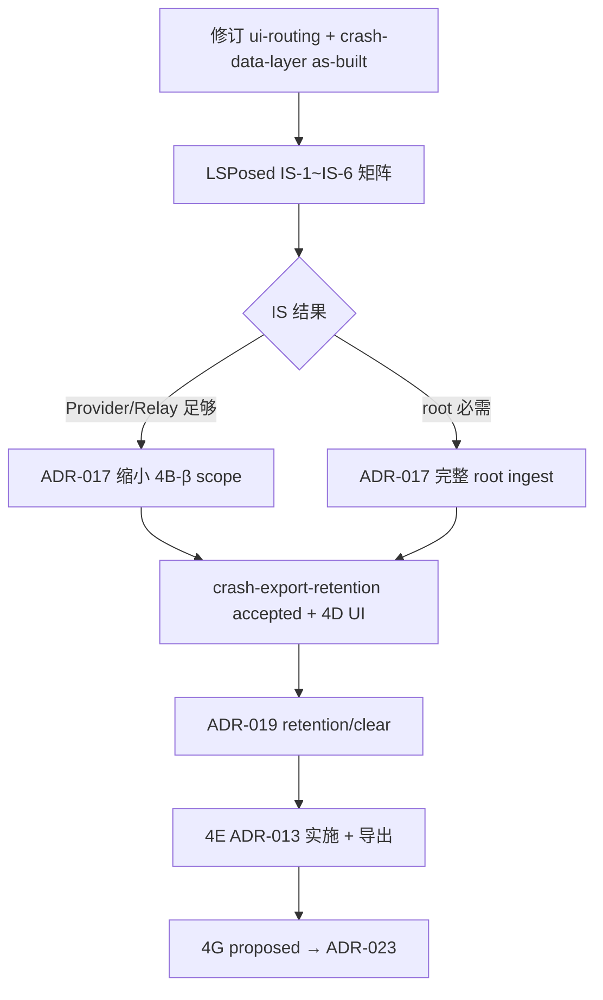

# 架构决策 backlog 与文档缺口

> **用途**：编码与方案 commit 前的决策入口。列出 **须用户/维护者拍板** 的架构分叉、**已有 ADR 编号预留但未写** 的项、以及 **实现已超前/滞后于文档** 的修订清单。
>
> **对照基准**：源码 as-built（2026-06-20）、`dev/progress/status.md`、`dev/roadmap/active/`、现有 ADR-001~015。

---

## 1. 总览

| 类别 | 数量 | 说明 |
|------|------|------|
| **P0 决策**（阻塞 4B 验收或 doc 可信度） | 5 | 4B-β ingest、JSONL dedupe、IS 矩阵策略、ui-routing 漂移、Repository 契约 |
| **P1 决策**（4D–4E 前须定） | 6 | retention UI、导出隐私、CrashEvent 扩展字段、DI 框架、分页 vs 全量扫描、通知 crash_id 实施窗口 |
| **P2 决策**（可 defer，但宜早定边界） | 5 | 主题 override、M3 迁移时点、Room/sidecar、LLM/云端、Framework parseQueries |
| **架构文档 stale** | 8 | 与 MainShell / ServiceLocator / SDK 37 等不一致 |
| **架构文档 proposed/draft** | 4+ | 4D+ 规格 proposed；design/ 已 accepted（2026-06-22） |

**当前最大风险**：**4B-β relay ingest + id dedupe 已编码**（`RelayMergeBackend`），但 **IS-1~IS-6 / IS-R1~IS-R5 真机矩阵** 未验收、**ADR-017 仍为 proposed**；`crash-data-layer.md` 部分段落仍滞后于 Paging as-built。

---

## 2. 待决关键点（须 ADR 或显式拍板）

### 2.1 P0 — 阻塞观测层闭环

#### D-01 · 4B-β：root 优先写入 vs 仅 Phase 2 三后端

| 项 | 内容 |
|----|------|
| **背景** | [crash-log-backends.md](../../docs/architecture/crash-log-backends.md) 定义 Tier 0 `RootSuBackend` + 模块 `CrashLogIngestCoordinator`；[CrashLogCoordinator.kt](../../app/src/main/java/nota/android/crash/log/CrashLogCoordinator.kt) 注释 *RootSu deferred to 4B-β* |
| **分叉** | A) 按文档实施 Phase 1 root 短窗（≤1500ms）+ ingest relay；B) 延长仅 Phase 2（Provider/DirectFs/Relay），root 作为可选增强；C) 放弃 hook 侧 `su`，仅模块 root harvest |
| **影响** | IS-R1~R5、canonical 路径、libsu 体积、无 root 设备体验 |
| **建议** | 实施 4B-β 前 **ADR-017 accepted**（[017-root-ingest-and-dedupe.md](../../docs/decisions/017-root-ingest-and-dedupe.md) 已 proposed） |
| **关联文档** | crash-log-backends §Tier 0、crash-log-ipc §ingest、phase4 §4B-β |

#### D-02 · 多后端并行写入的 dedupe 语义

| 项 | 内容 |
|----|------|
| **背景** | 三后端并行时 canonical JSONL **可能出现同 `id` 多行**（各 backend 独立 stamp）；**relay ingest** 经 `RelayMergeBackend` 按 `id` dedupe（2026-06-23 as-built）；hook 直写 canonical 仍可能重复 |
| **分叉** | A) ingest 时按 `id` 合并为一行并写 `backendWritten[]`；B) 读路径 dedupe（Repository 层）；C) 写路径协调器只 append 一次 canonical，backend 仅写 relay |
| **影响** | 统计准确性、历史列表重复行、retention 计数 |
| **建议** | **ADR-017** proposed — relay ingest 已选 A；读路径 `FileCrashLogRepository` 已有 `distinctBy id`；hook 直写重复待 IS 矩阵后定 |
| **状态** | ✅ **relay merge 已实现**；hook 多后端写 canonical 重复行 **待决** |

#### D-03 · IS-1~IS-6 验收失败时的降级策略

| 项 | 内容 |
|----|------|
| **背景** | [phase4_crash_observability.md](../roadmap/active/phase4_crash_observability.md) 要求 IS-1+IS-2 至少一条写入路径通过；包可见性（IS-3）ROM 差异大 |
| **分叉** | A) 强制 `QUERY_ALL_PACKAGES` + 文档化无 root 最低配置；B) 推广 ADR-012 手动授权 + TargetRelay 为主路径；C) 接受部分 ROM 仅 Provider fallback |
| **影响** | usage.md 用户说明、是否实现 framework parseQueries（见 D-12） |
| **建议** | 验收报告写入 `dev/verification/` 后再定；若 B 为主路径，更新 [crash-log-ipc.md](../../docs/architecture/crash-log-ipc.md) Primary A 优先级叙述 |
| **关联 ADR** | ADR-012 包可见性 |

#### D-04 · CrashLogRepository 读口契约（已补全）

| 项 | 内容 |
|----|------|
| **背景** | 文档定义 `observeChanges()`、`clear()`、`deleteById()`、`applyRetention()`；[FileCrashLogRepository.kt](../../app/src/main/java/nota/android/crash/xp/app/data/CrashLogRepository.kt) ~~**仅** `getAll/getById/getCount`，LRU 200 + mtime 失效，**无 Flow**~~ **已实现** `deleteById`、`clear`、`observeChanges()`、`applyRetention()` |
| **分叉** | ~~A) 修订 crash-data-layer 对齐 as-built，4D 再扩展接口；B) 补全 Repository 接口再写 4D UI；C) 引入 Paging3 为唯一列表读口，废弃 offset 扫描~~ → **已选 B，接口已补全** |
| **影响** | CrashHistoryPagingSource、StatsAggregator、清空历史、导出 |
| **建议** | ~~**先修订 crash-data-layer（as-built 节）**，4D 启动前 **ADR-019** 定 *清空/retention 是否经 Repository*~~ **已解决 — 接口已扩展，待 ADR-019 定 retention 策略** |
| **现状** | 实现已用 `CrashEventPagingSource` + `CrashHistoryPagingAdapter`，文档未描述分页 |
| **状态** | ✅ **已实现** |

#### D-05 · 模块 DI：ServiceLocator  vs  Hilt

| 项 | 内容 |
|----|------|
| **背景** | [ServiceLocator.kt](../../app/src/main/java/nota/android/crash/xp/app/di/ServiceLocator.kt) 注释 *until Hilt*；ViewModelFactory 已接 Repository 注入 |
| **分叉** | A) 长期 ServiceLocator（单模块、小团队）；B) Phase 4D 前引入 Hilt；C) 仅测试用 ServiceLocator.clear()，生产保持手动 |
| **影响** | 包结构、ProGuard、测试替身、AGENTS 技术栈表 |
| **建议** | 若选 B → **ADR-020**；若选 A → 修订 ServiceLocator 注释 + 在 architecture-optimization §5 记 as-built |
| **紧迫度** | 中（不阻塞 4B，但 4D 多 ViewModel 前宜定） |

---

### 2.2 P1 — 4D–4E 前须定

#### D-06 · Retention 配置：硬编码 vs 用户可调

| 项 | 内容 |
|----|------|
| **背景** | `CanonicalJsonlWriter` 500 条 / 8MB 硬编码；[crash-export-retention.md](../../docs/architecture/crash-export-retention.md) status **proposed** |
| **分叉** | 全局 pref `crash_log_max_entries` / `crash_log_max_bytes` vs 仅「清空历史」无上限调整 |
| **建议** | 4D Toolbar「清空」与 retention pref **同一 ADR-019**；更新 crash-export-retention → accepted |

#### D-07 · CrashEvent 扩展字段时间表

| 项 | 内容 |
|----|------|
| **背景** | [crash-logging.md](../../docs/architecture/crash-logging.md) 列 `pid/uid/threadName/causeClasses/isSystemApp/moduleVersion` 为 defer |
| **分叉** | 4B-β 一次补齐 vs 4G 分析层按需 vs 永久不写（统计够用） |
| **建议** | 若 4G-MVP 需要 `threadName`/`causeClasses` → 在 crash-logging 增 **字段版本** `schemaVersion` 即可，不必单独 ADR；若改 JSONL 破坏性 → 另开 ADR |

#### D-08 · ADR-013 crash_id 通知：已实施

| 项 | 内容 |
|----|------|
| **背景** | ADR-013 **accepted**，标注 Phase 4E；~~当前通知仍传 `Exception` extra~~ **已在 `CrashFeedbackFacade` / `ActivityCrashInfo` 实施** |
| **分叉** | ~~4E 统一改 vs 4C-β 详情就绪后即改（Repository.getById 已可用）~~ → **已实施** |
| **影响** | ~~早改可减 Binder 风险；须同步 [crash-notification.md](../../docs/architecture/crash-notification.md) 与 ActivityCrashInfo 回退逻辑~~ |
| **建议** | ~~早改可减 Binder 风险；须同步 [crash-notification.md](../../docs/architecture/crash-notification.md) 与 ActivityCrashInfo 回退逻辑~~ **已实施 — 通知传 `crash_id`，ActivityCrashInfo 回退逻辑已就位** |
| **状态** | ✅ **已实施** |

---

### 2.2 P1 — 4D–4E 前须定

#### D-09 · SAF 导出隐私与数据范围

| 项 | 内容 |
|----|------|
| **背景** | crash-export-retention proposed；含 stack、路径、可能 PII |
| **分叉** | 仅 JSONL vs zip+meta；导出前强制对话框 vs 设置项默认关闭 |
| **建议** | 4E 前 crash-export-retention → accepted；**无需新 ADR**（产品策略，文档即可） |

#### D-10 · 历史列表：Paging3 vs 全量 Flow

| 项 | 内容 |
|----|------|
| **背景** | 已实现 Paging；crash-data-layer 描述全文件扫描 + `observeChanges` Flow |
| **分叉** | 文档以 Paging 为准 vs 实现改回 Flow + DiffUtil |
| **建议** | **修订 crash-history-ui + crash-data-layer**（D-04 子项），不必 ADR |

#### D-11 · 观测 tab 内层 Tab：4D 统计何时加入

| 项 | 内容 |
|----|------|
| **背景** | [navigation-ia.md](../../docs/architecture/navigation-ia.md) / crash-stats-ui 定义 历史\|统计 子 tab；ObserveHost 当前仅历史 |
| **分叉** | 4D 一次加 TabLayout vs 统计独立 Activity |
| **建议** | 遵循 navigation-ia（已 accepted）；**无需新 ADR**

---

### 2.3 P2 — 边界与远期

#### D-12 · Framework parseQueries 补丁（可选）

| 项 | 内容 |
|----|------|
| **背景** | [framework-injection-feasibility.md](../../docs/architecture/framework-injection-feasibility.md) 否决主路径；IS-3 失败时可局部借鉴 |
| **分叉** | 不做 / 文档化手动 LSPosed System Framework scope / 内置可选模块 |
| **建议** | 仅当 IS-3 矩阵失败率过高时再 **ADR-022**；默认 defer |

#### D-13 · ADR-016 应用内主题三态 toggle（已预留编号）

| 项 | 内容 |
|----|------|
| **背景** | [dark-mode-theming.md](../../docs/architecture/dark-mode-theming.md)、ADR-009 均写 *v1 仅系统 DayNight*；**ADR-016 尚未创建** |
| **分叉** | 永久不做 / v2 做 Light|Dark|System |
| **建议** | 用户明确要应用内切换时再写 ADR-016；否则在 dark-mode-theming 标记 *won't do v1* |

#### D-14 · Material 3 迁移时点

| 项 | 内容 |
|----|------|
| **背景** | ADR-006 defer M3；Design System 基于 M2 + Fluent token |
| **分叉** | Phase 5+ / 永不 / 仅 Compose 新页 |
| **建议** | 维持 ADR-006；**无需新 ADR** 直至用户发起 M3 专项 |

#### D-15 · 4G-V3 端侧 LLM / 云端 API

| 项 | 内容 |
|----|------|
| **背景** | phase4 §4G 写 *须另立 ADR*；[architecture-optimization.md](../../docs/architecture/architecture-optimization.md) §9.3 误将 ADR-009 标为 LLM（**ADR-009 已是 UI Shell**） |
| **分叉** | 离线 only / 可选 API / 仅 PC 脚本 |
| **建议** | 启用任何网络 stack 分析前写 **ADR-023**（隐私、出境、默认关）；修正 architecture-optimization §9.3 编号错误 |

#### D-16 · JSONL → Room 或 sidecar 索引

| 项 | 内容 |
|----|------|
| **背景** | ADR-007 JSONL 先行；crash-data-layer §未来演进 sidecar `index.json` |
| **分叉** | 500 条内不优化 / 4E sidecar / Room 迁移 |
| **建议** | 性能实测后再 **ADR-024**；MVP 不阻塞 |

---

## 3. 架构文档缺口矩阵

### 3.1 须 urgent 修订（与 as-built 冲突）

**2026-06-20 批次已全部完成**（ui-routing、crash-data-layer、overview、AGENTS、architecture-optimization §9.3、crash-history-ui、status）。无当前 open 项。

### 3.2 须从 proposed/draft → accepted（实施前）

| 文档 | status | 触发条件 |
|------|--------|----------|
| [crash-export-retention.md](../../docs/architecture/crash-export-retention.md) | proposed | 4E 启动或 D-06/D-09 拍板 |
| [crash-intelligent-analysis.md](../../docs/architecture/crash-intelligent-analysis.md) | proposed | 4G-MVP 立项 |
| [adb-logcat-analysis.md](../../docs/architecture/adb-logcat-analysis.md) | accepted | 4F 脚本立项 |

### 3.3 须新建（尚无独立规格）

| 文档 | 目的 | 优先级 | 状态 |
|------|------|--------|------|
| [app-di-and-module-boundaries.md](../../docs/architecture/app-di-and-module-boundaries.md) | ServiceLocator、hook 包门禁 | P1 | ✅ 2026-06-20 |
| `docs/architecture/crash-history-paging.md` 或并入 crash-history-ui | Paging3 语义 | P1 | ✅ 并入 crash-history-ui §As-built |
| [017-root-ingest-and-dedupe.md](../../docs/decisions/017-root-ingest-and-dedupe.md) | D-01 + D-02 | P0 | ✅ **proposed** — 待 IS 矩阵 accepted |
| [crash-log-filesystem.md](../../docs/architecture/crash-log-filesystem.md) + [021-canonical-jsonl-io-consistency.md](../../docs/decisions/021-canonical-jsonl-io-consistency.md) | F1~F6 canonical I/O、读序、FileLock | P0 | ✅ **proposed** — 4B-γ |
| `docs/decisions/019-retention-and-clear-policy.md` | D-06 + Repository clear API | P1 | 待 4D |
| `docs/decisions/020-di-framework.md` | D-05（若选 Hilt） | P1 | 待 D-05 |
| `docs/decisions/023-llm-cloud-analysis-boundary.md` | D-15 | P2 | 待 4G |

### 3.4 已有 ADR 但缺架构展开

| ADR | 缺什么 |
|-----|--------|
| ADR-014 Legacy 迁移 | PrefMigrator / ManagedModelMigrator 已拆分 — 补 dev/iterations 实现对照 |
| ADR-015 受管应用 | AppInterventionEditActivity 路由与 intervention rules codec — 补 app-management-ui as-built |
| ADR-013 crash_id | 已实施 — `CrashFeedbackFacade` / `ActivityCrashInfo` / `CrashDetailLoader` |

---

## 4. 推荐决策与文档顺序



| 步骤 | 动作 | 产出 | 状态 |
|------|------|------|------|
| 1 | 无 ADR：同步 as-built 文档（§3.1） | docs-only | ✅ 2026-06-20 |
| 2 | 真机 IS 矩阵 | `dev/verification/crash_log_is_*.md` | ⏳ |
| 3 | 根据 IS 写 **ADR-017** | root/dedupe 策略 | ✅ proposed → 待 accepted |
| 4 | 修订 crash-data-layer + 可选 ADR-019 | 4D 统计/清空可编码 | ⏳ |
| 5 | crash-export-retention → accepted | 4E 导出 | ⏳ |
| 6 | 若引入 Hilt → ADR-020 | DI 统一 | ⏳ |

---

## 5. 不必新 ADR 的项（文档/roadmap 即可）

- ActivityCrashInfo 复制/分享（Phase 3C）
- `values-zh` 文案
- CodeEditor `setDark(night)` 与 AOSP 模拟器 dark QA
- Sticky 搜索头（Phase 3B P2 defer）
- Gradle 拆 `:crash-log-root` — 除非 libsu 独立模块落地（原 architecture-optimization 可选 ADR-010 编号已被占用）

---

## 6. 文档维护门禁

完成 §3.1 修订或新增 ADR 后：

```bash
./scripts/generate-docs-index.sh
python3 scripts/check-docs-health.py
```

含 as-built 行为变更时同步 [overview.md](../../docs/architecture/overview.md) 与 [status.md](../progress/status.md)（规则 3a）。

---

## 相关文档

- [architecture-optimization.md](../../docs/architecture/architecture-optimization.md) — 演进总纲（须修正 §9.3 ADR 编号）
- [phase4_crash_observability.md](../roadmap/active/phase4_crash_observability.md) — 4B–4G 任务清单
- [crash-log-backends.md](../../docs/architecture/crash-log-backends.md) — 多后端与 4B-β defer
- [DOCUMENTATION.md](../../docs/DOCUMENTATION.md) — 文档类型与提交门禁
- [sibling-projects.md](../../docs/reference/sibling-projects.md) — 外部仓库引用 SSOT
