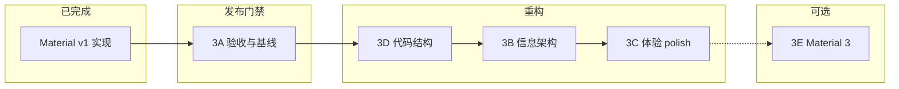

# 配置 UI 重设计执行计划

> 子系统：配置 UI（`:app`）
> 关联 Roadmap：[phase3_ui_redesign.md](../roadmap/active/phase3_ui_redesign.md)
> 架构依据：[configuration-ui.md](../../docs/architecture/configuration-ui.md)
> 已实现基线：[material-ui-redesign-2026-06-19.md](../iterations/configuration-ui/material-ui-redesign-2026-06-19.md)

## 背景

2026-06-19 已完成 **Material Components v1**（状态条、设置卡片、搜索/Chip、列表卡片、崩溃详情 Toolbar）。代码已落地，但存在：

| 缺口 | 影响 |
|------|------|
| Java 21 + Gradle 7.2 不兼容 | 本地/CI 无法 `assembleDebug` |
| material-ui-redesign 验证清单未勾选 | v1 无回归基线 |
| adb smoke 未覆盖 UI 交互 | Switch/prefs 持久化未验收 |
| 主屏设置卡片占用首屏 | 应用列表可见区域偏小 |
| Anko / ProgressDialog / 遗留 pref | 技术债与泄漏风险 |

本计划将「重设计 UI」拆为 **5 个子阶段（3A–3E）**，在 **不改变 hook/scope 语义**（[ADR-002](../../docs/decisions/002-inverted-package-toggle.md)、[ADR-003](../../docs/decisions/003-xsharedpreferences-cross-process.md)）前提下推进。

## 目标

1. **3A**：建立可重复的构建与真机验收基线
2. **3B**：优化信息架构，释放列表首屏空间
3. **3C**：补齐体验细节（加载、空状态、崩溃页操作、可选暗色）
4. **3D**：清理技术债，降低后续 diff 噪音
5. **3E（可选）**：Material 3 + 工具链升级（独立 ADR，默认延后）

## 约束

- **不改**：`PREF_*` key、`updatePref()` 集合语义、XposedEntry / CrashHandler 行为
- **可改**：布局、导航、主题、加载 UX、代码结构
- **文档门禁**：每子阶段实施 commit 前同步 `configuration-ui.md`；用户可见变更更新 `usage.md`

## 阶段总览

**推荐顺序**：`3A → 3D（轻量）→ 3B → 3C → 3E（延后）`

> 架构评审结论：3A 完成前不启动 3B/3C 视觉改动；3B 开工前须 ADR-005（设置信息架构）。

---

## 3A — 验收与基线修复（发布门禁）

### 任务

| Step | 任务 | 产出 |
|------|------|------|
| 0 | 构建工具链：JDK 17 pin 或 Gradle/AGP 升级（见 ADR-004 草案） | 稳定 `assembleDebug` |
| 1 | 修复/可选化 Windows 硬编码签名路径 | 非 Windows 可构建 debug |
| 2 | 勾选 material-ui-redesign 验证清单 | iter 文档 status 更新 |
| 3 | 运行 `adb-smoke-verification.sh` + 手动 UI 项 | `dev/verification/smoke_YYYYMMDD.md` |
| 4 | 修正 verification README 中 scope_mode 描述错误 | 文档一致性 |

### 手动 smoke 扩展项（adb 脚本未覆盖）

- [ ] 状态条：未激活橙色 / 激活绿色（需 LSPosed 环境）
- [ ] 搜索：按名称、包名过滤
- [ ] Chip：全部 / 已应用 / 未应用
- [ ] Switch：切换后 `run-as` 或重启目标 app 验证 hook 范围
- [ ] 设置卡片三开关写 prefs 后 XSharedPreferences 可读

### 验收标准

- `./gradlew :app:assembleDebug` 在约定 JDK 下通过
- 首份 smoke 报告入库
- material-ui-redesign 验证三项全部勾选
- 无 prefs / hook 语义变更

### 依赖 ADR

- [ADR-004 构建工具链策略](../../docs/decisions/004-build-toolchain-jdk17.md)（3A 开工前定稿）

---

## 3D — 代码结构（轻量，可提前于 3B）

> 与 3B 布局大改解耦，降低后续 diff 噪音。

### 任务

| Step | 任务 | 文件/范围 |
|------|------|-----------|
| 0 | 移除 `kotlin-android-extensions` 插件 | `app/build.gradle` |
| 1 | 启用 ViewBinding | `app/build.gradle` + Activity 迁移 |
| 2 | `doAsync` → `lifecycleScope` + 主线程回调 | `ActivityMain.kt` |
| 3 | `ProgressDialog` → 内联 `CircularProgressIndicator` 或 Material 对话框 | `ActivityMain.kt` + layout |
| 4 | 删除 `res/xml/pref_general.xml` 及残留引用 | resources |
| 5 | 移除 Anko 依赖（若无其他引用） | `app/build.gradle` |

### 验收标准

- 无 Anko / ProgressDialog / pref_general
- 3A 核心 smoke 回归通过
- 消除 `@SuppressLint("StaticFieldLeak")` 场景

### 文档

- 迭代记录：`dev/iterations/configuration-ui/structure-cleanup-YYYYMMDD.md`

---

## 3B — 信息架构优化

### 设计方向（待 ADR-005 定稿）

| 选项 | 优点 | 缺点 |
|------|------|------|
| **A. 独立 Settings Activity**（推荐默认） | 实现简单、可测性好、与 LSPosed 类 app 习惯一致 | 多一次导航 |
| B. Modal BottomSheet | 主屏改动小 | 可发现性弱，需明确入口 |
| C. 保留卡片 + 折叠 | 改动最小 | 首屏问题未根本解决 |

**迁出主屏的控件**（三 Switch + scope 说明）：

- 作用域模式、处理系统应用、显示系统应用

**保留主屏**：

- Toolbar（排序 / 批量 / 关于 / 测试）
- 状态条（可点击 → Xposed 管理器，见下）
- 搜索 + Chip + appCount
- RecyclerView 列表

**可选（P2）**：搜索/Chip 粘性头部（`CoordinatorLayout` 或 RecyclerView header item）

### 状态条 → 管理器跳转

- 检测已安装的 LSPosed / EdXposed / 经典管理器
- `try/catch` + 多框架回退（打开管理器 / 说明对话框）
- **不保证**跨版本 stable deep link

### 验收标准

- 三 Switch 行为与迁移前一致；`show_system_ui` 仍持久化
- 主列表首屏可见应用数 ≥ v1（或文档记录有意减少）
- 未激活状态条点击不 crash，有明确引导
- 更新 `configuration-ui.md`

### 依赖 ADR

- [ADR-005 设置信息架构](../../docs/decisions/005-settings-information-architecture.md)（**3B 编码前必须 accepted**）

---

## 3C — 体验 Polish

| 任务 | 说明 |
|------|------|
| 空状态 | 搜索/Chip 无结果时显示引导文案 + 清除过滤操作 |
| 崩溃详情 FAB | 复制到剪贴板 + `ACTION_SEND` 分享 |
| 暗色主题（可选） | `values-night/` + 检查 hardcoded 色（status banner、badge） |
| 国际化 | 新文案同步 `values-zh/` |

### 验收标准

- 过滤为空非空白 RecyclerView
- Crash 页复制/分享可用，大 stack trace 不 OOM
- 若做暗色：至少 1 台设备抽测

---

## 3E — Material 3（可选，默认延后）

触发条件：用户明确要求视觉升级或工具链统一升级。

| 变更 | 影响 |
|------|------|
| compileSdk 33+、AGP 8.x、Gradle 8.x、Kotlin 升级 | 全项目构建链 |
| Material 3 主题 / 动态色 | 全资源层 |

**必须**先写并批准 [ADR-006 Material 3 与工具链升级](../../docs/decisions/006-material3-toolchain.md)（待创建）。

---

## 任务拆解总表

| Phase | 任务 | 依赖 | 预估 |
|-------|------|------|------|
| 3A-0 | ADR-004 定稿 + JDK/Gradle 修复 | — | 0.5d |
| 3A-1 | assembleDebug + smoke 报告 | 3A-0 | 0.5d |
| 3D | ViewBinding / 去 Anko / 删遗留 | 3A-1 | 1d |
| 3B-0 | ADR-005 定稿 | 3A-1 | 0.5d |
| 3B-1 | Settings Activity + 主屏精简 | 3B-0, 3D | 1–2d |
| 3B-2 | 状态条管理器跳转 | 3B-1 | 0.5d |
| 3C | 空状态 / FAB / 暗色 | 3B-1 | 1–2d |
| 3E | Material 3 | ADR-006 | 3d+ |

## 风险

| 风险 | 影响 | 缓解 |
|------|------|------|
| 无 LSPosed 真机 | 无法验状态条/self hook | 文档化阻塞；先验 prefs 写入 |
| Gradle 升级牵连面大 | 3A 范围膨胀 | 优先 JDK 17 pin，升级走 ADR-004 |
| 3B 与 v1 文档冲突 | 架构文档过时 | 每 phase 同步 configuration-ui.md |
| LSPosed deep link 不稳定 | 状态条点击无效 | 多框架检测 + 回退文案 |
| 旋转重建重载包列表 | 体验差 | 3D 可选 ViewModel 或文档化接受 |

## Commit 策略

按 AGENTS.md **方案 / 实施分离**：

1. **方案 commit**（仅文档）：本 plan + phase3 roadmap + ADR-004/005 草案
2. **实施 commit**（每子阶段）：代码 + iter 记录 + architecture/usage 同步 + status.md + roadmap 勾选

## 相关文档

- [configuration-ui.md](../../docs/architecture/configuration-ui.md)
- [scope-and-prefs.md](../../docs/architecture/scope-and-prefs.md)
- [usage.md](../../docs/guides/usage.md)
- [material-ui-redesign-2026-06-19.md](../iterations/configuration-ui/material-ui-redesign-2026-06-19.md)
- [phase3_ui_redesign.md](../roadmap/active/phase3_ui_redesign.md)
- [verification/README.md](../verification/README.md)
