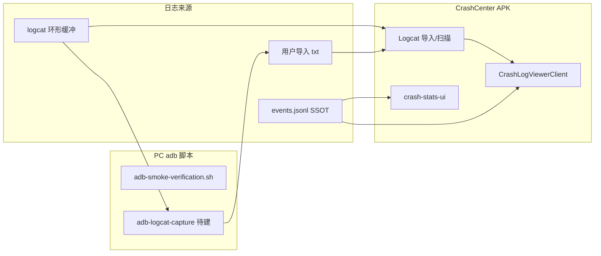

# ADB / Logcat 崩溃日志分析需求

> 适用：开发验收（`scripts/`）、可选观测域增强（Phase 4E+）
> 数据 SSOT 仍为 [crash-logging.md](crash-logging.md) `events.jsonl` — logcat **不**作为历史统计主数据源
> ANR 观测：[ADR-025](../decisions/025-anr-observation-no-framework-hook.md)、[anr-observation.md](anr-observation.md)
> 现有脚本：[scripts/adb-smoke-verification.sh](../../scripts/adb-smoke-verification.sh)、[dev/verification/README.md](../../dev/verification/README.md)

## 概述

CrashCenter 当前通过 `XposedBridge.log` / `Log.e` 将拦截与自检信息写入 **logcat 环形缓冲区**（非持久化）。开发与验收已依赖 **PC 端 `adb logcat`** 判断 hook 是否生效；用户侧「分析崩溃」主路径是 JSONL + 观测 UI（[crash-stats-ui.md](crash-stats-ui.md)）。

本需求定义：**如何系统化读取本机（设备）logcat 并解析为可浏览的崩溃线索**，覆盖：

| 通道 | 典型用户 | 是否需要 root |
|------|----------|----------------|
| **A. PC adb 工具链** | 开发者 / CI | 否（USB 调试） |
| **B. 应用内导入 logcat 文件** | 进阶用户 | 否（用户自行 `adb logcat -d > file`） |
| **C. 应用内 root 拉取 logcat** | Root + LSPosed 用户 | 是 |
| **D. 应用内实时 tail** | 调试 | root 或 adb 无线调试；MVP 不优先 |

**不替代** [CrashLogCoordinator](crash-log-backends.md)：`logcat` 后端 tier=9 仅调试，不参与写入成功判定。

---

## 问题与动机

### logcat 能补什么、不能补什么

| 能力 | JSONL（Phase 4） | logcat |
|------|------------------|--------|
| 持久化 | ✅ 本地文件 | ❌ 环形缓冲，重启丢失 |
| 全量拦截记录 | ✅ 每次 handler 可记 | ⚠️ 仅当代码 `log()` 且未被冲掉 |
| 未 hook app 的真崩溃 | ❌ | ✅ `AndroidRuntime: FATAL EXCEPTION` |
| Native crash | ❌ | ⚠️ `DEBUG` / tombstone 指针，无完整 Java stack |
| 模块 hook 自检 | ⚠️ 无专门字段 | ✅ `catch package` / `selfCheck` |
| 跨 app 统计 | ✅ 结构化 `CrashEvent` | ❌ 需解析，难聚合 |
| **ANR** | ❌ 不入 JSONL SSOT | ✅ `system` / `events` buffer（路径 A，[anr-observation.md](anr-observation.md)） |

结论：logcat 分析是 **诊断与验收补充**，用于「hook 是否生效」「系统侧真实崩溃」「与 JSONL 对账」；产品化「历史 + 统计」仍以 JSONL 为准（[crash-logging.md](crash-logging.md)）。

### 当前缺口

| 现状 | 缺口 |
|------|------|
| `adb-smoke-verification.sh` 仅 grep 200 行、10s 窗口 | 无结构化解析、无导出、无与包名过滤 |
| `XposedEntry` 打 log，无 UI 展示 logcat | 用户看不到「被吞掉」异常的 logcat 副本（若未点通知） |
| 验收文档手写 logcat 命令 | 无统一解析规则与报告模板字段 |

---

## 用户场景

| ID | 场景 | 期望能力 |
|----|------|----------|
| U1 | 开发者验收 hook | 一键：安装 → 触发 Test → 解析 logcat 中 `catch package` / 异常栈 |
| U2 | 排查「拦截了但没通知」 | 在 logcat 中搜 `XposedBridge` + 目标包栈 |
| U3 | 分析未 hook app 闪退 | 解析 `FATAL EXCEPTION` / `Process: <pkg>` |
| U4 | Phase 4 对账 | 对比 JSONL 条数与 logcat 中 Xposed 异常行数量（近似） |
| U5 | 无 USB 时事后分析 | 导入此前 `adb logcat -d` 保存的文本 |
| U6 | Root 机现场拉取 | 应用内「扫描 logcat」→ CodeEditor 浏览 |
| U7 | INTERCEPT 后 app 卡死 ANR | root 拉 `system` buffer 或导入含 `ANR in` / `am_anr` 的 log |

---

## 系统约束（Android）

| 约束 | 影响 |
|------|------|
| `READ_LOGS` | 普通应用 **无法** 读全设备 logcat（signature\|privileged\|development） |
| 本应用 log | API 33+ 仅可读自身 tag；**不可**读其他 app / `XposedBridge` 全量 |
| **adb** | 主机通过 `adb logcat` 读全量（需 USB/Wi‑Fi 调试授权） |
| **root `su logcat -d`** | 应用内可拉全量 dump（与 [crash-log-backends.md](crash-log-backends.md) root 能力一致） |
| 缓冲区大小 | 通常数 MB；旧日志会被覆盖 |
| CrashCenter 吞异常 | 常 **不出现** `AndroidRuntime` FATAL（进程未杀）；栈多在 `XposedBridge` |

---

## 日志解析规范（SSOT for parsers）

### 优先关注的 log tag / 优先级

| Tag / 源 | 用途 | 示例 |
|----------|------|------|
| `XposedBridge` | 拦截异常对象打印、`catch package` | `XposedBridge.log(throwable)` |
| `XposedEntry` | 模块 selfCheck | `selfCheck:pkg: nota.android.crash.xp.app` |
| `AndroidRuntime` | 未拦截 Java 崩溃 | `FATAL EXCEPTION: main` |
| `ActivityManager` | 进程死亡、**ANR**（部分 ROM） | `Process <pkg> has died`；`ANR in <pkg>` |
| `eventlog` / `events` buffer | 结构化 **am_anr** | `am_anr` 行（文本模式 `-v threadtime`） |
| `libc` / `DEBUG` | Native crash 线索 | `Fatal signal 11` |

### 结构化事件类型（解析输出）

```kotlin
// 概念模型 LogcatCrashSnippet（不必持久化，或可选写入旁路文件）
data class LogcatCrashSnippet(
    val kind: Kind,           // XPOSED_INTERCEPTED | JAVA_FATAL | NATIVE_HINT | ANR_HINT | HOOK_MARKER | OTHER
    val timestampMs: Long?,   // logcat 行首时间（若可解析）
    val packageName: String?, // 从 Process / catch package / 上下文推断
    val rawLines: List<String>,
    val summary: String,      // 首行 exception 或 marker 行
)
```

| `kind` | 识别规则（启发式） |
|--------|-------------------|
| `HOOK_MARKER` | 匹配 `catch package:\s*(\S+)`、`selfCheck:pkg:` |
| `XPOSED_INTERCEPTED` | `XposedBridge` 连续多行含 `at ` stack |
| `JAVA_FATAL` | `FATAL EXCEPTION` 起至下一个空行或下一 `--------- beginning of` |
| `NATIVE_HINT` | `Fatal signal` / `backtrace:` |
| `ANR_HINT` | 见下表 §ANR 启发式 |
| `OTHER` | 用户自定义 grep |

### ANR 启发式（`ANR_HINT`，[ADR-025](../decisions/025-anr-observation-no-framework-hook.md)）

`LogcatParser.filterCrashRelated()` 与片段聚合须对齐以下规则（**4F-ANR as-built**：`LogcatParser.isAnrHint`）：

| 信号 | 识别规则 | 典型 buffer |
|------|----------|-------------|
| 文本 ANR 头 | message 含 `ANR in`（大小写不敏感） | `system`、`main` |
| ActivityManager | tag `ActivityManager` 且 message 含 `ANR`、`not responding` 或 `Input dispatching timed out` | `system` |
| EventLog | message 含 `am_anr` 或解析为 event tag 30008 | `events` |
| 进程死亡（弱） | 已有 `Process ... has died`；**单独不构成** ANR，可与上项组合对账 | `system` |

**默认不入** `events.jsonl`；仅在 logcat 观测 UI 展示或未来写入 `anr_hints.jsonl`（[anr-observation.md](anr-observation.md)）。

### 与 `CrashEvent` 的映射（可选）

| logcat 片段 | 是否入库 JSONL |
|-------------|----------------|
| `XPOSED_INTERCEPTED` | 已由 hook 写 JSONL 时 **不重复**；仅 UI「对账」展示 |
| `JAVA_FATAL`（未 hook 包） | 可选「导入为观测事件」扩展（`source=logcat_import`）— **非 MVP** |
| `HOOK_MARKER` | 不入库；验收报告用 |
| `ANR_HINT` | **不入库** JSONL SSOT；logcat UI / 未来旁路 `anr_hints.jsonl` |

---

## 功能需求分通道

### A. PC adb 工具链（优先 P0）

**载体**：扩展 `scripts/`（可与 smoke 并列，不塞进 APK）。

| 功能 | 说明 |
|------|------|
| `adb-logcat-capture.sh` | `adb logcat -d` 或 `-t N` → `dev/verification/logcat_YYYYMMDD_HHMMSS.txt` |
| `adb-logcat-parse.sh` / Python | 按上文规范输出 JSON 或 Markdown 摘要 |
| 与 smoke 集成 | 可选 `--capture-logcat`；Test 菜单后自动 dump |
| 包名过滤 | 参数 `--package com.example` |
| 退出码 | 验收：存在 `selfCheck:pkg: nota.android.crash.xp.app`；可选要求 `catch package` |

**输出示例（验收报告段落）**：

```markdown
## Logcat 解析摘要
- hook 标记: 12 条 catch package
- 模块自检: selfCheck OK
- FATAL EXCEPTION: 0（符合吞异常预期）
- XposedBridge 异常块: 1（Test 菜单）
```

### B. 应用内导入 logcat 文件（P1）

| 功能 | 说明 |
|------|------|
| 入口 | 观测 tab Toolbar「导入 logcat」或设置 |
| 输入 | SAF 选 `.txt` / `.log`（用户 PC 上 `adb logcat -d > crash.txt`） |
| 处理 | 后台解析 → 片段列表 |
| 展示 | 列表 → [code-editor-porting.md](code-editor-porting.md) 看 `rawLines` |
| 隐私 | 导入前提示：log 可能含路径、账号 token |

**不入** `events.jsonl` MVP；可选勾选「合并到历史」为 P2。

### C. 应用内 root 拉取（P1，可选）

| 功能 | 说明 |
|------|------|
| 前置 | 检测到 `su` 可用（与 ingest root 同能力） |
| 动作 | `su -c 'logcat -d -t 5000'` 或按 tag 过滤 |
| 限流 | 最大行数 / 字符（如 2MB），防 OOM |
| UI | 与 B 相同列表 + CodeEditor |
| 失败 | 无 root → 引导使用 PC adb 或导入文件 |

### D. 实时 tail（P3，非 MVP）

- `su logcat -v threadtime` 流式读：耗电、需前台 Service
- 仅开发者选项开关；默认不做

---

## UI 与导航（若做应用内 B/C）

与 [navigation-ia.md](navigation-ia.md) 对齐：

```
观测 tab Toolbar
  ├─ 历史 | 统计（已有）
  └─ 菜单：导入 logcat / 扫描 logcat（root）
        → LogcatImportActivity 或 Fragment
             ├─ 片段列表（时间、kind、包名、摘要）
             └─ 详情 → CrashLogViewerClient
```

**不放**配置 tab：与干预层无关。  
**不与**全局统计页混排：logcat 片段默认 **不** 进入 [crash-stats-ui.md](crash-stats-ui.md) 计数（除非显式导入为 `CrashEvent`）。

---

## 与现有组件关系



| 组件 | 变更 |
|------|------|
| `XposedEntry` | 可选增加统一 tag `CrashCenter`（便于 `-s CrashCenter`）；**非必须** |
| `CrashLogCoordinator` | 保持 `logcat` tier=9 调试；不改为 SSOT |
| `adb-smoke-verification.sh` | 扩展 capture/parse 或调用新脚本 |

---

## 非目标

- 替代 JSONL 做统计 SSOT
- 读取其他用户未授权设备 log（仅本机 adb / root / 用户文件）
- 完整 Native tombstone 解析与符号化
- 云端 log 上传
- 无 root 应用内读全设备 logcat（系统不允许）

---

## 分阶段交付

| 阶段 | 内容 | 产出 |
|------|------|------|
| **P0** | PC `adb-logcat-capture` + 解析摘要；验收模板字段 | `scripts/` + `dev/verification/` |
| **P1** | 应用内 SAF 导入 + 片段列表 + CodeEditor 详情 | 观测菜单项 |
| **P1b** | root `logcat -d` 扫描（与 root ingest 共用探测） | 同上 |
| **P2** | 可选：logcat 片段导入为 `CrashEvent(source=logcat_import)` | JSONL 扩展 |
| **P3** | 实时 tail；与 smoke CI 集成 | 开发者向 |

与 [phase4_crash_observability.md](../../dev/roadmap/active/phase4_crash_observability.md)：**4E 之后或 4E 并行**，不阻塞 JSONL MVP。

---

## 验收标准

| # | 场景 | 期望 |
|---|------|------|
| L1 | 运行 smoke + capture | 生成 logcat 文件；解析出 `selfCheck` |
| L2 | 菜单 Test 后 capture | 解析出 ≥1 `XPOSED_INTERCEPTED` 或 XposedBridge 栈块 |
| L3 | 未 hook 的第三方 app 强制崩溃 | PC 解析出 `JAVA_FATAL` + 正确 `packageName` |
| L4 | 导入 sample log txt | 应用内列表条数与手工 grep 一致 |
| L5 | 无 root 设备 | 「扫描 logcat」不可用；导入仍可用 |
| L6 | 大文件 5MB | 导入不 ANR；截断有提示 |
| L7 | INTERCEPT 目标 app 主线程卡死 | root 拉 `system` 或导入含 `ANR in` 的 log；`filterCrashRelated` 命中 `ANR_HINT` |

---

## 相关文档

- [ADR-025](../decisions/025-anr-observation-no-framework-hook.md) — ANR 不走 Framework hook
- [anr-observation.md](anr-observation.md) — ANR 路径 A/B、INTERCEPT 行为
- [logcat-multi-source.md](logcat-multi-source.md) — buffer P2/P3 实施
- [crash-logging.md](crash-logging.md) — 为何不单靠 logcat
- [crash-log-backends.md](crash-log-backends.md) — `logcat` debug backend
- [crash-notification.md](crash-notification.md) — 用户可见 stack 与 logcat 并行
- [crash-stats-ui.md](crash-stats-ui.md) — JSONL 统计（与 logcat 分离）
- [code-editor-porting.md](code-editor-porting.md) — 详情阅读器
- [dev/verification/README.md](../../dev/verification/README.md) — 现有 logcat 关键字
- [guides/build-and-install.md](../guides/build-and-install.md) — adb 连接
