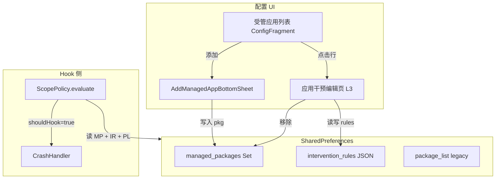
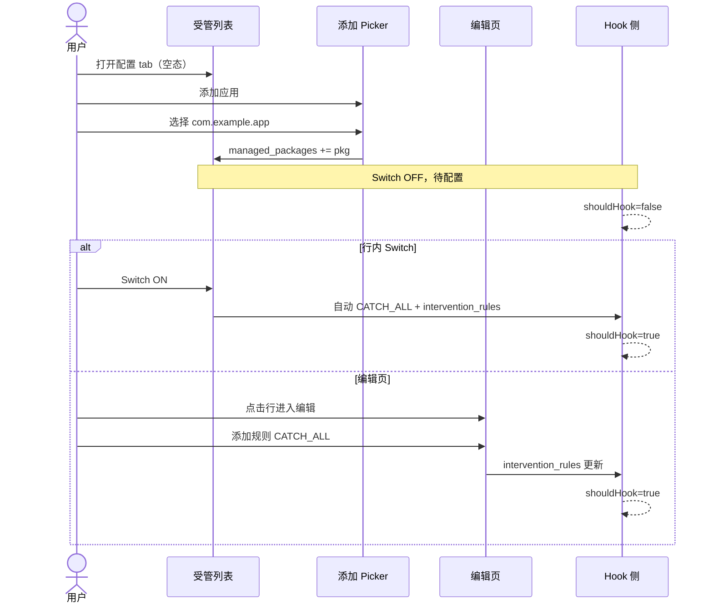

# 受管应用与干预规则 UI

> 适用模块：`:app` 配置域  
> 决策记录：[ADR-015](../decisions/015-managed-apps-intervention-rules.md)  
> 现状对照：[configuration-ui.md](configuration-ui.md)、[scope-and-prefs.md](scope-and-prefs.md)

## 概述

配置 UI 从 **「枚举全部已安装应用 + 行内 Switch」** 演进为 **「受管应用策展列表 + 单应用干预规则编辑页」**：

| 维度 | 现状（ADR-002） | 目标 |
|------|----------------|------|
| 列表内容 | 全部已安装包 | 用户 **主动添加** 的受管应用 |
| 干预开关 | 行内 Switch ↔ `package_list` 黑名单 | **行内 Switch**（快捷）+ **干预规则**（编辑页细配）；Switch ON 可隐式创建默认规则 |
| 添加流程 | 无（被动出现在列表） | 添加应用 **不要求** 预先配置规则 |
| 配置深度 | 单屏 toggle | L3 **应用干预编辑页** 手动增删规则 |

**核心用户故事**：

1. 用户点击「添加应用」，从已安装列表挑选包名 → **立即加入受管列表**，无需配置规则。
2. 受管列表中该应用显示 **「待配置」**；hook 侧 **不** 安装 `CrashHandler`。
3. 用户 **打开行内 Switch** 或进入 **编辑页** 添加规则 → hook 生效（Switch ON 且无规则时 **自动追加** `CATCH_ALL`）。
4. 用户可在编辑页增删规则、调整通知等行为；Switch OFF 停用干预但 **保留** 受管条目与规则数据；也可 **移除** 应用。

**术语**：本文 **干预规则（Intervention Rule）** 指 hook 侧崩溃拦截配置，与 Phase 4G **分析规则（RuleEngine）** 不同 — 见 [glossary.md](../glossary.md)。

---

## 设计目标

| 目标 | 说明 |
|------|------|
| **意图分层** | 「关注这个 app」≠「已配置干预」；列表成员与 hook 行为解耦 |
| **渐进配置** | 允许空规则入库；复杂选项在编辑页完成 |
| **可迁移** | 老用户 `package_list` 迁移后 hook 行为 **等价** |
| **Shell 兼容** | 列表留 L2 `ConfigFragment`；添加/编辑走 L3 — [ui-routing.md](ui-routing.md) |
| **ADR-005 修订** | 配置 tab 仍为单屏高密度；列表范围改为受管子集，全局 Chip 保留 |

### 非目标（v1）

- 异常类 / stack 模式匹配规则（v2 扩展）
- 在观测域 `PerAppCrashActivity` 编辑干预规则
- 替换 `scope_mode` 全局 Chip（保留为系统 app 过滤 + 全局默认策略）

---

## 概念模型



### 三层语义

| 概念 | 含义 | UI 表现 |
|------|------|---------|
| **受管应用（Managed App）** | 用户在列表中主动跟踪的包 | 出现在 Config 列表 |
| **待配置** | 在 `managed_packages` 中但 **无启用规则** | 角标「待配置」；`shouldHook=false` |
| **已干预** | 至少一条 **enabled** 干预规则 | 角标「已启用」或规则摘要；`shouldHook=true`（再经 ScopePolicy 过滤） |

---

## 数据模型

### 新增偏好键

| Key | 类型 | 默认 | 含义 |
|-----|------|------|------|
| `managed_packages` | `Set<String>` | **`null`**（哨兵：Legacy 模式） | 受管应用包名集合 |
| `intervention_rules` | `String`（JSON） | `{}` | `packageName → AppInterventionProfile` |
| `managed_model_migrated` | boolean | `false` | 一次性迁移标记 |

**Legacy 哨兵**：`managed_packages == null` 时 hook 与 UI **完全沿用** ADR-002 / ADR-010 现有逻辑；非 `null` 时启用新模型。

`package_list` **迁移期保留**（disabled 语义不变），新 UI 不再写入；`ScopePolicy` 在新模型下 **不读** `package_list`。时间表见 ADR-015。

### `AppInterventionProfile`（JSON）

```json
{
  "com.example.app": {
    "rules": [
      {
        "id": "550e8400-e29b-41d4-a716-446655440000",
        "type": "CATCH_ALL",
        "enabled": true,
        "showNotify": null,
        "crashLogEnabled": null
      }
    ],
    "updatedAt": 1718812800000
  }
}
```

| 字段 | 说明 |
|------|------|
| `rules[]` | 有序规则列表；**空数组 = 待配置** |
| `type` | v1 仅 `CATCH_ALL`（拦截全部未捕获 Java 异常） |
| `enabled` | 规则是否参与评估 |
| `showNotify` | `null` = 继承 ScopePolicy 全局分支 |
| `crashLogEnabled` | `null` = 继承全局 `crash_log_enabled`（Phase 4） |

### Hook 评估（扩展 ScopePolicy）

```
evaluate(xsp, lpparam):
  1. self / 忽略包 → 不变
  2. if managed_packages == null → Legacy（ADR-010 现有表）
  3. if pkg ∉ managed_packages → shouldHook=false
  4. profile = intervention_rules[pkg] ?? { rules: [] }
  5. if 无 enabled 规则 → shouldHook=false
  6. 合并 enabled 规则字段 + scope_mode × handle_system × isSystemApp
  7. 输出 ScopeDecision { shouldHook, showNotify, crashLogEnabled }
```

**关键**：「刚添加、零规则」**明确不 hook** — 与「先加后配」用户路径一致；迁移时为原 Switch-ON 的应用 **自动写入** 一条 `CATCH_ALL` 规则以保持行为等价。

---

## 信息架构与页面

### 配置 tab 列表（L2 `ConfigFragment`）

保留 ADR-005 单屏布局骨架，替换列表语义：

| 区域 | 变更 |
|------|------|
| 全局 FilterChip | **保留** `scope_mode` / `handle_system` / `show_system_ui` |
| 搜索 | 过滤 **受管列表** 名称/包名 |
| 过滤 Chip | **全部** / **已启用** / **待配置**（替换 已应用/未应用） |
| 列表行 | 图标 + 名称 + 包名 + **状态角标** + **行内 Switch** + chevron（可选隐藏 chevron，以 Switch 为右锚） |
| 空态 | 「尚未添加应用」+ 主按钮 **添加应用** |
| Toolbar | **添加应用**（P0）；排序保留；**移除** 全选/全不选 |

#### 列表行交互

| 手势 | 行为 |
|------|------|
| **点击行**（非 Switch 区域） | → `AppInterventionEditActivity` |
| **行内 Switch** | 快捷开/关干预（见下表）；`clickable=true`，不触发行导航 |
| **长按 / 右键** | 上下文菜单：编辑规则、移除应用、（可选）打开观测页 |

#### 行内 Switch 语义（v1）

Switch **绑定**「是否存在 enabled 干预规则」，而非「是否在受管列表」：

| 操作 | 存储 | UI |
|------|------|-----|
| **OFF → ON**，无规则 | 自动 append `CATCH_ALL`（`enabled=true`） | Switch checked；角标「已启用」 |
| **OFF → ON**，有规则但全 disabled | 将首条或全部 `CATCH_ALL` 设为 `enabled=true` | 同上 |
| **ON → OFF** | 全部规则 `enabled=false`（**不删** rules 条目） | Switch unchecked；角标「待配置」 |
| 添加应用（Picker） | 仅 `managed_packages`；Switch 默认 **OFF** | 待配置 |

**文案**：Switch 的 `contentDescription` 用「启用崩溃拦截 / 停用崩溃拦截」；角标「待配置」表示「在列表中但未启用干预」，避免与 Switch OFF 混淆。

按压规范：行根 ① overlay；Switch `clickable=false` 于 **行根** 但 Switch 自身独立触区可点 — [form-controls.md](../design/components/form-controls.md)。

### 添加应用（Half Sheet Picker）

**载体（v1 已定）**：`AddManagedAppBottomSheet` — [Draggable Half Sheet](../design/components/draggable-half-sheet.md)；自 `ConfigFragment` 弹出，**非** 独立 Activity。

**内容**（默认半屏停靠，可拖至全屏）：

```
[ scrim ]
┌─ radius 28dp ───────────────────────┐
│        ━━━ DragHandle ━━━           │
│  [✕]      添加应用           [完成] │
├─────────────────────────────────────┤
│ [🔍 搜索应用名称或包名            ] │
│ [全部] [用户] [系统]   ← FilterChip │
│ ☐  App A                            │
│ ☐  App B                            │
│ ...                                 │
└─────────────────────────────────────┘
```

| 行为 | 说明 |
|------|------|
| 数据源 | 已安装包 **减去** 已在 `managed_packages` 中的包 |
| 多选 | 支持；Toolbar「完成」批量写入 |
| 单点添加 | 点行立即添加并 Snackbar「已添加 · 去配置」→ 可选跳转编辑页 |
| 系统 app | 受 `show_system_ui` 控制是否出现在 Picker |
| 包可见性受限 | 与现 `PackageVisibilityHelper` 流程一致；Picker 内 banner 复用 |

**写入**：仅 `managed_packages.add(pkg)`；**不** 自动创建 `intervention_rules` 条目。

### 移除应用

| 入口 | 流程 |
|------|------|
| 编辑页 Toolbar | 「移除应用」→ 确认 Dialog |
| 列表长按菜单 | 「从列表移除」→ 确认 Dialog |

**效果**：

1. 从 `managed_packages` 删除包名  
2. 从 `intervention_rules` JSON 删除对应 profile  
3. 返回列表；hook 侧下一 `reload()` 后不再 hook  

确认文案强调：「将停止对该应用的崩溃拦截，已配置规则一并删除。」

### 应用干预编辑页（L3）

**载体**：`AppInterventionEditActivity`  
**参数**：`packageName`（必填）；可选 `auto_add_rule` deep link

```
┌─────────────────────────────────────┐
│ ←  微信                         ⋮  │
├─────────────────────────────────────┤
│  [icon]  微信                       │
│          com.tencent.mm             │
│          待配置 / 已启用 1 条规则    │
├─────────────────────────────────────┤
│  干预规则                           │
│  ┌───────────────────────────────┐  │
│  │ （空态）                       │  │
│  │  尚未添加规则                  │  │
│  │  添加规则后才会拦截崩溃        │  │
│  │  [ + 添加规则 ]                │  │
│  └───────────────────────────────┘  │
│                                     │
│  或规则卡片：                        │
│  ┌───────────────────────────────┐  │
│  │ 拦截未捕获异常          [开关] │  │
│  │ 崩溃时通知              [开关] │  │
│  │                    [删除规则]  │  │
│  └───────────────────────────────┘  │
├─────────────────────────────────────┤
│  [ 移除应用 ]                       │
└─────────────────────────────────────┘
```

#### 添加规则流程

1. 用户点 **「添加规则」**  
2. Bottom Sheet / Dialog 展示 v1 规则类型目录（仅一项）：**拦截未捕获异常**  
3. 确认后 append `CATCH_ALL` 规则（`enabled=true`，notify/log 继承全局）  
4. 即时写入 `intervention_rules`；Snackbar「规则已生效，重启目标应用后完全生效」（XSP 延迟提示）

#### 规则卡片（v1 单类型）

| 控件 | 映射 |
|------|------|
| 规则总开关 | `rule.enabled` |
| 崩溃时通知 | `rule.showNotify`（三态：继承 / 开 / 关 → null / true / false） |
| 记录崩溃日志 | `rule.crashLogEnabled`（Phase 4；inherit 同上） |
| 删除规则 | 移除该条；若 rules 变空 → 回到「待配置」 |

#### 与观测域边界

- 编辑页 **仅** 干预配置；崩溃历史入口（若有数据）为次要链接 → `PerAppCrashActivity`  
- 观测页 **不** 提供 hook 开关 — [crash-stats-ui.md](crash-stats-ui.md)

---

## 用户流程（端到端）

### 流程 A：新用户从零配置



### 流程 B：老用户迁移

1. 首次启动 `PrefMigrator.migrateManagedModel()`  
2. 由 `package_list` + 安装列表推导 `managed_packages`  
3. 对原 Switch-ON 的包写入默认 `CATCH_ALL` 规则  
4. 设置 `managed_model_migrated=true`；`managed_packages` 非 null → 新模型激活  
5. UI 展示受管列表，行为与迁移前 hook 集合 **等价**（单测验收）

### 流程 C：移除

用户编辑页 → 移除应用 → 确认 → 列表更新 + prefs  prune → 目标 app 下次启动不再 hook。

---

## 路由

| 路由 ID | 载体 | 参数 | 返回 |
|---------|------|------|------|
| `config_list` | `ConfigFragment` | — | — |
| `add_managed_app` | `AddManagedAppBottomSheet` | — | dismiss + 新增 pkgs（Fragment Result） |
| `app_intervention_edit` | `AppInterventionEditActivity` | `packageName` | `RESULT_OK` if changed |

NavGraph 挂载于 `MainShellActivity`（Phase 4C+）；Phase 3 过渡期可由 `ActivityMain` 直接 startActivity。

Deep link（可选 P2）：`crashcenter://config/app/{packageName}/edit`

完整路由表更新见 [ui-routing.md](ui-routing.md)（实施阶段同步）。

---

## ViewModel / Repository

### `ManagedAppRepository`

| 方法 | 职责 |
|------|------|
| `observeManagedApps()` | Flow/List：合并 PM 元数据 + profile 状态 |
| `addManagedPackages(packages)` | 写 Set；不 touched rules |
| `removeManagedPackage(package)` | 删 Set + profile |
| `getProfile(package)` / `saveProfile` | JSON 读写 |
| `setInterventionEnabled(package, enabled)` | 行内 Switch：OFF→ON 隐式/启用 `CATCH_ALL`；ON→OFF 全部 `enabled=false` |
| `pruneUninstalled()` | 加载时移除已卸载包 |

### `ConfigUiState` 扩展

| 字段 | 说明 |
|------|------|
| `managedApps` | 受管应用 domain model |
| `managedFilter` | ALL / ENABLED / PENDING |
| `isLegacyMode` | `managed_packages == null`（迁移前 UI 可显示旧列表或强制迁移） |

### Domain model `ManagedApp`

```kotlin
data class ManagedApp(
    val packageName: String,
    val label: String,
    val icon: Drawable,
    val isSystem: Boolean,
    val interventionStatus: InterventionStatus, // PENDING | ENABLED
    val switchChecked: Boolean,                 // 是否有 enabled 规则
    val enabledRuleCount: Int,
    val summary: String?, // 如 "拦截未捕获异常"
)
```

---

## 视觉与交互规范

对齐 [interaction-language.md](../design/interaction-language.md)：

| 项 | 规范 |
|----|------|
| 列表行 | ① iOS overlay 按压；**行内 Switch** 独立触区（`AppToggleRow`）；点击行其余区域进编辑页 |
| 空态 | `EmptyState` + P0 填充按钮「添加应用」 |
| 添加 Picker | 多选 checkbox 行；完成按钮 Toolbar 右侧 |
| 编辑页规则卡片 | `MaterialCardView` 或 flat section；卡片内 Switch `clickable=false` |
| 移除确认 | `AlertDialog`；destructive 按钮用 error 色 |
| Snackbar | 添加成功 / 规则生效 / 移除成功 |
| Compact | Toolbar「添加应用」P0；排序进 overflow（与现 Compact 策略一致） |

---

## 分阶段实施

| 阶段 | 交付 | 依赖 |
|------|------|------|
| **文档** | 本文 + ADR-015 | — |
| **3G-α** | `ManagedAppRepository` + 迁移 + `ScopePolicy` 扩展（无 UI） | ADR-015 accepted |
| **3G-β** | 受管列表 + 行内 Switch + Half Sheet 添加 + 编辑页 MVP | 3G-α |
| **4C** | 迁入 `ConfigFragment` + NavGraph | MainShellActivity |
| **v2** | 规则类型扩展、规则排序 | 3G-β 稳定 |

Roadmap checkbox 写入 `phase3_ui_redesign.md` §3G（实施 commit 时）。

---

## 迁移与兼容

### 迁移算法（摘要）

```
if managed_model_migrated: return

installed = enumerateInstalled(excludeSelf)
disabled = package_list ?? empty
scope = scope_mode; handleSystem = handle_system

managed = installed
  .filter { it !in disabled }
  .filter { if (scope) passesSystemFilter(it, handleSystem) else true }

rules = {}
for pkg in managed:
  rules[pkg] = { rules: [{ type: CATCH_ALL, enabled: true, ... }] }

write managed_packages = managed
write intervention_rules = json(rules)
write managed_model_migrated = true
// package_list 只读保留
```

### 行为等价验收

对迁移前 prefs 快照采样 N 包：`ScopePolicy.evaluate` 的 `shouldHook` / `showNotify` 与旧 `shouldHandlePackage()` **一致**。

### 新用户（新模型已激活、空列表）

| 状态 | hook 行为 |
|------|-----------|
| `managed_packages = emptySet()` | **不 hook 任何第三方 app**（与 ADR-002 默认全 hook 不同 — 产品转向显式策展） |

须在 [usage.md](../guides/usage.md) 与首次空态引导中说明。

---

## 风险与缓解

| 风险 | 缓解 |
|------|------|
| 三概念混淆（受管 / 待配置 / 已干预） | 统一角标文案 + glossary 术语 |
| 新用户空列表零 hook | 空态强引导 + 可选首次启动向导 |
| `scope_mode` 与受管列表语义重叠 | Chip 长按说明更新；`scope_mode` 仅管系统 app 过滤 |
| 卸载 app 残留 | `pruneUninstalled()` 每次加载 |
| JSON 体积 | v1 可接受；监控 >200 条 profile |
| 与 RuleEngine 同名 | 文档与 UI 用「干预规则」；分析用「诊断规则」 |

---

## 文案与 i18n 键（实施参考）

| 键 / 场景 | 中文（`values-zh`） | 英文（`values`） |
|-----------|---------------------|------------------|
| `empty_managed_apps_title` | 尚未添加应用 | No apps added yet |
| `empty_managed_apps_subtitle` | 添加需要拦截崩溃的应用 | Add apps you want to protect from crashes |
| `action_add_app` | 添加应用 | Add app |
| `snackbar_app_added` | 已添加 · 去配置 | Added · Configure |
| `badge_pending` | 待配置 | Not configured |
| `badge_enabled` | 已启用 | Active |
| `switch_intervention_cd_on` | 启用崩溃拦截 | Enable crash interception |
| `switch_intervention_cd_off` | 停用崩溃拦截 | Disable crash interception |
| `edit_rules_empty_title` | 尚未添加规则 | No rules yet |
| `edit_rules_empty_subtitle` | 添加规则后才会拦截崩溃 | Crashes are intercepted only after you add a rule |
| `action_add_rule` | 添加规则 | Add rule |
| `rule_type_catch_all` | 拦截未捕获异常 | Intercept uncaught exceptions |
| `snackbar_rule_active` | 规则已生效，重启目标应用后完全生效 | Rule active; restart the target app to apply fully |
| `confirm_remove_app_title` | 移除应用？ | Remove app? |
| `confirm_remove_app_message` | 将停止对该应用的崩溃拦截，已配置规则一并删除。 | Crash interception and all rules for this app will be removed. |
| `filter_all` / `filter_enabled` / `filter_pending` | 全部 / 已启用 / 待配置 | All / Active / Not configured |
| `picker_title` | 添加应用 | Add app |
| `picker_done` | 完成 | Done |

---

## 验收标准（3G-β）

| # | 场景 | 预期 |
|---|------|------|
| 1 | 空态首次打开 | 显示空态 +「添加应用」；不 hook 任何第三方 app |
| 2 | Half Sheet 多选添加 | 列表出现 N 条「待配置」；Switch OFF；不 hook |
| 3 | 行内 Switch ON（无规则） | 自动 `CATCH_ALL`；角标「已启用」；ScopePolicy hook |
| 4 | 行内 Switch OFF | rules 全 disabled；角标「待配置」；不 hook |
| 5 | 编辑页添加/删除规则 | 与 Switch 状态同步；notify 三态可写 |
| 6 | 移除应用 | managed + rules 清除；列表更新 |
| 7 | 迁移用户 | hook 集合与升级前一致（单测 +  smoke） |
| 8 | Legacy `managed_packages==null` | 仍走 ADR-002 全量列表（迁移前构建） |

```bash
./gradlew :app:assembleDebug
./scripts/adb-smoke-verification.sh --skip-build  # 基础回归
# 手动：添加 → Switch → 编辑页 → 移除 → Test 菜单崩溃
```

---

## 相关文档

- [ADR-015: 受管应用与干预规则](../decisions/015-managed-apps-intervention-rules.md)
- [configuration-ui.md](configuration-ui.md)
- [scope-and-prefs.md](scope-and-prefs.md)
- [ui-routing.md](ui-routing.md)
- [navigation-ia.md](navigation-ia.md)
- [crash-stats-ui.md](crash-stats-ui.md)
- [ADR-002: 反向 Toggle](../decisions/002-inverted-package-toggle.md)（Legacy）
- [ADR-005: 设置信息架构](../decisions/005-settings-information-architecture.md)
- [ADR-010: ScopePolicy](../decisions/010-scope-policy-show-notify.md)
- [ADR-014: Legacy prefs 迁移](../decisions/014-legacy-prefs-migration.md)
- [interaction-language.md](../design/interaction-language.md)
- [glossary.md](../glossary.md)
