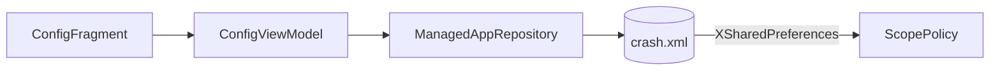

# 配置 tab — 应用列表 UI

> 适用模块：`:app` 配置域  
> 源码：`ConfigFragment.kt`、`ConfigViewModel.kt`、`ManagedAppRepository.kt`、`AppToggleAdapter.kt`  
> 决策：[ADR-023](../decisions/023-injection-observe-intercept-split.md)（观测/拦截分离仍有效）  
> 存储：[scope-and-prefs.md](scope-and-prefs.md)

## As-built（2026-06-24）

| 维度 | 行为 |
|------|------|
| 列表内容 | **全部已安装应用**（`PackageVisibilityHelper`；可按「显示系统应用」Chip 过滤） |
| 行内 Switch | ON → 包名写入 `managed_packages` → `shouldIntercept=true` |
| Switch OFF | 从 `managed_packages` 移除 → **仅观测**（`shouldInstall=true`） |
| 筛选 Chip | 全部 / 已拦截 / 仅观测 |
| 排序 Chip | 名称、安装时间、更新时间（升/降） |
| 全局 Chip | 「处理系统应用」「显示系统应用」→ `handle_system` / `show_system_ui` |
| Toolbar 菜单 | 帮助、测试崩溃、排序子菜单（无「添加应用」「全选/取消」） |
| 点击行 | 跳转 `PerAppCrashActivity`（观测历史） |

**已移除**（无迁移代码）：

- `package_list` 禁用列表模型（ADR-002 legacy）
- `intervention_rules` JSON 与 `AppInterventionEditActivity`
- 受管策展列表、`AddManagedAppBottomSheet`、`ManagedApp` / `PickableApp` 双列表
- `PrefMigrator`、`LegacyPrefSnapshotReader`、旧包 `tiiehenry.xp.grapcrash` 导入

## 数据流

## ViewModel 职责

- `loadApps()`：`ManagedAppRepository.loadInstalledApps()` → 合并 `interceptEnabled` 状态
- `toggleIntercept(pkg)`：更新 `managed_packages` 并刷新列表
- `applyFilters()`：系统 app / 拦截状态 / 搜索 / 排序

## 空态

| 条件 | 文案 |
|------|------|
| 无已安装应用可显示 | `managed_empty_message` |
| 筛选后无结果 | `filter_empty` |

## 与 hook 的关系

- **LSPosed 作用域**决定哪些进程会执行 `XposedEntry`
- **`managed_packages`** 仅决定该包是否 **拦截**；不在集合内仍 **观测**并写 JSONL（ADR-023）

## 历史文档

ADR-015 原「策展列表 + intervention_rules」方案已于 2026-06-24 移除；设计记录见 [ADR-015](../decisions/015-managed-apps-intervention-rules.md)（部分 superseded）、[pref-migrator-split-2026-06-20.md](../../dev/iterations/configuration-ui/pref-migrator-split-2026-06-20.md)（archived 叙事）。

## 相关文档

- [scope-and-prefs.md](scope-and-prefs.md)
- [configuration-ui.md](configuration-ui.md)
- [ui-routing.md](ui-routing.md)
- [usage.md](../guides/usage.md)
