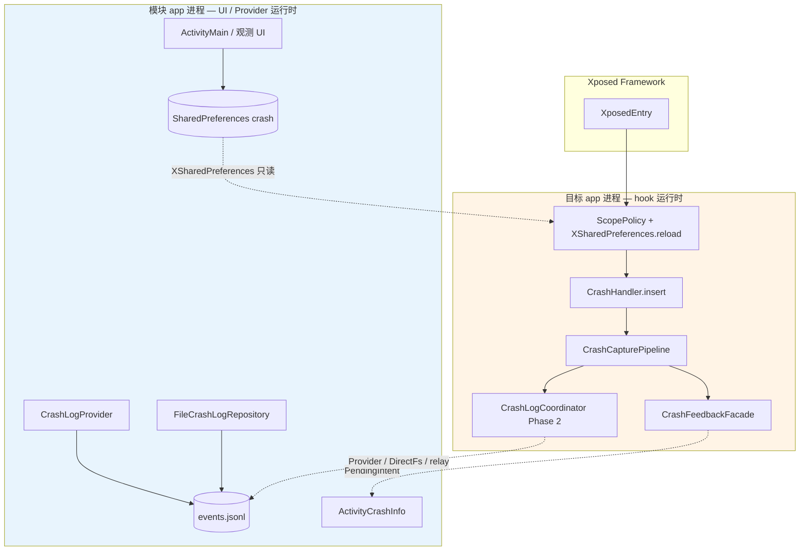
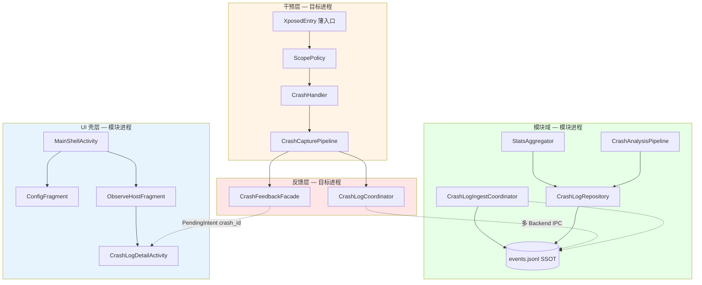
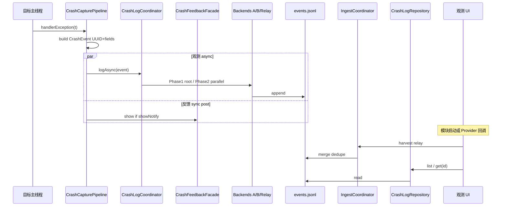

# 架构优化设计

> 适用模块：`:app`（当前单模块；Phase 4 起建议源集/子模块拆分）
> 描述性总览见 [overview.md](overview.md)；本文件为 **prescriptive** 演进方案
> 约束：不推翻 [ADR-001](../decisions/001-looper-loop-resurrection.md) Looper 续命、[ADR-002](../decisions/002-inverted-package-toggle.md) 禁用列表、[ADR-007/008](../decisions/007-crash-log-cross-process-storage.md) 存储模型

## 概述

CrashCenter 已完成 **干预层**（吞异常）、**配置 UI Shell**（Phase 3/4C-α）与 **观测读路径 MVP**（4B-α 写入 + 4C-β Paging 历史）。**4B-β root ingest、4D 统计、4G 分析** 仍待落地。当前 `:app` 单模块在 Phase 4 后半段并行实施时，须维持 hook 与 UI 包边界、Repository 读口单一化。

本文档基于源码与现有 ADR/架构文档对照，给出 **可执行的架构优化项** 与 **分阶段落地顺序**，映射至 [phase3_ui_redesign.md](../../dev/roadmap/active/phase3_ui_redesign.md) / [phase4_crash_observability.md](../../dev/roadmap/active/phase4_crash_observability.md)。

---

## 1. 现状架构摘要

### 1.1 进程与职责（as-built 2026-06-19）



### 1.2 源码包地图（as-built 2026-06-19）

| 包 / 类 | 进程 | 职责 |
|---------|------|------|
| `nota.android.crash.CrashHandler` | hook | Looper 续命 + UEH 替换 |
| `nota.android.crash.capture.CrashCapturePipeline` | hook | 观测 + 反馈单入口 |
| `nota.android.crash.log.CrashLogCoordinator` | hook | Phase 2 多后端并行写入 |
| `nota.android.crash.log.backend.*` | hook | Provider / DirectFs / TargetRelay |
| `nota.android.crash.xp.XposedEntry` | hook | 包过滤、hook 安装、委托 Pipeline |
| `nota.android.crash.xp.ScopePolicy` | hook | scope + showNotify 实例级决策 |
| `nota.android.crash.xp.PrefManager` | 共享常量 | scope + `crash_log_*` 观测键（部分） |
| `nota.android.crash.xp.app.CrashLogProvider` | 模块 | exported Provider IPC append |
| `nota.android.crash.xp.app.data.FileCrashLogRepository` | 模块 | canonical JSONL 读 |
| `nota.android.crash.xp.app.ActivityMain` | 模块 | 配置 UI 全功能单体 |
| `nota.android.crash.ActivityCrashInfo` | 模块 | 通知详情（依赖 `xp.app` UI 组件） |
| `nota.android.crash.xp.PrefMigrator` | 模块 | legacy prefs 迁移（含可选 root 读） |

### 1.3 数据流（as-is）

| 通道 | 方向 | 状态 |
|------|------|------|
| scope / 禁用列表 | UI → hook（XSharedPreferences） | ✅ 已实现 |
| 崩溃 stack | hook → 通知 Intent extra | ✅ 单次、无历史 |
| CrashEvent JSONL | hook → 模块存储 | ✅ 4B-α（Phase 2 并行；ingest defer 4B-β） |
| 分析结果 | 模块进程 | ❌ 未实现 |

---

## 2. 问题与债务清单

按 **对 Phase 4 阻塞程度** 与 **架构风险** 排序。

| 优先级 | 问题 | 现状证据 | 影响 |
|--------|------|----------|------|
| ~~**P0**~~ | ~~hook 回调与 UI 反馈未分层~~ | ✅ `CrashCapturePipeline` + `CrashFeedbackFacade`（2026-06-19） | — |
| ~~**P0**~~ | ~~`showNotify` 静态变量~~ | ✅ `ScopePolicy` → `ScopeDecision`（ADR-010） | — |
| **P1** | 观测层部分 MVP | `CrashLogCoordinator` Phase 2 ✅；ingest / root defer 4B-β | 4C UI / 4B-β ingest 仍待建 |
| **P1** | `ActivityMain` 单体 | ~450 行：列表、prefs、可见性、排序、测试 | 4C 壳层改造成本高 |
| **P1** | 包结构无域边界 | hook / UI / 详情混在同一 `:app` 扁平包 | Phase 4 多后端、Repository、Analysis 无处安放 |
| **P2** | `ActivityCrashInfo` 跨包依赖 UI | Java 类依赖 `xp.app.SystemBars`、databinding | 详情页演进（CodeEditor）牵动 UI 包 |
| **P2** | Java/Kotlin 无约定边界 | hook 核心 Java；UI Kotlin；无 `api` 模块 | 新组件语言选型随机 |
| **P2** | `PrefManager` 观测键部分落地 | `crash_log_enabled` + 三 backend toggle；`crash_log_max_entries` 等 defer 4D | retention pref UI 仍缺常量 |
| **P3** | 注释死代码 | `XposedEntry` 大段注释 stack 格式化 | 维护噪音 |
| **P3** | 无单元测试结构 | 仅 adb smoke | RuleEngine / Aggregator 难测 |
| **P3** | Notification 塞整段 stack | Intent extra `Exception` | Binder 上限；与 4E `crash_id` 目标冲突 |

**已文档化、实施前须遵守（非新债务）**：ADR-007/008 多后端、Provider 无 signature permission、分析层禁止在 hook 进程运行。

---

## 3. 目标架构

### 3.1 逻辑分层（to-be）



### 3.2 进程边界不变量

| 不变量 | 说明 |
|--------|------|
| 干预语义 | [CrashHandler](crash-handler.md) 行为不因观测层失败而改变 |
| 配置方向 | UI 写 prefs → hook `XSharedPreferences.reload()`（[ADR-003](../decisions/003-xsharedpreferences-cross-process.md)） |
| 事件方向 | hook 写 JSONL / Provider / relay → 模块 ingest → UI 读（[ADR-007/008](../decisions/008-multi-backend-crash-log-storage.md)） |
| 分析位置 | **仅模块进程**；hook 禁止 RuleEngine / LLM（[crash-intelligent-analysis.md](crash-intelligent-analysis.md)） |
| 详情深链 | 4E 后通知传 `crash_id`，stack 从 Repository 加载 |

### 3.3 Gradle 模块演进（to-be，渐进）

| 阶段 | 结构 | 说明 |
|------|------|------|
| **现在** | 单 `:app` | 可维持至 4B-α |
| **4B** | `:app` + 源集 `crash-log-api`（同模块内包） | 纯 Kotlin/JVM 接口 + `CrashEvent` 数据类 |
| **4B-β** | 可选 `:crash-log-root` 或 `app` 内 `root/` 源集 | libsu **仅模块**依赖 |
| **4C+** | UI 子包 `shell` / `config` / `observe` | 不必立即拆 Gradle 子模块 |
| **4G+** | 可选 `:crash-analysis-rules` | assets JSON + 纯 JVM 单测 |

原则：**先包内域划分，后 Gradle 物理拆分**；避免过早 multi-module 拖慢构建。

---

## 4. 包结构 / 模块划分建议

### 4.1 推荐包树（`:app` 内）

```
nota.android.crash
├── core/                    # 进程无关：CrashEvent、PrefKeys 扩展
├── hook/                    # 仅 hook classpath 热路径
│   ├── XposedEntry.kt       # 薄：loadPackage → ScopePolicy → HookInstaller
│   ├── ScopePolicy.kt       # shouldHandlePackage 纯函数 + 结果对象
│   ├── CrashHandler.java    # 保留 Java（Xposed 稳定）；或迁 Kotlin 低优先
│   ├── feedback/
│   │   └── CrashFeedbackFacade.kt   # Toast、Notification、PendingIntent
│   └── logging/
│       ├── CrashLogCoordinator.kt
│       └── backends/        # RootSu、Provider、DirectFs、TargetRelay
├── module/                  # 模块 Application 域
│   ├── ingest/
│   │   ├── CrashLogIngestCoordinator.kt
│   │   └── backends/        # RootFs、RelayMerge、LocalFs
│   ├── data/
│   │   ├── CrashLogRepository.kt
│   │   └── StatsAggregator.kt
│   └── analysis/            # Phase 4G
│       ├── RuleEngine.kt
│       └── AnalysisWorker.kt
└── xp.app/                  # Android UI
    ├── shell/
    │   └── MainShellActivity.kt
    ├── config/
    │   └── ConfigFragment.kt    # 自 ActivityMain 抽取
    ├── observe/
    │   ├── ObserveHostFragment.kt
    │   ├── CrashHistoryFragment.kt
    │   └── CrashStatsFragment.kt
    ├── detail/
    │   └── CrashLogDetailActivity.kt  # 自 ActivityCrashInfo 演进
    └── legacy/
        └── ActivityMain.kt      # 4C 前保留；壳层就绪后删除或 alias
```

### 4.2 迁移映射（现有 → 目标）

| 现有 | 目标 | 时机 |
|------|------|------|
| `xp.XposedEntry` | `hook.XposedEntry` + `feedback` + `logging` | 4B 前 refactor（小步） |
| `crash.ActivityCrashInfo` | `xp.app.detail.CrashLogDetailActivity` | 4C（CodeEditor 同期） |
| `xp.app.ActivityMain` | `config.ConfigFragment` + `shell.MainShellActivity` | 4C |
| `xp.PrefManager` | `core.PrefKeys`（Kotlin object） | 4B 起扩展观测键 |
| `xp.PrefMigrator` | `module.prefs.PrefMigrator` | 任意小 refactor |

### 4.3 依赖规则（lint / review 可 enforcement）

```
hook.*     → 可依赖 core.*；禁止依赖 xp.app.*
module.*   → 可依赖 core.*；禁止依赖 hook.*
xp.app.*   → 可依赖 module.*、core.*；禁止被 hook 依赖
CrashHandler → 仅依赖 core + Android/Xposed；不依赖 logging UI
```

---

## 5. 关键优化项

### 5.1 拆分 XposedEntry：薄入口 + 反馈门面

| 维度 | 内容 |
|------|------|
| **现状** | `XposedEntry` 承担过滤、hook、Toast、Notification、PendingIntent；通知失败 `System.exit(0)` |
| **目标** | `ScopePolicy.evaluate(lpparam)` 返回 `ScopeDecision{shouldHook, showNotify}`（**实例级**，非 static）；`CrashFeedbackFacade.show(...)` 独立 try/catch；`HookInstaller.install(app, onCrash)` 只注册 `CrashHandler` |
| **理由** | 4B 在 `onCrash` 内并行调用 `CrashLogCoordinator` 与 `CrashFeedbackFacade`，互不牵连；消除 `showNotify` 静态竞态 |
| **依赖 Phase** | **4B 前**（小 refactor，不改 hook 语义） |

### 5.2 建立 CrashCapturePipeline 单入口

| 维度 | 内容 |
|------|------|
| **现状** | 异常回调内联 lambda |
| **目标** | `CrashCapturePipeline.onException(ctx, eventBuilder)`：构建 `CrashEvent` → 投递 `CrashLogCoordinator.logAsync` → 若 `showNotify` 则 `CrashFeedbackFacade` |
| **理由** | 观测与反馈 **同触发、异失败域**；便于单测 event 字段完整性 |
| **依赖 Phase** | **4B-α** |

### 5.3 PrefKeys 统一与观测配置

| 维度 | 内容 |
|------|------|
| **现状** | `PrefManager` 仅 scope 键；Phase 4 键在 [scope-and-prefs.md](scope-and-prefs.md) 文档 |
| **目标** | `core.PrefKeys` 含 `crash_log_*` 常量；UI 写、hook `XSharedPreferences` 读同一 SSOT |
| **理由** | 避免实现与文档漂移；4D retention UI 直接引用 |
| **依赖 Phase** | **4B-α**（与 Coordinator 同步） |

### 5.4 ActivityMain → ConfigFragment + MainShellActivity

| 维度 | 内容 |
|------|------|
| **现状** | 单 Activity 承载全部配置 |
| **目标** | [navigation-ia.md](navigation-ia.md) / [ui-routing.md](ui-routing.md)：`MainShellActivity` + 底栏 2 tab；配置 tab 为 `ConfigFragment`（原布局几乎平移） |
| **理由** | 4C 观测 tab 与配置 tab 并行；避免 4D 二次壳层重构 |
| **依赖 Phase** | **4C**（与历史 UI 同批） |

### 5.5 CrashLogRepository 作为 UI 唯一读口

| 维度 | 内容 |
|------|------|
| **现状** | 无持久化读路径 |
| **目标** | `CrashLogRepository`：读 `events.jsonl`、按 `crash_id` 查、清空、retention；`StatsAggregator` 仅依赖 Repository |
| **理由** | 历史 / 统计 / 详情 / 导出 / 分析共用 SSOT；未来 Room 迁移只改 Repository |
| **依赖 Phase** | **4B-β**（ingest 后）+ **4C/4D** UI |

### 5.6 ActivityCrashInfo → CrashLogDetailActivity + CodeEditor

| 维度 | 内容 |
|------|------|
| **现状** | `TextView` + Intent `Exception`；类在 `nota.android.crash` 却依赖 `xp.app` |
| **目标** | `CrashLogDetailActivity` 于 `xp.app.detail`；`CrashLogViewerClient`（[code-editor-porting.md](code-editor-porting.md)）；参数 `crash_id` 优先 |
| **理由** | 统一历史与通知详情；解除反向 UI 依赖 |
| **依赖 Phase** | **4C**（详情）+ **4E**（通知 `crash_id`） |

### 5.7 模块侧 ingest 与 UI 解耦

| 维度 | 内容 |
|------|------|
| **现状** | 无 `Application` 级 ingest |
| **目标** | `CrashCenterApplication.onCreate` → `CrashLogIngestCoordinator.schedule()`；Provider insert 回调亦可触发 |
| **理由** | 用户打开 UI 前 relay 已 merge；统计基于 canonical |
| **依赖 Phase** | **4B-β** |

### 5.8 分析层管道（模块进程）

| 维度 | 内容 |
|------|------|
| **现状** | 仅 [crash-intelligent-analysis.md](crash-intelligent-analysis.md) 方案 |
| **目标** | ingest 后对 **新 id** 入队 `AnalysisWorker`；详情 lazy 补算；**禁止** hook 引用 |
| **理由** | 4G 不污染 4B–4E；规则引擎可 JVM 单测 |
| **依赖 Phase** | **4G**（backlog） |

---

## 6. 数据流与边界强化

### 6.1 CrashEvent 管道（to-be）



### 6.2 配置 vs 事件体（边界 SSOT）

| 数据 | 存储 | 写入方 | 读取方 |
|------|------|--------|--------|
| scope、禁用列表、观测开关 | `shared_prefs/crash.xml` | UI | hook `XSharedPreferences` |
| CrashEvent 行 | `files/crash_logs/events.jsonl` | hook Backend / Provider | 模块 Repository |
| relay 副本 | 目标 app `files/crashcenter_relay/` | hook TargetRelay | 模块 root ingest |
| analysis 扩展 | JSONL inline 或 sidecar | 模块 AnalysisWorker | UI 详情 / 统计 |

**禁止**：stack 写入 prefs；hook 侧 `System.exit` 因日志或通知失败。

### 6.3 IPC 失败域隔离

```
try { CrashFeedbackFacade } catch { log only — 不 exit }
try { CrashLogCoordinator } catch { silent }
// 现有 XposedEntry catch System.exit → 移除或仅限不可恢复错误
```

与 [crash-log-ipc.md](crash-log-ipc.md) § 失败模式一致。

---

## 7. UI 壳层与导航统一

### 7.1 目标壳层

遵循 [navigation-ia.md](navigation-ia.md)、[ui-routing.md](ui-routing.md)：

| 层级 | 组件 | 说明 |
|------|------|------|
| L1 | `MainShellActivity` | Toolbar + Xposed 状态条 + BottomNav(2) + NavHost |
| L2 配置 | `ConfigFragment` | ADR-005 单屏高密度不变 |
| L2 观测 | `ObserveHostFragment` + TabLayout | 历史（4C）\| 统计（4D） |
| L3 | `CrashLogDetailActivity` | `crash_id` / 兼容 `Exception` |
| L3 | `PerAppCrashActivity` | 4D 单应用观测 |

### 7.2 实施顺序建议

1. **4C 第一批**：新建 `MainShellActivity` 为 Launcher；`ActivityMain` 逻辑迁入 `ConfigFragment`；观测 tab 占位或仅历史 Fragment
2. **4D**：观测内层 TabLayout 增加统计；`PerAppCrashActivity`
3. **4E**：通知改 `crash_id`；SAF 导出挂观测 Toolbar
4. **4F**：`LogcatImportActivity` 独立 L3，不进 bottom nav

**不做的导航**：第三 bottom tab；About/Test 独立 Activity；设置迁出配置 tab（ADR-005）。

---

## 8. 分阶段落地计划

与 roadmap checkbox 映射：

| 优化项 | Phase 3 | 4B-α | 4B-β | 4C | 4D | 4E | 4G |
|--------|---------|------|------|----|----|----|-----|
| 消除 showNotify static + 反馈/日志 try 隔离 | 可选小 PR | ✅ **2026-06-19** | | | | | |
| PrefKeys 扩展观测键（enable + backend toggles） | | ✅ 部分 | | | | | |
| CrashLogBackend + Coordinator（Phase 2 并行） | | ✅ | | | | | |
| CrashLogProvider + CanonicalJsonlWriter retention | | ✅ | | | | | |
| RootSuBackend（Phase 1） | | | ✅ | | | | |
| CrashLogIngestCoordinator + relay merge | | | ✅ | | | | |
| FileCrashLogRepository 读 + 历史 UI | | 读 ✅ | | ✅ | | | |
| MainShell + ConfigFragment | | | | ✅ | | | |
| CrashLogDetail + CodeEditor | | | | ✅ | | | |
| StatsAggregator + 观测 tab 统计 | | | | | ✅ | | |
| 通知 crash_id | | | | | | ✅ | |
| AnalysisWorker + RuleEngine | | | | | | | ✅ |

### 8.1 Phase 3 收尾（并行、低风险）

- [ ] `ActivityCrashInfo` 复制/分享（不改变架构）
- [ ] 可选：提取 `SystemBars` 到 `xp.app.common`，减轻详情页跨包依赖 — 为 4C 铺垫

### 8.2 Phase 4B 实施顺序（as-built + 剩余）

**4B-α 已完成**：

1. `CrashEvent` + `PrefManager` 观测键（部分）
2. `nota.android.crash.log.*` Backend 接口 + Phase 2 三后端 + `CrashLogBackendRegistry`
3. `CrashCapturePipeline` + `CrashLogCoordinator` 接入 `XposedEntry`
4. `CrashLogProvider` + `CanonicalJsonlWriter`（500/8MB retention）
5. `FileCrashLogRepository` 读 canonical

**4B-β 剩余**：

1. `RootSuBackend` Phase 1
2. `CrashLogIngestCoordinator` + root relay harvest
3. IS-1~IS-6 / IS-R1~IS-R5 真机矩阵 → `dev/verification/`
4. dedupe / `ingestedFrom` 字段

### 8.3 Phase 4C+ UI 顺序

1. 壳层 + ConfigFragment（不阻塞 4B 验收）
2. `CrashHistoryFragment` + Repository
3. `CrashLogDetailActivity` 替换 TextView 详情
4. 4D 统计与 4G 分析 **可并行**，但聚类统计依赖 4G-V2 signatureHash

---

## 9. 风险与不做的事

### 9.1 风险

| 风险 | 缓解 |
|------|------|
| 过早 multi-module Gradle | 先包内域；4B 仅 optional 源集 |
| refactor XposedEntry 引入回归 | 小步 + adb smoke + Test 菜单；hook 语义不变 |
| 壳层与 4B 并行冲突 | 4B 不依赖 UI；壳层仅 4C |
| Repository 全文件扫描性能 | MVP 可接受；4E 可选 sidecar 索引 |
| libsu 体积 | 仅模块进程；hook 禁止依赖 |

### 9.2 明确 defer（scope 外）

| 项 | 理由 |
|----|------|
| Framework / system_server 注入为主路径 | [framework-injection-feasibility.md](framework-injection-feasibility.md) 已否决 |
| Room 作为 MVP 存储 | ADR-007 明确 JSONL 先行 |
| Clean Architecture 全套 UseCase 层 | 模块规模小；Repository + Coordinator 足够 |
| 第三 bottom tab / 独立 Settings Activity | ADR-005 + navigation-ia |
| hook 侧 RuleEngine / LLM | crash-intelligent-analysis 禁止 |
| 自动修复目标 app（pm clear 等） | 产品哲学：只吞不修 |
| Material 3 全量迁移 | ADR-006 defer |
| 多 `:app` flavor 分 hook/UI | 单 APK Xposed 模块无必要 |

### 9.3 建议 ADR（实施前评估）

> **编号勘误（2026-06-20）**：ADR-009~015 已占用（UI Shell、ScopePolicy、迁移、受管应用等）。下表使用 **新预留编号**，勿与现有 ADR 混淆。

| 编号 | 触发条件 | 状态 |
|------|----------|------|
| **ADR-017** | 4B-β root ingest + JSONL dedupe 语义（ADR-008 跟进） | proposed — [017-root-ingest-and-dedupe.md](../decisions/017-root-ingest-and-dedupe.md) |
| **ADR-021** | canonical JSONL FileLock 统一 + 读序降序 | proposed — [021-canonical-jsonl-io-consistency.md](../decisions/021-canonical-jsonl-io-consistency.md) |
| **ADR-019** | 4D retention pref + `Repository.clear()` API | 待 4D 立项 |
| **ADR-020** | 引入 Hilt 替代 `ServiceLocator` | 待 D-05 拍板 |
| **ADR-023** | 4G-V3 端侧 LLM 或云端 API 分析 — 隐私与数据出境边界 | 待 4G 立项 |
| （可选）**ADR-024** | Gradle 拆 `:crash-log-root` 独立模块 — libsu 版本与 ProGuard | 待 libsu 落地 |

当前优化项 **不强制** 全部新建 ADR；与 ADR-001/002/007/008 **无冲突**。

---

## 10. 验收与可测试性

| 类型 | 手段 |
|------|------|
| 构建 | `./gradlew :app:assembleDebug` |
| 设备 smoke | `./scripts/adb-smoke-verification.sh` |
| 4B 矩阵 | IS-1~IS-6、IS-R1~IS-R5 → `dev/verification/` |
| 单元测试 | `RuleEngine`、`StatsAggregator`、`ScopePolicy` 纯 JVM（不启 Xposed） |
| 架构门禁 | hook 包 import 检查不引用 `xp.app`；`CrashLogCoordinator` 不调用 `System.exit` |

---

## 与独立文档的分工

本文档为 **prescriptive** 演进总纲。以下新建文档从 §5.1–5.2 扩展出独立规格：

| 本文档章节 | 独立文档 | 分工 |
|-----------|----------|------|
| §5.1 拆分 XposedEntry + §5.2 Pipeline | [crash-capture-pipeline.md](crash-capture-pipeline.md) | Pipeline 完整接口、字段映射、时序 |
| §5.1 ScopePolicy | [ADR-010](../decisions/010-scope-policy-show-notify.md) | static showNotify 消除决策 |
| §6.3 失败域隔离 | [ADR-011](../decisions/011-feedback-failure-isolation.md) | System.exit 移除决策 |
| §5.5 CrashLogRepository | [crash-data-layer.md](crash-data-layer.md) | Repository 接口、retention、StatsAggregator |
| §5.4 Shell + ConfigFragment | [design-system.md](design-system.md) | Design System 共享组件清单 |
| §7 UI 壳层 | [crash-history-ui.md](crash-history-ui.md) | 历史列表 IA、字段、筛选 |

**原则**：本文档保留架构全景与优化项索引；具体接口与决策细节以独立文档为准。

## 相关文档

- [overview.md](overview.md) — 系统总览（as-is 描述）
- [crash-capture-pipeline.md](crash-capture-pipeline.md) — hook 侧 Pipeline（§5.1–5.2 扩展）
- [crash-data-layer.md](crash-data-layer.md) — Repository 与聚合（§5.5 扩展）
- [design-system.md](design-system.md) — Design System 共享组件
- [crash-history-ui.md](crash-history-ui.md) — 历史列表 UI
- [crash-export-retention.md](crash-export-retention.md) — 导出与 retention 管理
- [xposed-entry.md](xposed-entry.md) — hook 入口
- [crash-handler.md](crash-handler.md) — 干预层
- [crash-logging.md](crash-logging.md) — 观测层
- [crash-log-backends.md](crash-log-backends.md) — 多后端
- [crash-log-ipc.md](crash-log-ipc.md) — IPC FAQ
- [navigation-ia.md](navigation-ia.md) — 导航 IA
- [ui-routing.md](ui-routing.md) — 路由 SSOT
- [crash-intelligent-analysis.md](crash-intelligent-analysis.md) — 分析层
- [configuration-ui.md](configuration-ui.md) — 配置 UI
- [scope-and-prefs.md](scope-and-prefs.md) — prefs 模型
- [ADR-010](../decisions/010-scope-policy-show-notify.md) — ScopePolicy
- [ADR-011](../decisions/011-feedback-failure-isolation.md) — 失败域隔离
- [ADR-012](../decisions/012-package-visibility-manual-grant.md) — 包可见性授权
- [ADR-013](../decisions/013-notification-crash-id-intent.md) — 通知 crash_id
- [ADR-014](../decisions/014-legacy-prefs-migration.md) — 旧 prefs 迁移
- [phase4_crash_observability.md](../../dev/roadmap/active/phase4_crash_observability.md) — Phase 4 任务
- [phase3_ui_redesign.md](../../dev/roadmap/active/phase3_ui_redesign.md) — Phase 3 任务
- [glossary.md](../glossary.md) — 术语
