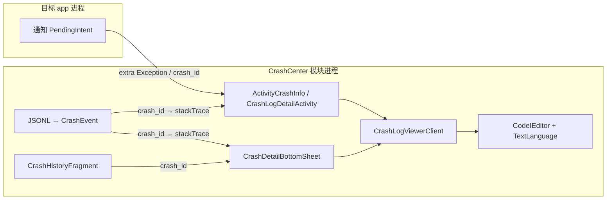

# CodeEditor 移植方案（日志浏览）

> 参照项目：celestailruler（外部 sibling，路径 `/home/clarence/Projects/Android/celestailruler`）
> 源码对照：`CrashInfoActivity.kt`、`BaseCodeEditorClient.kt`、`CodeEditor` / `CodeEditorClient` 模块
> 关联：[crash-notification.md](crash-notification.md)、[crash-logging.md](crash-logging.md)、[navigation-ia.md](navigation-ia.md)

## 结论（Executive Summary）

**推荐移植 celestailruler 的 `CodeEditor` + `CodeEditorClient` 两套 library 模块**，以 `BaseCodeEditorClient`（只读浏览模式）替换当前 `ActivityCrashInfo` 的 `TextView`，并在 Phase 4C **崩溃历史详情**复用同一组件浏览 `stackTrace` / 格式化 `CrashEvent` JSON。

- **不必**为日志浏览引入 `CodeEditorAntlr`（Lua 语法）；默认 `TextLanguage` 即可覆盖 stack trace 与 JSONL 行。
- **不必**使用 celestailruler 的 `CodeEditorClient` 子类（Lua 保存/运行）；那是脚本编辑场景。
- celestailruler 已在 `CrashInfoActivity` 验证过**与 CrashCenter 同构**的崩溃详情场景。
- **Hybrid dual-carrier**：壳内观测域用 `CrashDetailBottomSheet`（半屏 + Editor）；外部通知 / 深链仍用全屏 `ActivityCrashInfo` / `CrashLogDetailActivity`。两载体共用 `CrashLogViewerClient`。
- 详情属于 **observe/detail domain**：Activity 路由契约为 `crash_detail`；壳内 Sheet 路由为 `crash_detail_sheet`；参数优先 `crash_id`，兼容旧 `Exception` extra。

---

## celestailruler 编辑器架构

### 模块分层

```
:CodeEditor          — 核心 View（CodeEditor / CodeTextField）、Document、TextLanguage
:CodeEditorAntlr     — ANTLR 语法（Lua 等）；日志浏览可不依赖
:CodeEditorClient    — UI 壳：contents_codeeditor 布局 + BaseCodeEditorClient
:app                 — CrashInfoActivity / CodeEditorClient(Lua) 等业务集成
```

| 模块 | namespace | minSdk | 体量（约） | CrashCenter 是否需要 |
|------|-----------|--------|------------|---------------------|
| `CodeEditor` | `tiiehenry.code` | 21 | ~49 Java 文件 | ✅ |
| `CodeEditorClient` | `tiiehenry.code.editor.client` | 21 | ~36 kt/java | ✅ |
| `CodeEditorAntlr` | `tiiehenry.code.antlr` | 21 | ANTLR runtime | ❌ MVP 日志浏览 |

### 核心类职责

| 类 | 职责 |
|----|------|
| `CodeEditor` / `CodeTextField` | 可编辑文本场：行号、选区、undo、LexTask 着色 |
| `TextLanguage` | 默认语言；`isWordWrap = true`；无 ANTLR |
| `CodeIEditor` | `CodeEditor` + `IEditor` 适配器池（undo / search / cursor） |
| `BaseCodeEditorClient` | inflate `contents_codeeditor`；初始化查找替换、浮动按钮、暗色主题 |
| `CodeEditorClient` | 继承 Base；绑定 **Lua** 语言 + 保存/运行/说明模式（**日志场景不用**） |

### `contents_codeeditor` UI 能力（日志浏览相关）

| 区域 | 能力 |
|------|------|
| `CodeIEditor` | 大文本滚动、行号、选区复制 |
| `FindReplaceLayout` + `CESearcher` | 查找 / 替换 / 正则 / 大小写 |
| `SelectOperateLayout` | 选区快捷操作 |
| `QuickControlLayout` | undo / redo |
| `QuickFloatLayout` | 左下浮动：`upView`（保存）、`downView`（退出） |
| `QuickInputLayout` | 快捷输入条（日志只读模式可隐藏） |

默认 `CodeTextField.Default.language = TextLanguage.getInstance()`，故未显式设 `language` 时仍可工作（celestailruler `CrashInfoActivity` 即如此）。

---

## celestailruler 崩溃详情参考实现

```kotlin
// tiiehenry.celestialruler.crashinfo.CrashInfoActivity
val client = BaseCodeEditorClient(this, this, inflater, resources)
client.initView()
container.addView(client.layout, MATCH_PARENT, MATCH_PARENT)
client.codeEditor.setText(intent.getStringExtra("Exception"))
client.quickFloatLayout.downView.setOnClickListener { finish() }
```

与 CrashCenter 对照：

| 项 | celestailruler | CrashCenter 现状 |
|----|----------------|------------------|
| Activity | `CrashInfoActivity` | `nota.android.crash.ActivityCrashInfo` |
| Intent extra | `Exception` | 同左（[crash-notification.md](crash-notification.md)） |
| 展示控件 | `BaseCodeEditorClient` | `TextView`（ViewBinding） |
| 退出 | 浮动 `downView` | Toolbar navigate up |

移植后 **Intent 契约不变**，通知 `PendingIntent` 无需改动。

---

## CrashCenter 使用场景

### 场景 A — 通知 / 即时详情（Phase 3，优先）

- **载体**：`ActivityCrashInfo`（或重命名 / 新建 `CrashLogDetailActivity` 可选）
- **数据**：`Intent.getStringExtra("Exception")`（`Log.getStackTraceString` 全文）
- **模式**：只读浏览 + 查找；隐藏保存浮动钮

### 场景 B — 历史单条详情（Phase 4C，壳内）

- **载体**：`CrashDetailBottomSheet`（Draggable Half Sheet）
- **数据**：`CrashEvent.stackTrace`；以 `crash_id` 从 `events.jsonl` 加载（避免 Binder 限制，见 [crash-logging.md](crash-logging.md)）
- **入口**：`CrashHistoryFragment` / `PerAppCrashActivity` / 统计下钻 item 点击

### 场景 B′ — 历史 / 通知详情（Phase 4C+，外部 Activity）

- **载体**：`CrashLogDetailActivity` / 兼容扩展后的 `ActivityCrashInfo`（全屏）
- **数据**：同场景 B；或通知直传 `Exception` extra
- **入口**：通知 PendingIntent、深链、logcat 导入详情（Phase 4F）

### 场景 C — JSONL 文件抽查（Phase 4D+，可选）

- 打开 `files/crash_logs/events.jsonl` 子集或导出文件
- 大文件：编辑器 Document 已按行管理；仍建议 **按条加载** 或分页，避免一次 `setText` 数 MB

| 场景 | 语言 | 需要 Antlr |
|------|------|------------|
| stack trace | `TextLanguage` | 否 |
| 单行 JSON | `TextLanguage` 或后续 `JsonLanguage` | 可选 |
| Lua 脚本 | `LuaLanguage` | 是 |

---

## 移植路径对比

| 方案 | 做法 | 优点 | 缺点 |
|------|------|------|------|
| **A. Gradle 相对路径 include** | `settings.gradle` 指向 `../celestailruler/CodeEditor*` | 零拷贝；上游修 bug 可同步 | 构建依赖 sibling 目录；CI 须 checkout 两仓库 |
| **B.  vendoring 拷贝** | 复制 `CodeEditor` + `CodeEditorClient` 到本仓库 `editor/` | 单仓库自包含；CI 简单 | 与上游 diff 需手动合并 |
| **C. 发布 AAR** | mavenLocal / Maven 坐标 | 版本化 | 当前无发布流水线；维护成本高 |

**推荐**：开发期 **方案 A**（与 celestailruler 同机 sibling）；发布前 **方案 B** 固化一版到 CrashCenter 或私有 Maven。

`settings.gradle` 示例（方案 A）：

```gradle
include ':CodeEditor', ':CodeEditorClient'
project(':CodeEditor').projectDir = file('../celestailruler/CodeEditor')
project(':CodeEditorClient').projectDir = file('../celestailruler/CodeEditorClient')
```

`app/build.gradle`：

```gradle
implementation project(':CodeEditorClient')
```

---

## 依赖与构建对齐

### 需处理的依赖

| 依赖 | 说明 | 移植动作 |
|------|------|----------|
| `androidx.constraintlayout` | CodeEditorClient 布局 | CrashCenter 已有 |
| `androidx.annotation` | Client | 随 Client 传递 |
| `androidx.legacy:preference-v14` | Client build.gradle | 可评估是否仍需要 |
| `tiiehenry.nota.toolkit:android-base:+` | Client build.gradle 声明 | **源码未引用**；移植时 **删除** |
| `org.antlr:antlr4-runtime` | 仅 Antlr 模块 | 不引入 Antlr 则无 |

### 与 CrashCenter 工具链对齐

| 项 | celestailruler 模块 | CrashCenter `:app` | 动作 |
|----|---------------------|-------------------|------|
| compileSdk | 36 | 36 | ✅ |
| minSdk | 21 | 21 | ✅ |
| Java | Client 11 | 17 | 模块保持 11 或升到 17 |
| Kotlin | Client 有 | 2.3 | 仅 Client 模块需 kotlin 插件 |
| namespace | `tiiehenry.code.*` | `nota.android.crash.xp.app` | **保留编辑器 namespace**，避免大规模改包名 |

---

## CrashCenter 集成设计

### observe/detail 包边界

| 元素 | 建议包 | 说明 |
|------|--------|------|
| `CrashLogViewerClient` | `nota.android.crash.xp.app.view` | Design System 与 CodeEditor 的适配层，只读日志浏览 |
| `CrashDetailBottomSheet` | `nota.android.crash.xp.app.observe` | 壳内半屏详情；inflate `CrashLogViewerClient` |
| `CrashLogDetailActivity` / `ActivityCrashInfo` | `nota.android.crash` | **外部** L3 任务页，manifest 显式 Component 兼容通知 |
| `CrashHistoryFragment` | `nota.android.crash.xp.app.observe` | 传 `crash_id` → `CrashDetailBottomSheet` |
| `PerAppCrashActivity` | `nota.android.crash.xp.app.observe` | 单应用列表，复用 `CrashEventRow` 与 Sheet 详情路由 |

`CrashLogViewerClient` 不持有历史列表状态；它只接收已经解析出的文本并展示。由 **Sheet 或 Activity 宿主** 负责加载 `CrashEvent` 并调用 `showStackTrace()`。

### Sheet vs Activity 双载体

| 维度 | `CrashDetailBottomSheet`（壳内） | `ActivityCrashInfo` / `CrashLogDetailActivity`（外部） |
|------|----------------------------------|--------------------------------------------------------|
| 触发 | 历史 / 单应用 / 统计下钻列表点击 | 通知 PendingIntent、深链、logcat 导入 |
| 布局 | Draggable Half Sheet：DragHandle + 可选 title + Editor 内容区 | 全屏：Toolbar + Editor 内容区 |
| Sheet 规范 | 28dp 顶圆角、`peekHeight` 50%、DragHandle-only 拖曳；对齐 `AddManagedAppBottomSheet` | N/A |
| 关闭 | scrim tap / ✕ / DragHandle 拖至 dismiss | Toolbar navigate up / 浮动 `downView`（Activity 模式） |
| 禁止模式 | **不** 用 settings-card-detail-sheet（metadata 16dp 装饰把手） | — |

**`CrashLogViewerClient` Sheet 适配**（相对 Activity 默认行为）：

| 控件 / 行为 | Activity 模式 | Sheet 模式 |
|-------------|---------------|------------|
| `quickFloatLayout.upView`（保存） | `GONE` | `GONE` |
| `quickFloatLayout.downView`（退出） | `finish()` Activity | **隐藏**；由 Sheet chrome ✕ / dismiss 关闭 |
| `quick_input_layout` | `GONE` | `GONE` |
| Find / Replace | 保留（Toolbar 或 Editor 内入口） | 保留 |
| `isEditable` | `false` | `false` |
| 宿主回调 | `(hostContext as? Activity)?.finish()` | 可选 `onDismissRequest` lambda 供 Sheet 调用 |

Sheet 宿主在 `onViewCreated` 中创建 `CrashLogViewerClient`，将 `client.layout` 加入 Sheet 内容容器；参数 `crash_id` 经 arguments 传入，ViewModel / Repository 异步加载 stack 后 `showStackTrace()`。

### 1. `CrashLogViewerClient`（建议新建）

继承 `BaseCodeEditorClient`，封装日志只读模式：

```kotlin
// nota.android.crash.xp.app.view.CrashLogViewerClient（示意）
class CrashLogViewerClient(
    ...,
    private val onDismiss: (() -> Unit)? = null,  // Sheet 模式传入；Activity 可 null 并用 finish()
) : BaseCodeEditorClient(...) {
    override fun initView() {
        codeEditor.language = TextLanguage.getInstance()
        super.initView()
        codeEditor.isEditable = false
        quickFloatLayout.upView.visibility = View.GONE
        if (onDismiss != null) {
            quickFloatLayout.downView.visibility = View.GONE
        } else {
            quickFloatLayout.downView.setOnClickListener {
                (hostContext as? Activity)?.finish()
            }
        }
        layout.findViewById<View>(R.id.quick_input_layout)?.visibility = View.GONE
    }

    fun showStackTrace(text: String?) {
        codeEditor.setText(text ?: "")
    }
}
```

### 2. 外部 Activity：`ActivityCrashInfo` / `CrashLogDetailActivity`

- 保留 Toolbar + `SystemBars`（与 [configuration-ui.md](configuration-ui.md) 一致）
- 内容区：`FrameLayout` 承载 `client.layout`（替代 `TextView`）
- `onCreate` 参数优先级：`crash_id` → Repository 加载 `CrashEvent.stackTrace`；否则 `Exception` → 直接展示旧通知 stack
- `onCreate` 参数优先级：`crash_id` → Repository 加载 `CrashEvent.stackTrace`；否则 `Exception` → 直接展示旧通知 stack
- 若类名保留为 `ActivityCrashInfo`，manifest 与通知 Component 可不变

### 3. 壳内 Sheet：`CrashDetailBottomSheet`

- 继承 `BottomSheetDialogFragment`；`BottomSheetBehavior`：`peekHeight` = 50% 屏高、`isDraggable = true`、**仅 DragHandle 命中拖曳**（对齐 [AddManagedAppBottomSheet](app-management-ui.md) / M5 实现）
- arguments：`crash_id` 或预览用 `Exception`
- 内容区：`FrameLayout` + `CrashLogViewerClient(..., onDismiss = { dismiss() })`
- 顶栏：DragHandle（必填）+ 可选居中 title（应用名 / 异常类）+ ✕ 关闭
- **不** 使用 settings-card-detail-sheet 布局或 16dp metadata 顶缘

### 4. Phase 4C 历史详情

- 列表 → `CrashDetailBottomSheet.show()` + `crash_id`
- ViewModel / Repository 从 `events.jsonl` 读单行 → `showStackTrace(event.stackTrace)`
- 与 [navigation-ia.md](navigation-ia.md) 观测 tab 和 [ui-routing.md](ui-routing.md) `crash_detail_sheet` 路由一致；通知仍走 `crash_detail` Activity

### 5. 主题与资源

`BaseCodeEditorClient` 使用 `CodeEditorClient` 模块内颜色（`main_content_background_color` 等），与 CrashCenter Fluent 色板可能不一致。

| 策略 | 说明 |
|------|------|
| **短期** | 沿用 Client 模块资源，仅保证暗色模式 `setDark(night)` 可用 |
| **中期** | 在 CrashCenter 覆盖 `values/colors.xml` 同名资源，或 fork `initCodeEditorSetting` 对齐 [configuration-ui.md](configuration-ui.md) token |

---

## 数据流（移植后）



---

## 实施阶段（建议写入 roadmap）

| 阶段 | 任务 | 产出 |
|------|------|------|
| **P0** | Gradle include `CodeEditor` + `CodeEditorClient`；删 `android-base` 依赖 | 编译通过 |
| **P1** | `CrashLogViewerClient` + 改造 `ActivityCrashInfo` | 通知详情可查找/滚动 |
| **P2** | 主题色对齐、只读 UX 打磨（隐藏无关控件） | 与配置页视觉一致 |
| **P3** | `CrashDetailBottomSheet` + 历史 / 单应用列表接入 | 壳内半屏详情 |
| **P3b** | Sheet 模式 Client 适配（隐藏 downView、onDismiss） | 与 AddManagedAppBottomSheet 一致 |
| **P4**（可选） | `JsonLanguage` 或 Antlr 美化 JSON 行 | 历史 JSON 高亮 |

**不在 MVP**：Lua `CodeEditorClient`、自动补全、`CodeEditorAntlr` 全量引入。

---

## 风险与缓解

| 风险 | 缓解 |
|------|------|
| sibling 路径缺失导致 CI 失败 | vendoring 或 submodule；CI 脚本检测目录 |
| 超大 stack 一次 `setText` 卡顿 | 异步加载 + `ProgressDialog`；Phase 4 用 `eventId` 懒加载 |
| `ProgressDialog` 已废弃（Base 内 format 用） | 日志只读不走 format；或换 `AlertDialog` / Material 进度 |
| 编辑器默认可编辑 | `isEditable = false`；防止误改日志 |
| 浮动保存钮误触 | `upView` 隐藏或禁用 |

---

## 与现有文档关系

| 文档 | 关系 |
|------|------|
| [crash-notification.md](crash-notification.md) | Intent `Exception` extra → 编辑器 `setText` |
| [crash-logging.md](crash-logging.md) | 历史数据 → 场景 B/C |
| [framework-injection-feasibility.md](framework-injection-feasibility.md) | celestailruler 另一子系统；编辑器 **独立**，不依赖 framework hook |
| [configuration-ui.md](configuration-ui.md) | ActivityCrashInfo 布局变更 |

---

## 相关文档

- [navigation-ia.md](navigation-ia.md) — Phase 4C 观测详情入口
- [ui-routing.md](ui-routing.md) — `crash_detail` / `crash_detail_sheet` / `per_app_crash` 路由
- [crash-history-ui.md](crash-history-ui.md) — 历史列表 → `CrashDetailBottomSheet`
- [design-system.md](design-system.md) — `CrashDetailBottomSheet` 观测域组件
- [app-management-ui.md](app-management-ui.md) — `AddManagedAppBottomSheet` Half Sheet 参考实现
- [ADR-009](../decisions/009-ui-shell-design-system.md) — observe/detail 域与 Design System 边界
- [glossary.md](../glossary.md) — CrashEvent、events.jsonl
- celestailruler `dev/DEV_GUIDE.md` — 上游模块地图
