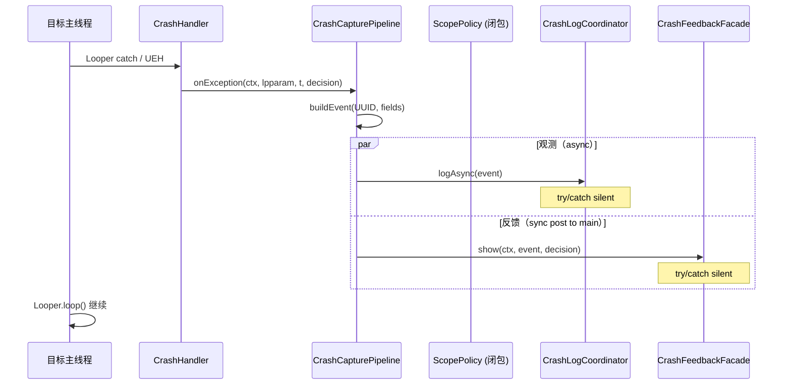

# 崩溃采集管道

> 适用模块：`:app`（Phase 4B 实现）
> 源码入口：`XposedEntry` → `CrashHandler.install` → `ExceptionHandler` 回调
> 相关 ADR：[ADR-010](../decisions/010-scope-policy-show-notify.md)、[ADR-011](../decisions/011-feedback-failure-isolation.md)、[ADR-023](../decisions/023-injection-observe-intercept-split.md)
> 上游：[crash-handler.md](crash-handler.md)（干预层）
> 下游：[crash-log-backends.md](crash-log-backends.md)（多后端写入）、[crash-notification.md](crash-notification.md)（反馈）

## 概述

`CrashCapturePipeline` 是 hook 侧将异常转化为**结构化事件**并并行投递到观测/反馈路径的单入口。它运行在目标 app 进程的崩溃回调中，解决当前 `XposedEntry.hookToGrabCrash` 内联 lambda 中 Toast/Notification/日志路径混杂、`System.exit(0)` 跨路径传染的问题。

**核心不变量**：

- Pipeline 内任何路径失败 **不得** 改变 INTERCEPT 模式下 [CrashHandler](crash-handler.md) 的 Looper 续命语义
- 观测路径（`CrashLogCoordinator`）与反馈路径（`CrashFeedbackFacade`）**同触发、异失败域**
- Pipeline 不持有 `static showNotify`；通知决策由 `ScopePolicy` 实例级输出

## 现状问题（已解决 2026-06-19）

历史债务对照（实施前）：

| 问题 | 原代码证据 | 现状 |
|------|----------|------|
| `showNotify` static | `XposedEntry` 类级字段 | `ScopePolicy` → `ScopeDecision` |
| 反馈/日志同 try + `System.exit` | `hookToGrabCrash` catch | Pipeline + Facade 独立 try；无 exit |
| 无日志持久化 | 仅 log + UI | `CrashLogCoordinator` Phase 2 并行 ✅ |
| PendingIntent 塞整段 stack | Intent extra | 仍待 4E `crash_id` |

## 目标架构

```
CrashHandler.install(mode, exceptionHandler)
  └── exceptionHandler.handleException(throwable, source)
        └── CrashCapturePipeline.onException(...)
              ├── [1] 构建 CrashEvent
              ├── [2] 观测：shouldIntercept ? logAsync : logSync
              └── [3] 反馈：CrashFeedbackFacade.show（通常仅 intercept + showNotify）
```

### ScopePolicy（ADR-023）

```
ScopePolicy.evaluate(...) → ScopeDecision {
    shouldInstall: Boolean,
    shouldIntercept: Boolean,
    showNotify: Boolean,
    crashLogEnabled: Boolean
}
```

### CrashCapturePipeline

| 方法 | 职责 |
|------|------|
| `onException(ctx, lpparam, throwable, decision)` | 主入口；构建 event → 并行投递 |
| `buildEvent(ctx, lpparam, throwable)` | 填充 `CrashEvent` 所有字段（UUID、timestamp、stack 等） |

Pipeline **不**决定是否 hook（已由 ScopePolicy 在 `handleLoadPackage` 阶段完成）。

### CrashLogCoordinator

hook 侧写入协调器。**4B-α as-built**：仅 Phase 2 并行（`RootSuBackend` defer 4B-β）：

1. ~~Phase 1：`RootSuBackend`~~ — defer 4B-β
2. Phase 2：`ProviderBackend` ∥ `DirectFsBackend` ∥ `TargetRelayBackend`（各 backend 独立 `Thread`，`CountDownLatch` ≤2s）

**契约**：`logAsync`（拦截）/ `logSync`（观测，relay 优先 ≤500ms）；内部 `catch Throwable`，不向 Pipeline 抛异常。

详见 [crash-log-backends.md](crash-log-backends.md)。

### CrashFeedbackFacade

独立封装 Toast + Notification + PendingIntent：

| 行为 | 条件 |
|------|------|
| Toast | `scopeDecision.showNotify == true` |
| Notification | 同上 |
| PendingIntent | 当前：`Exception` extra；Phase 4E 起传 `crash_id` |

**契约**：内部 `catch Throwable`，失败不 `System.exit`、不影响 Coordinator（[ADR-011](../decisions/011-feedback-failure-isolation.md)）。

## 数据流序列图



## 失败域隔离

| 路径 | 失败处理 | 禁止 |
|------|----------|------|
| CrashLogCoordinator | `catch { XposedBridge.log }` — silent | `System.exit`、抛 RuntimeException |
| CrashFeedbackFacade | `catch { XposedBridge.log }` — silent | `System.exit`、阻塞 Coordinator |
| Pipeline 自身 | 外层 catch 兜底 — silent | 任何影响 CrashHandler 续命的行为 |

**`System.exit(0)` 已移除**（2026-06-19）：`CrashFeedbackFacade` 与 `CrashLogCoordinator` 各自 `catch`；通知 / 日志失败仅 `XposedBridge.log`，不影响 Looper 续命（[ADR-011](../decisions/011-feedback-failure-isolation.md)）。

## 与现有代码的映射

| 现有代码 | 目标组件 | 状态 |
|----------|----------|------|
| `XposedEntry.shouldHandlePackage()` | `ScopePolicy.evaluate()` | ✅ |
| `XposedEntry.hookToGrabCrash` lambda | `CrashCapturePipeline.onException()` | ✅ |
| `XposedEntry.showNotification()` | `CrashFeedbackFacade.show()` | ✅ |
| `showNotify` static field | `ScopeDecision.showNotify` 实例 | ✅ |
| inline handler | `logAsync` / `logSync`（ADR-023） | ✅ |

## CrashEvent 构建

Pipeline 经 `CrashLogCoordinator` → `CrashEventBuilder.build` 填充字段（对照 [crash-logging.md § As-built](crash-logging.md#as-built4b-α2026-06-19)）：

| 字段 | 4B-α | 来源 |
|------|------|------|
| `id` | ✅ | `UUID.randomUUID()` |
| `timestampMs` | ✅ | `System.currentTimeMillis()` |
| `packageName` | ✅ | 参数 |
| `appLabel` | ✅ | `ApplicationInfo.loadLabel()` |
| `processName` | ✅ | `Application.getProcessName()` 或包名 |
| `exceptionClass` / `message` | ✅ | root cause |
| `stackTrace` | ✅ | `Log.getStackTraceString`（64KB 截断） |
| `source` | ✅ | `"looper"` / `"uncaught"` — CrashHandler 传入 |
| `backendWritten` | ✅ | 各 Backend append 成功时 stamp |
| `pid` / `uid` / `threadName` / `causeClasses` / `isSystemApp` / `moduleVersion` | defer | 未实现 |

## 边界约束

| 约束 | 说明 |
|------|------|
| **不依赖模块进程** | Pipeline 在目标进程内闭环构建 event；跨进程由 Backend 处理 |
| **不引用 UI 包** | `hook.*` 不依赖 `xp.app.*`（[architecture-optimization.md § 4.3](architecture-optimization.md#43-依赖规则lint--review-可-enforcement)） |
| **不阻塞主线程** | Coordinator 异步单线程 executor；Facade 用 `Handler.post` |
| **不改变 CrashHandler 语义** | Pipeline 在 `handlerException` 回调之后执行；续命 loop 不受影响 |

## 相关文档

- [crash-handler.md](crash-handler.md) — 干预层（上游）
- [crash-log-backends.md](crash-log-backends.md) — 多后端写入
- [crash-logging.md](crash-logging.md) — 观测层总方案与 CrashEvent 模型
- [crash-notification.md](crash-notification.md) — Toast / 通知
- [architecture-optimization.md](architecture-optimization.md) — §5.1 / §5.2 原始设计
- [scope-and-prefs.md](scope-and-prefs.md) — prefs 模型
- [ADR-010](../decisions/010-scope-policy-show-notify.md) — ScopePolicy 消除 static showNotify
- [ADR-011](../decisions/011-feedback-failure-isolation.md) — 反馈/日志失败域隔离
- [phase4_crash_observability.md](../../dev/roadmap/active/phase4_crash_observability.md) — 实施任务
