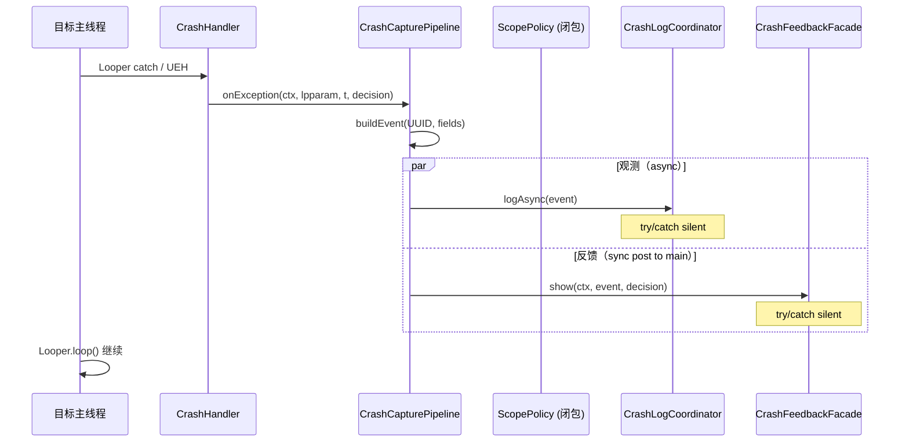

# 崩溃采集管道

> 适用模块：`:app`（Phase 4B 实现）
> 源码入口：`XposedEntry.java` → `CrashHandler.insert` → `ExceptionHandler` 回调
> 相关 ADR：[ADR-010](../decisions/010-scope-policy-show-notify.md)、[ADR-011](../decisions/011-feedback-failure-isolation.md)
> 上游：[crash-handler.md](crash-handler.md)（干预层）
> 下游：[crash-log-backends.md](crash-log-backends.md)（多后端写入）、[crash-notification.md](crash-notification.md)（反馈）

## 概述

`CrashCapturePipeline` 是 hook 侧将异常转化为**结构化事件**并并行投递到观测/反馈路径的单入口。它运行在目标 app 进程的崩溃回调中，解决当前 `XposedEntry.hookToGrabCrash` 内联 lambda 中 Toast/Notification/日志路径混杂、`System.exit(0)` 跨路径传染的问题。

**核心不变量**：

- Pipeline 内任何路径失败 **不得** 改变 [CrashHandler](crash-handler.md) 的 Looper 续命语义
- 观测路径（`CrashLogCoordinator`）与反馈路径（`CrashFeedbackFacade`）**同触发、异失败域**
- Pipeline 不持有 `static showNotify`；通知决策由 `ScopePolicy` 实例级输出

## 现状问题

对照源码 `XposedEntry.java`：

| 问题 | 代码证据 | 影响 |
|------|----------|------|
| `showNotify` 为 static 字段 | 第 39 行 `private static boolean showNotify` | 多包并发 `handleLoadPackage` 互相覆盖 |
| 反馈/日志同 try 块 | 第 94–105 行 `try { ... Toast ... Notification ... } catch { System.exit(0) }` | 通知异常导致 exit，同时断送日志写入机会 |
| 无日志持久化 | `hookToGrabCrash` 仅 XposedBridge.log + UI 反馈 | 观测层无锚点 |
| PendingIntent 塞整段 stack | 第 130 行 `intent.putExtra("Exception", ...)` | Binder 上限风险；与 `crash_id` 目标冲突 |

## 目标架构

```
CrashHandler.insert(exceptionHandler)
  └── exceptionHandler.handlerException(throwable)
        └── CrashCapturePipeline.onException(context, lpparam, throwable, scopeDecision)
              │
              ├── [1] 构建 CrashEvent（UUID、timestamp、fields）
              │
              ├── [2] 观测：CrashLogCoordinator.logAsync(event)
              │        └── try/catch silent — 失败不 exit、不阻塞反馈
              │
              └── [3] 反馈：CrashFeedbackFacade.show(context, event, scopeDecision)
                       └── try/catch silent — 失败不 exit、不阻塞观测
```

### 进程边界

Pipeline 全部运行在 **目标 app 进程** 的崩溃回调内。跨进程写入由 `CrashLogCoordinator` 的各 Backend 负责（见 [crash-log-backends.md](crash-log-backends.md)）。

## 组件职责

### ScopePolicy

纯函数/对象，取代 `XposedEntry` 中 `shouldHandlePackage` + static `showNotify` 的耦合。

```
ScopePolicy.evaluate(xsp, lpparam) → ScopeDecision {
    shouldHook: Boolean,
    showNotify: Boolean
}
```

- 输入：`XSharedPreferences`（reload 后）、`LoadPackageParam`
- 输出：**实例级** `ScopeDecision`，闭包捕获后传入 Pipeline
- 不再依赖 `XposedEntry` 类级 static 字段

详见 [ADR-010](../decisions/010-scope-policy-show-notify.md)。

### CrashCapturePipeline

| 方法 | 职责 |
|------|------|
| `onException(ctx, lpparam, throwable, decision)` | 主入口；构建 event → 并行投递 |
| `buildEvent(ctx, lpparam, throwable)` | 填充 `CrashEvent` 所有字段（UUID、timestamp、stack 等） |

Pipeline **不**决定是否 hook（已由 ScopePolicy 在 `handleLoadPackage` 阶段完成）。

### CrashLogCoordinator

hook 侧写入协调器。阶段化多后端并行：

1. Phase 1：`RootSuBackend`（≤1.5s 超时）
2. Phase 2：`ProviderBackend` ∥ `DirectFsBackend` ∥ `TargetRelayBackend`

**契约**：内部 `catch Throwable`，不向 Pipeline 抛异常；写入失败仅 `XposedBridge.log`。

详见 [crash-log-backends.md](crash-log-backends.md)。

### CrashFeedbackFacade

独立封装 Toast + Notification + PendingIntent：

| 行为 | 条件 |
|------|------|
| Toast | `scopeDecision.showNotify == true` |
| Notification | 同上 |
| PendingIntent | 当前：`Exception` extra；Phase 4E 起传 `crash_id` |

**契约**：内部 `catch Throwable`，失败不 `System.exit`、不影响 Coordinator（[ADR-011](../decisions/011-feedback-failure-isolation.md)）。

## 数据流序列图



## 失败域隔离

| 路径 | 失败处理 | 禁止 |
|------|----------|------|
| CrashLogCoordinator | `catch { XposedBridge.log }` — silent | `System.exit`、抛 RuntimeException |
| CrashFeedbackFacade | `catch { XposedBridge.log }` — silent | `System.exit`、阻塞 Coordinator |
| Pipeline 自身 | 外层 catch 兜底 — silent | 任何影响 CrashHandler 续命的行为 |

**消除现有 `System.exit(0)`**：当前源码中通知异常触发 exit 的行为将在 4B refactor 中移除（或仅保留不可恢复错误如 OOM 时的日志输出，但不 exit）。

## 与现有代码的映射

| 现有代码 | 目标组件 | 改动时机 |
|----------|----------|----------|
| `XposedEntry.shouldHandlePackage()` | `ScopePolicy.evaluate()` | 4B 前小 refactor |
| `XposedEntry.hookToGrabCrash` lambda | `CrashCapturePipeline.onException()` | 4B-α |
| `XposedEntry.showNotification()` | `CrashFeedbackFacade.show()` | 4B-α |
| `showNotify` static field | `ScopeDecision.showNotify` 实例 | 4B 前 |
| （无） | `CrashLogCoordinator.logAsync()` | 4B-α 新建 |

## CrashEvent 构建

Pipeline 内 `buildEvent` 填充的字段（对照 [crash-logging.md § 数据模型](crash-logging.md#数据模型)）：

| 字段 | 来源 |
|------|------|
| `id` | `UUID.randomUUID()` |
| `timestampMs` | `System.currentTimeMillis()` |
| `packageName` | `lpparam.packageName` |
| `appLabel` | `applicationInfo.loadLabel()` |
| `processName` | `lpparam.processName` |
| `pid` / `uid` | `Process.myPid()` / `Process.myUid()` |
| `threadName` | `Thread.currentThread().name`（UEH 路径） |
| `exceptionClass` | `throwable.getClass().getName()` |
| `message` | `throwable.getLocalizedMessage()` |
| `stackTrace` | `Log.getStackTraceString(throwable)`（截断 64KB） |
| `causeClasses` | 递归 `getCause()` 链 |
| `isSystemApp` | `FLAG_SYSTEM` 标志 |
| `moduleVersion` | BuildConfig 或 prefs |
| `source` | `"looper"` / `"uncaught"` — 由 CrashHandler 路径传入 |

## 边界约束

| 约束 | 说明 |
|------|------|
| **不依赖模块进程** | Pipeline 在目标进程内闭环构建 event；跨进程由 Backend 处理 |
| **不引用 UI 包** | `hook.*` 不依赖 `xp.app.*`（[architecture-optimization.md § 4.3](architecture-optimization.md#43-依赖规则lint--review-可-enforcement)） |
| **不阻塞主线程** | Coordinator 异步单线程 executor；Facade 用 `Handler.post` |
| **不改变 CrashHandler 语义** | Pipeline 在 `handlerException` 回调之后执行；续命 loop 不受影响 |

## 相关文档

- [crash-handler.md](crash-handler.md) — 干预层（上游）
- [crash-log-backends.md](crash-log-backends.md) — 多后端写入
- [crash-logging.md](crash-logging.md) — 观测层总方案与 CrashEvent 模型
- [crash-notification.md](crash-notification.md) — Toast / 通知
- [architecture-optimization.md](architecture-optimization.md) — §5.1 / §5.2 原始设计
- [scope-and-prefs.md](scope-and-prefs.md) — prefs 模型
- [ADR-010](../decisions/010-scope-policy-show-notify.md) — ScopePolicy 消除 static showNotify
- [ADR-011](../decisions/011-feedback-failure-isolation.md) — 反馈/日志失败域隔离
- [phase4_crash_observability.md](../../dev/roadmap/active/phase4_crash_observability.md) — 实施任务
