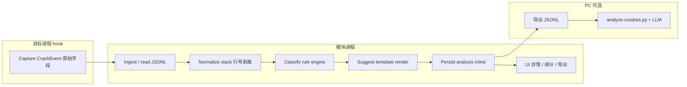

# 崩溃智能分析

> 适用模块：`:app` 观测域（Phase 4E+ / 5 backlog）
> 数据 SSOT：[crash-logging.md](crash-logging.md) `CrashEvent` / `events.jsonl`
> 前置：Phase 4B–4D 观测层 MVP（采集、历史、统计 UI）
> 相关：[crash-stats-ui.md](crash-stats-ui.md)、[adb-logcat-analysis.md](adb-logcat-analysis.md)、[code-editor-porting.md](code-editor-porting.md)

## 概述

CrashCenter 产品演进为 **Xposed 稳定性分析中心**，在 [干预层](crash-handler.md) 与 [观测层](crash-logging.md) 之上增加 **分析层（Analysis Layer）**：

| 层级 | 职责 | 智能分析范围 |
|------|------|--------------|
| 干预层 | 吞异常、Looper 续命 | **不在此层** |
| 观测层 | 结构化记录、统计、导出 | 提供原始信号 |
| **分析层** | 分类、聚类、诊断建议 | **本文档** |

**核心原则**（与 [AGENTS.md](../../AGENTS.md) 一致）：

- 模块 **不修复** 目标 app 缺陷；分析产出是 **解释与排查指引**，不是运行时补丁。
- 默认 **端侧、离线** 完成；stack 不上传云端，除非用户显式导出并自行分析。
- 分析 **不得** 阻塞 hook 崩溃路径；失败 silent，与 [CrashLogCoordinator](crash-log-backends.md) 同级约束。

---

## A. 问题与范围

### 「智能分析」在 CrashCenter 中的含义

| 维度 | 定义 | 默认 |
|------|------|------|
| **做什么** | 对每条 `CrashEvent`（及可选 logcat 片段）做：异常分类、根因标签、重复崩溃聚类、可读诊断与排查建议 | 规则引擎 + 模板 |
| **不做什么** | 自动改代码、hook 额外修复逻辑、静默清除用户数据、替目标 app 重试网络请求 | 永久排除 |
| **运行位置** | **模块 app 进程**（ingest 后或 UI 打开详情时 lazy）；PC 脚本为开发者可选通道 | 非 hook 进程 |
| **在线 vs 离线** | MVP/V2 **纯离线**；V3 可选「导出后 PC/LLM 分析」或设置内显式开启的 API 调用 | 离线优先 |
| **端侧 vs 云** | 分类与模板建议 **100% 端侧**；LLM 仅作可选增强，且默认不发送 stack 到网络 | 端侧优先 |

### 与现有 Phase 4 组件的关系

```
CrashHandler / XposedEntry（hook）
  └── CrashLogCoordinator → events.jsonl（观测 SSOT）
        └── CrashLogIngestCoordinator（模块）
              └── CrashAnalysisPipeline（本文档，模块进程）
                    ├── 写入 analysis 字段或 sidecar
                    └── StatsAggregator 扩展：按 category / cluster 聚合
              └── UI
                    ├── 历史 / 统计 / 单应用页（crash-stats-ui）
                    ├── 详情：CodeEditor + 分析卡片
                    └── logcat 导入（adb-logcat-analysis，对账与补充）
```

| 组件 | 智能分析角色 |
|------|--------------|
| `events.jsonl` | 原始事实；分析结果 **附加** 而非替换 stack |
| `StatsAggregator` | 扩展：按 `analysis.category`、`clusterId` TOP N |
| `CrashLogViewerClient` | 详情页 stack 下方展示「分类 + 建议」卡片 |
| logcat 导入 | 启发式 `kind` 与 JSONL **对账**；未 hook 的 `JAVA_FATAL` 可 P2 入库并走同一分析管道 |
| `ActivityCrashInfo` | 通知即时详情；Phase 4C 起由 CodeEditor 详情 + `crash_id` 深链取代整段 Intent stack |

**边界**：仅 **Java 层**被拦截异常进入主 taxonomy 与 `events.jsonl` 统计；Native crash、**ANR 实时监测**不在 scope。logcat 可提供 `NATIVE_HINT` / `ANR_HINT` 只读提示（[adb-logcat-analysis.md](adb-logcat-analysis.md)、[anr-observation.md](anr-observation.md)）。

**`RuleEngine` 的 `anr` 规则**：仅当详情页 stack **已含** `ANR in` 文本时被动匹配（如用户导入 logcat 片段），**不等于** ANR 监测能力。

---

## B. 崩溃分类

### 分类体系（Taxonomy）

采用 **两层标签 + 可选聚类签名**，便于统计与模板匹配。

#### 1. 异常类型层（`exceptionType`）— 由 `exceptionClass` / cause 链推导

| ID | 典型 `exceptionClass` | 说明 |
|----|------------------------|------|
| `null_pointer` | `NullPointerException` | 空引用 |
| `illegal_state` | `IllegalStateException`, `IllegalArgumentException` | 状态/参数非法 |
| `index_bounds` | `IndexOutOfBoundsException`, `ArrayIndexOutOfBoundsException` | 越界 |
| `class_cast` | `ClassCastException` | 类型转换 |
| `network` | `UnknownHostException`, `SocketTimeoutException`, `SSLException` | 网络栈 |
| `network_main_thread` | `NetworkOnMainThreadException` | 主线程网络 |
| `resource_not_found` | `Resources.NotFoundException` | 资源 ID |
| `activity_not_found` | `ActivityNotFoundException` | 组件未声明 |
| `security` | `SecurityException` | 权限/SELinux |
| `oom` | `OutOfMemoryError` | 内存（Java 层 OOM） |
| `reflection` | `InvocationTargetException` 等 | 反射包装 |
| `runtime_other` | 其他 `RuntimeException` | 兜底 |
| `error_other` | 其他 `Error` | 非 OOM 的 Error |
| `unknown` | 其他 | 兜底 |

#### 2. 根因类别层（`rootCauseTags[]`）— 规则 + stack 帧启发式

| Tag | 识别信号（示例） |
|-----|------------------|
| `lifecycle` | stack 含 `onCreate`/`onResume`/`Fragment`/`ViewModel`；`IllegalStateException` + `FragmentManager` |
| `threading` | 非 main 线程 + UI 类；`CalledFromWrongThreadException` |
| `view_binding` | `Binding`/`findViewById`/` lateinit` 未初始化 |
| `async_callback` | `Handler`/`Runnable`/`LiveData`/`RxJava`/`Coroutine` |
| `persistence` | `SQLite`/`Room`/`Cursor` |
| `serialization` | `JSONException`/`Gson`/`Parcelable` |
| `third_party_sdk` | stack 顶帧在 `com.google.`/`com.facebook.` 等已知 SDK 包前缀 |
| `configuration` | `Manifest`/`permission`/`provider` 相关 message |
| `obfuscated` | 帧类名形如 `a.b.c` 单字母段且无包语义 |
| `swallowed_context` | `source == looper` 且同一 session 高频（续命后状态损坏） |
| `unknown` | 无规则命中 |

#### 3. 上下文信号（输入，不单独作为 UI 主类）

| 信号 | 来源字段 | 用途 |
|------|----------|------|
| 包名 / 应用类型 | `packageName`, `isSystemApp` | 系统 app 建议模板分支 |
| 线程 | `threadName` | main vs background 分支 |
| 拦截来源 | `source` (`uncaught` \| `looper`) | 续命场景提示 |
| 频次 | 同 `signatureHash` 计数 | 聚类、严重度 |
| 设备上下文（可选 P2+） | API level、ABI（模块侧读取） | 规则版本化 |
| logcat 对账 | `LogcatCrashSnippet.kind` | 区分「被吞」vs「系统 FATAL」 |

### 方法选型：规则 vs ML vs 混合

| 方案 | 优点 | 缺点 | CrashCenter 建议 |
|------|------|------|------------------|
| **规则 + 签名** | 可解释、离线、零模型体积、易测 | 覆盖有限、需维护规则表 | **MVP / V2 主路径** |
| **传统 ML（端侧）** | 可学习 stack embedding | 训练数据缺、解释性差、APK 增量 | **不优先** |
| **LLM** | 自然语言建议、弱覆盖未知栈 | 隐私、延迟、成本、幻觉 | **V3 可选** |
| **混合** | 规则定类 + LLM 润色说明 | 复杂度高 | V3 若做 LLM，规则仍定 **category** |

**推荐**：**规则为主、签名为辅**；LLM 只处理规则 `unknown` 或用户主动「生成说明」，且不在 hook 路径调用。

### 输出：`CrashEvent` 扩展 schema

在 [crash-logging.md § CrashEvent](crash-logging.md#数据模型) 上增加可选对象 `analysis`（模块进程写入；hook 侧 **不** 写）：

```json
{
  "id": "550e8400-e29b-41d4-a716-446655440000",
  "timestampMs": 1750300800000,
  "packageName": "com.example.app",
  "exceptionClass": "java.lang.NullPointerException",
  "stackTrace": "...",
  "source": "uncaught",
  "analysis": {
    "schemaVersion": 1,
    "computedAtMs": 1750300801000,
    "analyzerId": "rule_v1",
    "exceptionType": "null_pointer",
    "rootCauseTags": ["view_binding", "lifecycle"],
    "signatureHash": "a1b2c3d4e5f6",
    "clusterId": "a1b2c3d4",
    "confidence": 0.85,
    "summaryZh": "空指针：可能在界面生命周期内访问了未初始化的视图。",
    "summaryEn": "Null pointer: likely accessing an uninitialized view during UI lifecycle.",
    "suggestions": [
      {
        "id": "dev_check_null",
        "audience": "developer",
        "severity": "info",
        "titleZh": "排查空引用",
        "bodyZh": "检查 stack 顶部涉及的可空字段是否在 onCreate/onViewCreated 之后赋值；续命后 Activity 可能处于半销毁状态。",
        "disclaimer": true
      },
      {
        "id": "user_restart",
        "audience": "user",
        "severity": "info",
        "titleZh": "你可以尝试",
        "bodyZh": "完全关闭并重新打开该应用。若频繁出现，可在配置 tab 暂时关闭对该应用的拦截并向开发者反馈。",
        "disclaimer": true
      }
    ]
  }
}
```

| 字段 | 说明 |
|------|------|
| `signatureHash` | 规范化 stack 前 N 帧（去行号、去混淆可变段）的 SHA-256 前缀 |
| `clusterId` | 通常等于 `signatureHash` 前 12 字符；统计页「同类崩溃」计数 |
| `confidence` | 规则命中权重 0–1；模板建议仅当 `≥ 0.5` 默认展示 |
| `suggestions[].audience` | `user` \| `developer` — 见下节 UX |
| `analyzerId` | `rule_v1` \| `llm_v1` 等，便于重算 |

**存储策略**：

- **默认**：分析结果 **inline** 写入 JSONL 行（ingest 后批量或首次打开详情时补写）。
- **备选**：`files/crash_logs/analysis/{eventId}.json` sidecar — 仅当单行过大时使用。
- **重算**：`analyzerId` 或规则版本 bump 时，模块后台 Job 扫描重分析（不改原始 stack）。

### 端侧可行性（Android）

| 约束 | 结论 |
|------|------|
| 隐私 | 规则引擎不离开设备；符合「stack 仅本地」 |
| 延迟 | 单条规则分析目标 **< 50ms**；500 条全量重算在 IO 线程可接受 |
| 模型体积 | MVP 无模型；Gemini Nano 等若 V3 引入，需单独评估 +10MB 级且 API 33+ |
| hook 进程 | **禁止** 在 hook 做分类；仅模块进程 |

---

## C. 智能修复建议

### 语义澄清：「修复建议」≠ 模块去修 bug

| 受众 | 含义 | 示例 |
|------|------|------|
| **user（终端用户）** | 降低损害的操作指引 | 重启 app、检查网络、暂时关闭对该包的 hook、导出日志反馈开发者 |
| **developer（开发者/进阶用户）** | 根因假设与排查步骤 | 查 lifecycle、查主线程 IO、查 ProGuard mapping、对照 logcat |
| **禁止表述** | 暗示模块会修复目标 app | 「已自动修复」「注入补丁」「清除数据即可根治」 |
| **禁止动作** | 模块自动执行 | `pm clear`、改目标 app 文件、额外 Xposed hook 修 bug |

所有建议卡片须带 **免责声明**：「CrashCenter 仅拦截异常以便继续使用，不修复应用缺陷；以下仅供参考。」

### 知识库结构（规则 MVP）

```
assets/crash_analysis/
  rules_v1.json       # exceptionClass / message regex / stack frame patterns → tags + templates
  sdk_prefixes.json   # 常见 SDK 包前缀 → third_party_sdk
  strings_zh.json     # 模板 i18n
  strings_en.json
```

规则条目示例（概念）：

```json
{
  "id": "npe_view_binding",
  "match": {
    "exceptionType": "null_pointer",
    "stackContainsAny": ["Binding", "findViewById", "requireView"]
  },
  "rootCauseTags": ["view_binding", "lifecycle"],
  "suggestions": ["dev_check_null", "user_restart"]
}
```

**签名库（V2）**：`signatures.jsonl` 存已知开源 issue / Stack Overflow 模式（hash → 说明），随 APK 更新；用户可关闭「在线更新签名库」。

### LLM 集成选项

| 选项 | 运行位置 | 隐私 | 适用 |
|------|----------|------|------|
| **A. 无 LLM（默认）** | — | 最高 | MVP–V2 |
| **B. 端侧 Gemini Nano / AICore** | 模块 app | stack 不出设备 | V3 实验；设备覆盖有限 |
| **C. 模块内 API 调用** | 模块 app → 用户配置的 endpoint | 用户显式同意 + 脱敏选项 | 不推荐默认；需 ADR |
| **D. PC 脚本** | `scripts/analyze-crashes.py` 读导出 JSONL | 用户自控 | 开发者首选 LLM 入口 |
| **E. 导出到剪贴板/文件后外部 App** | 用户 | 用户自控 | 零集成成本 |

**推荐路径**：MVP **A** → V2 **A + 签名库** → V3 **D 为主、B 为可选实验**；C 需单独 [ADR](../decisions/) 与隐私 UI。

### 安全与质量

- 建议文案 **白名单模板**；LLM 输出须经模板包裹 + 禁止词过滤（`pm clear`、`rm -rf`、`disable` 系统组件等）。
- `severity: warning` 仅用于「续命可能导致 UI 不一致」，不恐吓用户。
- 低置信度时展示「未知类型，请查看 stack」而非编造根因。

---

## D. 架构选项

### 管道（Pipeline）



| 阶段 | 运行位置 | 触发时机 |
|------|----------|----------|
| Capture | hook | 每次 `handlerException`（Phase 4B 已有） |
| Normalize | 模块 | ingest 后或分析 Job |
| Classify | 模块 | 同上 |
| Suggest | 模块 | 分类完成后 |
| Store | 模块 | 写回 JSONL 或 sidecar |
| Display | 模块 UI | 详情页、统计扩展、导出 |

**不在 hook 进程执行任何分析阶段。**

### 与 Phase 4 组件集成

| 组件 | 集成点 |
|------|--------|
| `CrashLogIngestCoordinator` | ingest merge 后对 **新 event id** 入队 `AnalysisWorker` |
| `CrashLogRepository` | `getEvent(id)` 若缺 `analysis` 则 sync 计算并 cache |
| `StatsAggregator` | `topCategories()`、`topClusters()` |
| 全局 / 单应用统计页 | 增加「异常类别 TOP」「重复崩溃 TOP」（V2） |
| `CrashLogViewerClient` | stack 下方 `AnalysisCard`：分类 Chip + 建议列表 |
| logcat 导入 | 解析后可「关联到最近 JSONL 事件」或独立展示（不入统计 MVP） |
| PC `adb-logcat-parse` | 输出与 `LogcatCrashSnippet` 同构；可与 JSONL 对账报告 |

### 模块拆分（实施参考）

```
crash-analysis-api/     CrashAnalysisResult、RuleEngine 接口
crash-analysis-rules/   assets JSON + RuleEngineImpl（纯 Kotlin/JVM，无 Android 依赖可测）
app/                    AnalysisWorker、AnalysisCard UI、Stats 扩展
scripts/                analyze-crashes.py（V3）
```

---

## As-built（2026-06-23，4G-MVP + 4G-V2 部分）

| 项 | 实现 |
|----|------|
| 数据类 | `CrashAnalysis`（`category`、`rootCauseTags`、`suggestion`、`devSuggestion`）— **未**写入 `CrashEvent` JSONL |
| 引擎 | `RuleEngine` + `assets/crash_analysis/rules_v1.json`（英文；NPE/OOM 等；`anr` 规则仅匹配 stack 含 `ANR in` 的**被动**分类） |
| 触发 | `CrashDetailBottomSheet` 加载 stack 后 **lazy** `match()`；无 `AnalysisWorker` / ingest 预分析 |
| UI 详情 | `AnalysisCard`：分类 Chip、rootCause Chip 行、用户建议、可展开开发者建议、免责声明 |
| 聚类 | `CrashSignature`：stack 前 5 帧规范化 → `signatureHash`（16 hex）/ `clusterId`（12 字符）；**读时计算**，不写 JSONL |
| 统计扩展 | `StatsAggregator.topCategories()`（`RuleEngine.match` 或 `shortExceptionClass` 回退）、`topClusters()`；`CrashStatsFragment` 展示「异常类别 TOP」「重复崩溃 TOP」 |
| 测试 | `RuleEngineTest`、`StatsAggregatorTest`（聚类/分类） |
| **defer** | `CrashEvent.analysis` JSONL 持久化、`AnalysisWorker` ingest 路径、i18n 模板、`signatures.jsonl` |

---

## E. 分阶段路线图

与 [phase4_crash_observability.md](../../dev/roadmap/active/phase4_crash_observability.md) 对齐：**4G 为观测层之后 backlog**，不阻塞 4B–4E。

| 阶段 | 内容 | 交付 |
|------|------|------|
| **前置** | Phase 4B–4C：`CrashEvent` + 历史详情 CodeEditor | 无分析 UI |
| **4G-MVP** | `RuleEngine` v1、`category` + `rootCauseTags`、详情页分析卡片、免责声明 | 规则分类 + 模板建议（**2026-06-23 部分 as-built**） |
| **4G-V2** | `signatureHash` / `clusterId`、统计页「同类崩溃 TOP」、可选 `signatures.jsonl` | 去重聚类（**2026-06-23 部分 as-built**） |
| **4G-V3** | PC `analyze-crashes.py`；可选端侧 LLM 实验开关 | 增强说明 |
| **4G+** | logcat 导入事件走分析管道；与 JSONL 对账 UI | 见 [adb-logcat-analysis.md](adb-logcat-analysis.md) P2 |

**依赖顺序**：4G-MVP **依赖** 4C（详情页容器）；可与 4D 统计 **并行**，但聚类统计依赖 V2。

---

## F. 风险与约束

| 风险 | 影响 | 缓解 |
|------|------|------|
| hook 进程误做分析 | 阻塞续命、增加 crash 路径耗时 | 架构上禁止；Code review + lint 模块边界 |
| 续命后 stack 误导 | 分类指向 UI 层，根因是更早的状态损坏 | `source==looper` 模板强调「续命上下文」 |
| 隐私泄露 | 用户导出 stack 含路径/token | 导出前现有隐私提示；LLM 默认关闭 |
| 建议幻觉 / 误导向 | 用户错误操作 | 模板白名单、免责声明、confidence 阈值 |
| 规则库维护成本 | 新 Android 版本 / SDK 变化 | 版本化 `rules_vN.json`；社区 PR 签名库 |
| JSONL 行膨胀 | analysis 增大文件 | 控制 suggestion 条数；超大走 sidecar |
| 与「不修复」产品哲学冲突 | 用户误以为模块应修 app | 文案 SSOT + 设置页说明 |

---

## G. 建议与后续

### 推荐方案（摘要）

1. **分析层建在模块进程**，管道为 **normalize → rule classify → template suggest → store**，hook 只采集。
2. **MVP 纯规则 + 模板**，双层 taxonomy（`exceptionType` + `rootCauseTags`），详情页展示 **user / developer** 分轨建议 + 免责声明。
3. **V2 签名聚类** 服务统计页「重复崩溃」与 severity 提示。
4. **LLM 默认不做**；优先 **PC 脚本分析导出 JSONL**；若做端侧 LLM 再开 ADR。
5. **logcat 通道** 作对账与未 hook 崩溃补充，不替代 JSONL 主分析源。

### 文档与 ADR

| 项 | 建议 |
|----|------|
| 本文档 | ✅ `crash-intelligent-analysis.md`（proposed） |
| 新 ADR | **4G-MVP 前** 若仅规则引擎 → **可不建**；若引入 LLM/API/端侧模型 → **ADR-009 智能分析隐私与 LLM 边界** |
| 更新 | [overview.md](overview.md) 分析层一行、[glossary.md](../glossary.md) 术语、[crash-logging.md](crash-logging.md) schema 链接 |

### 具体 next steps（roadmap checkbox）

见 [phase4_crash_observability.md § 4G](../../dev/roadmap/active/phase4_crash_observability.md)。

---

## 相关文档

- [crash-logging.md](crash-logging.md) — CrashEvent SSOT
- [crash-stats-ui.md](crash-stats-ui.md) — 统计 UI（扩展 category/cluster）
- [adb-logcat-analysis.md](adb-logcat-analysis.md) — logcat 补充通道（`ANR_HINT`）
- [anr-observation.md](anr-observation.md) — ANR 路径 A/B；RuleEngine `anr` 规则非监测
- [code-editor-porting.md](code-editor-porting.md) — 详情页 CodeEditor
- [crash-handler.md](crash-handler.md) — 干预层边界
- [crash-notification.md](crash-notification.md) — 即时通知 vs 历史分析
- [navigation-ia.md](navigation-ia.md) — 观测 tab 壳层
- [phase4_crash_observability.md](../../dev/roadmap/active/phase4_crash_observability.md) — 4G backlog
- [glossary.md](../glossary.md) — 术语
