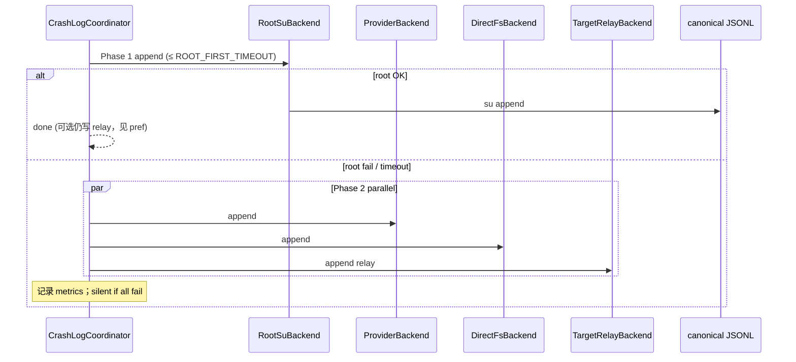

# 崩溃日志多后端存储

> 适用模块：`:app`（Phase 4 待建 `CrashLogger`、`CrashLogCoordinator`、`CrashLogIngest`）
> 机制对比与 FAQ 见 [crash-log-ipc.md](crash-log-ipc.md)
> 存储决策见 [ADR-007](../decisions/007-crash-log-cross-process-storage.md)、[ADR-008](../decisions/008-multi-backend-crash-log-storage.md)
> Root 实现参考：[root-service-patterns.md](../reference/root-service-patterns.md)（提炼自 AppSnapShotor libsu + RootService）

## 概述

在 Xposed 用户通常已具备 root（Magisk / KernelSU + LSPosed）的前提下，将 Phase 4 崩溃持久化从 ADR-007 的 **串行 A→B 主备**，演进为：

1. **多后端抽象** — 每种 IPC / 特权路径实现统一 `CrashLogBackend`
2. **hook 侧并行写入** — root 短窗优先，失败后多 IPC 并行
3. **模块侧 root ingest** — 管理器用 root 读取各 app 私有 relay，合并进 canonical 存储并供 UI 管理

**不变量**（与 [crash-logging.md](crash-logging.md) 一致）：

- 观测层不改变干预层语义：异步、失败 **silent**、不阻塞 [CrashHandler](crash-handler.md)、不 `System.exit`
- **Canonical SSOT**：`/data/data/nota.android.crash.xp.app/files/crash_logs/events.jsonl`
- 配置开关仍走 [XSharedPreferences](../decisions/003-xsharedpreferences-cross-process.md) 只读；**事件体不走 prefs**

---

## 进程模型

```
┌────────────────── 目标 app 进程 (hook, 目标 UID) ──────────────────┐
│  CrashLogCoordinator.logAsync(event)                                │
│    Phase 1: RootSuBackend (tier 0, ≤1.5s)                           │
│    Phase 2: ProviderBackend ∥ DirectFsBackend ∥ TargetRelayBackend│
└───────────────────────────────┬─────────────────────────────────────┘
                                │ 各后端写入不同位置
                                ▼
┌────────────────── 模块 app 进程 (nota.android.crash.xp.app) ──────────┐
│  CrashLogIngestCoordinator（模块启动 / Provider 回调 / 定时）         │
│    RootFsBackend (tier 0) — libsu RootService，参考 AppSnapShotor   │
│    RelayMergeBackend — 扫描 */files/crashcenter_relay/               │
│    LocalFsBackend — 同 UID 读/写 canonical JSONL                    │
│  CrashHistory UI — 列表 / 详情 / 清空 / retention / 导出             │
└────────────────────────────────────────────────────────────────────┘
```

| 角色 | 进程 | 职责 |
|------|------|------|
| **写入协调** | 目标 app（hook） | 崩溃后多后端 append / relay |
| **ingest 协调** | 模块 app | root 读各 app 私有 relay → merge canonical |
| **管理 UI** | 模块 app | 读 canonical；清空 / 统计 / 导出 |

**关键区分**：root 有两条腿，不可混用：

| 后端 | 进程 | 机制 |
|------|------|------|
| `RootSuBackend` | hook | `su -c` append canonical（轻量，不 bind RootService） |
| `RootFsBackend` | 模块 | libsu `RootService` + `FileSystemManager`（AppSnapShotor 模式） |

hook 进程 **不得** 依赖 libsu AAR；模块进程 **不得** 假设 hook 侧 root 一定成功。

---

## CrashLogBackend 抽象

### 接口契约

```kotlin
interface CrashLogBackend {
    val id: BackendId
    val tier: Int              // 0 = 最高优先级（root）
    val runsOn: ProcessSlot    // HOOK | MODULE

    /** 廉价探测；崩溃路径避免阻塞 IO */
    fun probe(): BackendAvailability

    /** 单次 append；内部 catch，不向外抛 */
    suspend fun append(event: CrashEvent, deadlineMs: Long): AppendResult
}

enum class BackendAvailability { READY, MAYBE, UNAVAILABLE }

enum class ProcessSlot { HOOK, MODULE }
```

### 注册表

| BackendId | tier | 进程 | 说明 |
|-----------|------|------|------|
| `root_su` | 0 | HOOK | `su` append canonical JSONL |
| `provider_insert` | 1 | HOOK | `ContentResolver.insert` → [CrashLogProvider](crash-log-ipc.md) |
| `direct_fs` | 2 | HOOK | `createPackageContext(module).filesDir` 直写 |
| `target_relay` | 3 | HOOK | 写目标 app 私有 relay（同 UID，几乎必成功） |
| `root_fsm` | 0 | MODULE | libsu RootService 读写 / merge |
| `local_fs` | 1 | MODULE | 同 UID canonical 读写 |
| `relay_merge` | 2 | MODULE | 扫描 relay 目录 merge（无 root 时仅扫模块已知路径则 skip） |
| `logcat` | 9 | HOOK | 调试，不参与 success 判定；分析见 [adb-logcat-analysis.md](adb-logcat-analysis.md) |

---

## hook 侧：CrashLogCoordinator

### 写入时序



### 参数默认值

| 常量 | 默认 | 说明 |
|------|------|------|
| `ROOT_FIRST_TIMEOUT_MS` | 1500 | su 冷启动上限 |
| `PARALLEL_TIMEOUT_MS` | 2000 | Provider AM 冷启动 |
| `crashExecutor` | 单线程 | 避免多崩溃并发打满 su / Binder |

### 调用位置

- [xposed-entry.md](xposed-entry.md) 所述 handler 内、**与 `showNotify` 解耦**
- **不得**放入 `try { Toast... } catch { System.exit(0) }` 块
- `crash_log_enabled == false` 时短路返回

---

## 各写入后端

### Tier 0 — RootSuBackend（hook）

```bash
# 禁止 JSON 直接拼接 shell；使用 base64 或 su 写 temp 再 append
su -c 'base64 -d >> /data/data/nota.android.crash.xp.app/files/crash_logs/events.jsonl'
```

| 项 | 说明 |
|----|------|
| `probe()` | 缓存 `SuProbe` 结果（TTL 5min）；Magisk DenyList 失败 → `UNAVAILABLE` |
| 权限 | 设备 root；**目标 app 进程**须未被 DenyList |
| 失败 | 进入 Phase 2，silent |

### Tier 1 — ProviderBackend

与 [crash-log-ipc.md § Fallback B](crash-log-ipc.md#b-contentprovider-insertfallback) 一致：

- `exported="true"`，**无** signature `android:permission`
- Provider 内 `callingUid` ↔ `packageName` 校验

### Tier 2 — DirectFsBackend

与 ADR-007 Primary A 一致：`createPackageContext(MODULE_PKG, CONTEXT_IGNORE_SECURITY).getFilesDir()`。

### Tier 3 — TargetRelayBackend

写入目标 app **同 UID** 私有目录（绕过跨包 SELinux）：

```
/data/user/0/{packageName}/files/crashcenter_relay/{eventId}.json
```

| 项 | 说明 |
|----|------|
| 可靠性 | 同 UID 写，**几乎总成功** |
| 用途 | Phase 2 并行兜底；canonical 全失败时仍留副本 |
| ingest | 模块侧 root 读回 merge（见下节） |

---

## 模块侧：CrashLogIngestCoordinator

### 职责

**管理器用 root 读取各 app 私有 relay，合并进 canonical，并供 UI 管理。**

| 步骤 | 后端 | 说明 |
|------|------|------|
| 1 | `RootFsBackend` | root 扫描 `/data/user/*/*/files/crashcenter_relay/` |
| 2 | `RelayMergeBackend` | 按 `event.id` dedupe → append canonical |
| 3 | `LocalFsBackend` | UI 读 canonical；retention 轮转 |
| 4 | 清理 | 删除已 ingest 的 relay 文件（或标记 `.ingested`） |

### 触发时机

| 触发 | 说明 |
|------|------|
| 模块 `Application.onCreate` | 用户打开管理器 |
| `CrashLogProvider.insert` 回调 | hook 走 Provider 时可顺带 schedule ingest |
| 可选 `WorkManager` | 周期性 harvest（须 root 仍可用） |

### RootFsBackend（参考 AppSnapShotor）

模块进程内：

1. `AppShell.initMainShell` — libsu，`FLAG_MOUNT_MASTER`，`su`
2. `Shell.getShell().isRoot` → `RootService.bind()`
3. `FileSystemManager` — list / read / append / delete

**不复制** AppSnapShotor 的 PM / tar / SSAID 栈；仅保留 FS 相关最小子集。

路径常量参考 AppSnapShotor `PathHelper`：

- USER：`/data/user/{userId}/{packageName}`
- relay：`{USER}/files/crashcenter_relay/`

### 读 canonical 是否需 root

| 操作 | 需 root |
|------|---------|
| UI 读 `events.jsonl` | **否**（模块同 UID） |
| 读其他 app 私有 relay | **是** |
| hook 已写入 canonical | ingest 可跳过 relay 扫描 |

---

## 数据模型扩展

在 [crash-logging.md § CrashEvent](crash-logging.md#数据模型) 基础上增加：

```json
{
  "id": "550e8400-e29b-41d4-a716-446655440000",
  "backendWritten": ["root_su"],
  "ingestedFrom": "target_relay"
}
```

### 去重规则

| 场景 | 规则 |
|------|------|
| 多后端并行写 canonical | 写侧：root 成功可跳过 Phase 2（pref `crash_log_parallel_after_root`） |
| relay + canonical 重复 | 读侧 merge 按 `id` dedupe；同 id 取 `tier` 更高 backend |
| meta.json | `pendingRelayCount`、`lastIngestMs` |

---

## 配置项（prefs / XSharedPreferences 只读）

| Key | 类型 | 默认 | 含义 |
|-----|------|------|------|
| `crash_log_enabled` | boolean | true | 总开关 |
| `crash_log_backend_root_su` | boolean | true | hook 侧 root su |
| `crash_log_backend_provider` | boolean | true | Provider |
| `crash_log_backend_direct_fs` | boolean | true | 直写 module filesDir |
| `crash_log_backend_relay` | boolean | true | target relay |
| `crash_log_relay_always` | boolean | false | root 成功仍写 relay（双保险） |
| `crash_log_ingest_on_start` | boolean | true | 模块启动时 root ingest |
| `crash_log_max_entries` | int | 500 | retention 条数上限 |

---

## 模块拆分（实施参考）

```
:app                 UI、Application、ingest 调度
:crash-log-api       CrashEvent、CrashLogBackend、BackendId（纯接口）
:crash-log-root      RootFsBackend、AppShell、RootService（可选，仅模块依赖 libsu）
```

hook 侧 backend 实现留在 `:app` 或独立 `:crash-log-hook` 源集，**不 link libsu**。

---

## 与 ADR-007 关系

| ADR-007 | 本方案 |
|---------|--------|
| canonical JSONL + Provider | **保留** |
| 串行 A→B | 升级为 **Coordinator + 多后端** |
| 未含 root | **Tier 0 root 优先** + 模块 ingest |
| 未含 relay | **Tier 3 兜底** + root harvest |

ADR-007 **不废止**；见 [ADR-008](../decisions/008-multi-backend-crash-log-storage.md)。

---

## 验收矩阵（扩展）

在 [phase4_crash_observability.md § 4B](../../dev/roadmap/active/phase4_crash_observability.md) 基础上增加：

| # | 场景 | 期望 |
|---|------|------|
| IS-R1 | root + 非 DenyList 目标 | Phase1 `root_su` 写 canonical |
| IS-R2 | DenyList 目标 app | Phase1 失败 → Provider / relay 成功 |
| IS-R3 | 仅 relay 成功 | 打开模块 → root ingest → UI 可见 |
| IS-R4 | 全 hook 后端失败 | silent；干预层续命 |
| IS-R5 | 模块无 root | canonical / Provider 路径仍可用；ingest 跳过 |

---

## 风险与缓解

| 风险 | 缓解 |
|------|------|
| su 拖慢崩溃路径 | Phase1 短超时；单线程 executor |
| 重复记录 | `event.id` dedupe |
| hook 误链 libsu | root_su 仅用 `ProcessBuilder("su")` 或极薄封装 |
| Provider 伪造 | UID ↔ packageName 校验（不变） |
| relay 磁盘碎片 | ingest 后 delete；retention 硬顶 |
| 无 root 用户 | Provider + relay 仍写；UI 读 canonical；ingest 降级 |

---

## 相关文档

- [crash-logging.md](crash-logging.md) — 观测层总方案、CrashEvent 模型
- [crash-log-ipc.md](crash-log-ipc.md) — IPC 机制对比与 FAQ
- [ADR-007](../decisions/007-crash-log-cross-process-storage.md) — 初版跨进程存储
- [ADR-008](../decisions/008-multi-backend-crash-log-storage.md) — 多后端并行决策
- [framework-injection-feasibility.md](framework-injection-feasibility.md) — 不采用 framework 代写
- [phase4_crash_observability.md](../../dev/roadmap/active/phase4_crash_observability.md) — 实施任务
- [glossary.md](../glossary.md) — CrashLogBackend、CrashLogCoordinator 等术语
