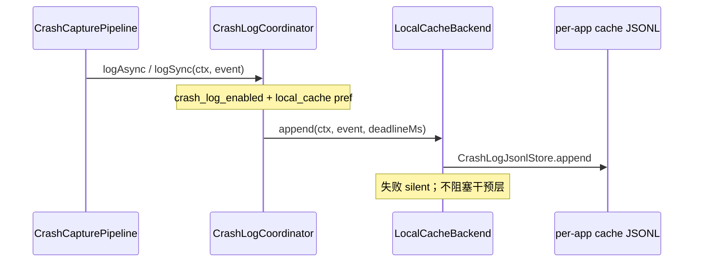

# 崩溃日志多后端存储

> 适用模块：`:app`（hook `CrashLogCoordinator` + `LocalCacheBackend`；模块 `DistributedCrashLogRepository` + `RootFsBackend`）
> **4B-δ as-built**：[ADR-024](../decisions/024-distributed-cache-crash-storage.md)、[crash-log-distributed-storage.md](crash-log-distributed-storage.md)
> 机制对比与 FAQ 见 [crash-log-ipc.md](crash-log-ipc.md)（Provider 章节已过时，仅历史参考）

## 概述（4B-δ）

ADR-024 将 hook 侧多后端并行（Provider / DirectFs / relay / RootSu）收敛为 **单一写后端**：

1. **写** — `LocalCacheBackend` 追加至目标 app `{cache}/crash_logs/events.jsonl`（同 UID，**无需 root**）
2. **读** — `DistributedCrashLogRepository` root 扫描各 app cache JSONL 聚合（**须 root**；无 root 返回空）
3. **删改** — `RootCrashLogMutation` + `RootFsBackend`（模块侧 root 删改各 app cache 文件）

**不变量**（与 [crash-logging.md](crash-logging.md) 一致）：

- 观测层不改变干预层语义：异步 / 同步写、失败 **silent**、不阻塞 [CrashHandler](crash-handler.md)
- **分布式 SSOT**：每条崩溃归属发生进程所在 app 的 `cache/crash_logs/events.jsonl`
- 配置开关走 [XSharedPreferences](../decisions/003-xsharedpreferences-cross-process.md) 只读；**事件体不走 prefs**

---

## As-built 4B-δ（2026-06-24）

### 写入时序



| 模式 | 方法 | 超时 | 场景 |
|------|------|------|------|
| 拦截 | `logAsync` | 2000ms | 进程续命，后台 IO |
| 观测 | `logSync` | 500ms | 进程退出前须落盘（[ADR-023](../decisions/023-injection-observe-intercept-split.md)） |

### CrashLogBackend 接口（保留）

```kotlin
interface CrashLogBackend {
    val id: BackendId
    fun append(context: Context, event: CrashEvent, deadlineMs: Long): AppendResult
}
```

hook 侧仅注册 **`LocalCacheBackend`**（`BackendId.LOCAL_CACHE`）。`CrashLogBackendRegistry` 保留抽象供测试与模块侧 `RootFsBackend` 复用。

### 注册表（当前）

| BackendId | 进程 | 类 | 职责 |
|-----------|------|-----|------|
| `local_cache` | HOOK | `LocalCacheBackend` | 写本 app `CrashLogPaths.eventsFile(ctx)` |
| `root_fsm` | MODULE | `RootFsBackend` | root 扫描 / 删改各 app cache JSONL |

**已移除**：`provider_insert`、`direct_fs`、`target_relay`、`root_su`、`relay_merge`、`CrashLogProvider`、`CrashLogIngestCoordinator`。

### 路径

| 角色 | 路径 |
|------|------|
| 分布式 SSOT | `/data/user/{userId}/{packageName}/cache/crash_logs/events.jsonl` |
| 路径 API | `CrashLogPaths.eventsFile(context)` |
| 单文件 I/O | `CrashLogJsonlStore`（retention 500 条 / 8 MB） |
| Legacy relay（仅迁移） | `files/crashcenter_relay/{id}.json` |

### 模块读路径

```
DistributedCrashLogRepository
  └── CrashLogCacheScanner（root 遍历 userId × packageName）
        └── 按 CrashEvent.id 去重（保留 timestampMs 较大者）
              └── CrashHistoryFragment / StatsAggregator / PerAppCrashActivity
```

`CrashLogMigrationCoordinator`：一次性将 legacy canonical + relay 迁入各 app cache（pref `distributed_cache_migrated`）。

### backendWritten 字段

JSONL 每行含 `backendWritten: ["local_cache"]`。`ingestedFrom` **已移除**（无 relay ingest）。

### 配置项

| Key | 默认 | 含义 |
|-----|------|------|
| `crash_log_enabled` | true | 总开关 |
| `crash_log_backend_local_cache` | true | hook 写本 app cache |
| `crash_log_max_entries` | 500 | retention 条数（per-app 文件） |

旧版 `crash_log_backend_provider` / `direct_fs` / `relay` / `ingest_on_start` 等 pref **不再读取**。

### 验收矩阵（IS-D）

取代 IS-1~IS-6 / IS-R* 中与 Provider / canonical 相关的期望。详见 [crash-log-distributed-storage.md §IS 矩阵](crash-log-distributed-storage.md#独立启动与-is-矩阵分布式) 与 `dev/verification/`。

| # | 要点 | 期望 |
|---|------|------|
| IS-D1 | root + 目标 app 崩溃 | cache JSONL 有新行；历史 UI 可见 |
| IS-D2 | 无 root | 历史/统计空态；不展示部分数据 |
| IS-D3 | 模块 force-stop | 写不依赖模块进程；adb root `cat` cache 可见 |
| IS-D4 | legacy 升级 | `distributed_cache_migrated`；legacy 已清理 |
| IS-D5 | Toolbar 清空 | 他包 cache 已删；新崩溃可再写入 |

---

## 历史架构（4B-α/β，已由 ADR-024 取代）

<details>
<summary>canonical + Provider + relay + ingest 多后端模型（归档参考）</summary>

### 写入时序（4B-α，2026-06-19）

`CrashLogCoordinator.logAsync` 在单线程 executor 上 `runPhase2Parallel`：

| BackendId | tier | 类 |
|-----------|------|-----|
| `provider_insert` | 1 | `ProviderBackend` → `CrashLogProvider` |
| `direct_fs` | 2 | `DirectFsBackend` → 模块 `filesDir` |
| `target_relay` | 3 | `TargetRelayBackend` → `crashcenter_relay/` |

Canonical SSOT：`/data/data/nota.android.crash.xp.app/files/crash_logs/events.jsonl`。

### 4B-β 扩展（2026-06-23，已移除）

| 组件 | 原职责 |
|------|--------|
| `RootSuBackend` | hook `su` append canonical |
| `RelayMergeBackend` | root 扫描 relay → canonical merge |
| `CrashLogIngestCoordinator` | `Application.onCreate` harvest |
| `FileCrashLogRepository` | 读 canonical 单文件 |

决策与迁移理由见 [ADR-024](../decisions/024-distributed-cache-crash-storage.md)。IPC 细节见 [crash-log-ipc.md](crash-log-ipc.md)（历史）。

</details>

---

## 相关文档

- [crash-log-distributed-storage.md](crash-log-distributed-storage.md) — 4B-δ 路径、扫描、迁移
- [crash-logging.md](crash-logging.md) — 观测层总方案、CrashEvent 模型
- [ADR-024](../decisions/024-distributed-cache-crash-storage.md) — 存储架构决策
- [ADR-008](../decisions/008-multi-backend-crash-log-storage.md) — 多后端并行（partially superseded）
- [unified-root-service.md](unified-root-service.md) — 模块侧 `RootAccessClient`
- [crash-log-ipc.md](crash-log-ipc.md) — IPC FAQ（Provider 历史）
- [phase4_crash_observability.md](../../dev/roadmap/active/phase4_crash_observability.md) — 实施任务
- [glossary.md](../glossary.md) — CrashLogBackend、CrashLogCoordinator 等术语
