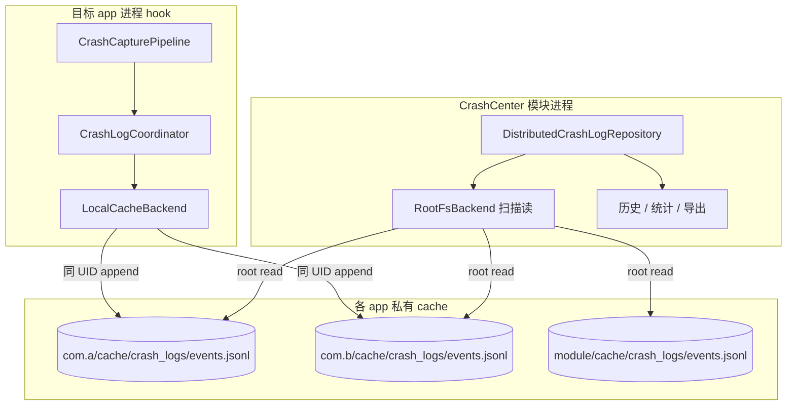

# 分布式崩溃日志存储（cache）

> 适用模块：`:app`（hook `CrashLogCoordinator`、`LocalCacheBackend`；模块 `DistributedCrashLogRepository`）
> 决策：[ADR-024](../decisions/024-distributed-cache-crash-storage.md)
> 取代关系：修订 [crash-logging.md](crash-logging.md) §当前存储、[crash-log-backends.md](crash-log-backends.md) §canonical SSOT、[crash-log-filesystem.md](crash-log-filesystem.md) 中心文件模型
> 术语：[glossary.md](../glossary.md) — **Distributed crash log**、**Per-app JSONL**

## 概述

将 Phase 4 崩溃持久化从 **模块进程 canonical JSONL（`files/`）+ relay 副本 + ingest merge** 演进为：

1. **分布式 SSOT** — 每条崩溃归属**发生进程所在 app**，写入该 app 私有 **`cache/crash_logs/events.jsonl`**
2. **无主记录** — 模块进程**不再**维护全局 `files/crash_logs/events.jsonl` 作为权威源
3. **读路径聚合** — CrashCenter UI **以 root 为前置条件**，扫描各 app（含模块自身）`cache/crash_logs/events.jsonl` 合并展示；全局按 `CrashEvent.id` 去重、`timestampMs` 降序

hook 仍在目标 app UID 运行；观测层语义不变（异步、失败 silent、不阻塞 [CrashHandler](crash-handler.md)）。

## 动机（相对 as-built canonical）

| 问题 | canonical + relay as-built | 分布式 cache |
|------|---------------------------|--------------|
| 跨 UID 写模块 `filesDir` | `DirectFsBackend` 常 EACCES；Provider 依赖模块进程 | 仅写**本 app** `cacheDir`，同 UID |
| 主/副存储心智 | relay 是副本，须 ingest 才进历史 | **无副本概念**；写即落盘在归属 app |
| 数据归属 | 所有崩溃挤在模块目录 | 与 Android 沙箱一致：谁崩溃谁持有 |
| 系统清理 | `files` 长期保留 | `cache` 可被系统回收 — **接受**（见 §风险） |

## 存储布局

### 路径约定

```
/data/user/{userId}/{packageName}/cache/crash_logs/events.jsonl
```

| 角色 | 示例路径 |
|------|----------|
| 目标 app A 崩溃 | `.../com.example.a/cache/crash_logs/events.jsonl` |
| CrashCenter 模块自身崩溃 | `.../nota.android.crash.xp.app/cache/crash_logs/events.jsonl` |
| 多用户 / 工作资料 | `userId` 遍历（与现有 relay 扫描一致，上限可配置） |

**常量**与路径 API 统一由 **`CrashLogPaths`** 提供（取代 `FileCrashLogRepository.eventsFile` 与各 backend 内联路径）：

```kotlin
object CrashLogPaths {
    const val LOG_DIR = "crash_logs"
    const val EVENTS_FILE = "events.jsonl"
    const val RELAY_DIR_LEGACY = "crashcenter_relay"  // 仅迁移扫描

    /** 分布式 SSOT：各 app 私有 cache JSONL */
    fun eventsFile(context: Context): File =
        File(context.applicationContext.cacheDir, "$LOG_DIR/$EVENTS_FILE")

    /** 模块 canonical，仅迁移读 */
    fun legacyCanonicalFile(context: Context): File =
        File(context.applicationContext.filesDir, "$LOG_DIR/$EVENTS_FILE")

    /** root 扫描用绝对路径（userId + packageName） */
    fun eventsPath(userId: Int, packageName: String): String =
        "/data/user/$userId/$packageName/cache/$LOG_DIR/$EVENTS_FILE"
}
```

| 常量 | 值 |
|------|-----|
| `LOG_DIR` | `crash_logs` |
| `EVENTS_FILE` | `events.jsonl` |
| `USER_BASE_PATH` | `/data/user`（扫描，与现 `RelayMergeBackend` 一致） |
| `MAX_USER_ID` | `150` |
| `MAX_SCAN_PACKAGES` | `500`（全机 JSONL 文件数上限，防 OOM） |

**不再使用**：

- `files/crash_logs/events.jsonl`（模块 canonical）
- `files/crashcenter_relay/{id}.json`（per-file relay）

### 文件格式

不变：append-only JSONL，每行一条 [CrashEvent](crash-logging.md#数据模型)；`stackTrace` 仍为 `Log.getStackTraceString` 文本字段（64KB 截断）。

单 app 文件内 retention：**500 条 / 8 MB** 先到者删最旧行（沿用 `CanonicalJsonlWriter` / 重命名为 `CrashLogJsonlStore`）。

## 进程模型



| 角色 | 进程 | 职责 |
|------|------|------|
| **写入** | 崩溃所在 app（hook） | `LocalCacheBackend` append **本 app** cache JSONL（**无需 root**） |
| **聚合读** | 模块 app | **root 必需**：扫描 `*/cache/crash_logs/events.jsonl`（含模块包名） |
| **变异** | 模块 app | 按 `event.packageName` 定位文件；**一律经 root** 删改他包与本模块 cache JSONL |

**关键区分**：

- **写**：同 UID `cacheDir`，三方 app hook **不需要 root**
- **读**：跨包读取属 Android 沙箱限制，模块进程 **无 root 无法读他包 cache**；本方案 **不实现无 root 读路径**，历史/统计/导出均在 root 可用时工作

## 写入路径

### LocalCacheBackend（取代 TargetRelayBackend + DirectFs + Provider 写 canonical）

| 项 | 值 |
|----|-----|
| `BackendId` | `LOCAL_CACHE` |
| `wireName` | `"local_cache"` |
| `tier` | 0（唯一 hook 写后端） |
| `runsOn` | `ProcessSlot.HOOK` |
| 路径 | `CrashLogPaths.eventsFile(context)` |
| 行为 | `CrashLogJsonlStore.append(...)` |
| 失败 | silent；`AppendResult.Failure` + `hookSafeLog` |

`BackendId` 枚举变更（4B-δ-1）：

| 操作 | id |
|------|-----|
| **新增** | `LOCAL_CACHE("local_cache")` |
| **移除** | `PROVIDER_INSERT`、`DIRECT_FS`、`TARGET_RELAY`、`RELAY_MERGE`、`ROOT_SU` |
| **保留** | `ROOT_FS("root_fsm")` — 模块侧 root I/O（读聚合 + 远程删改） |

旧 wire name 仍可能出现在**迁移前** JSONL 的 `backendWritten` 字段；读路径忽略即可。

### CrashLogCoordinator 收敛

| 模式 | as-built | 目标 |
|------|----------|------|
| 拦截 `logAsync` | Phase 2 四后端并行 | **仅** `LocalCacheBackend` |
| 观测 `logSync` | relay 优先 → Phase 2 | **同步** `LocalCacheBackend.append`（≤500ms）；[ADR-023](../decisions/023-injection-observe-intercept-split.md) §观测写路径 **amend** 为 local cache |

移除或 **deprecated（实现阶段删除）**：

- `DirectFsBackend` — 跨 UID 写模块 canonical
- `ProviderBackend` — IPC 写模块 canonical
- `CrashLogProvider.insert` 写 canonical — Provider 可 **整组件移除** 或保留空壳一版后删 manifest
- `RootSuBackend` 写模块路径 — 若保留则改为写 **hook Context 对应 app** 的 cache 路径（与 LocalCache 重复，**建议删除**）

### backendWritten / ingestedFrom

| 字段 | 目标 |
|------|------|
| `backendWritten` | `["local_cache"]`（`BackendId.LOCAL_CACHE.wireName`） |
| `ingestedFrom` | **废弃**；读聚合忽略；`scripts/analyze-crashes.py` 不再依赖 |

## 读路径：DistributedCrashLogRepository

取代 `FileCrashLogRepository` 的「单文件 SSOT」假设；**对外接口不变**（`CrashLogRepository`），便于 UI / 单测 mock。

### 聚合算法

```
1. 前置：RootAccessClient.probe() == AVAILABLE，否则 Repository 返回空 / UI 展示 root 不可用（不读任何 cache）
2. sources = root scanAllPackages("cache/crash_logs/events.jsonl")  // 含 nota.android.crash.xp.app
3. 逐文件流式解析行 → CrashEvent
4. 全局去重：events.groupBy { it.id }.map { (_, group) -> group.maxBy { it.timestampMs } }
5. filter(AppFilterEngine) → sort(timestampMs DESC) → offset/limit
```

**去重语义**（与 as-built `FileCrashLogRepository`「文件内先出现者 wins」**不同**）：跨文件冲突 **必须** 保留 `timestampMs` **较大** 的一条。

| API | 行为 |
|-----|------|
| `getAll` / `getCount` | root 可用时聚合后筛选分页；**无 root → 空列表 / count 0** |
| `getById` | root 扫描，命中 LRU |
| `getPackageCounts` | root 聚合后按 `packageName` 计数 |
| `deleteById` | root 定位 `packageName` → 对该 app JSONL `deleteById` |
| `deleteByPackage` | root 清空该包 cache JSONL |
| `clear` | root 删除或 truncate 所有已扫描到的 `cache/crash_logs/events.jsonl`（二次确认） |
| `applyRetention` | root 对各 app cache 文件执行 retention（与写侧 500/8MB 一致） |

### 读路径前提：root 必需（非降级）

| 事实 | 说明 |
|------|------|
| 三方写 | hook 在同 UID 写 `cacheDir`，**不需要 root** |
| 跨包读 | Android 沙箱下模块 **无法** 无 root 读他包 `cache`；**非产品降级场景，而是平台约束** |
| 产品策略 | **不实现**「无 root 时仅展示本模块 cache」；历史 / 统计 / 导出统一要求 root |
| 无 root 时 UI | 空列表或专用提示（如「需要 root 权限查看崩溃记录」）；**不**部分加载 |

实现：`ObserveHostFragment` / `CrashHistoryViewModel` 启动时探测 root；`DistributedCrashLogRepository` 在 `probe() != AVAILABLE` 时短路返回空。

### Root 远程变异契约（`RootFsBackend` / `RootAccessClient`）

模块进程 **不** 对他包路径使用 Java `FileLock`（文件不在本进程 mount 语义下）。删改经 root：

| 操作 | root API（概念） | 行为 |
|------|------------------|------|
| `deleteById` | `readText(path)` → 过滤行 → `writeText(temp)` → `rename` 或整文件 rewrite | 单文件内按 `id` 删一行；失败 `Log.w`，返回 `false` |
| `deleteByPackage` | `delete(path)` 或 `writeText("")` | 删除该包 `events.jsonl` |
| `clear` | 遍历扫描结果，对每个 path `delete` | 部分失败仍继续；返回成功删除数 |
| `applyRetention` | 每文件 `readLines` → trim → `writeText` | 与 `CrashLogJsonlStore.applyRetention` 规则一致 |

`RootFsBackend` 职责拆分：

- **读**：`listDir` + `readText` / 流式读（聚合扫描）
- **写删**：`RootMutationClient`（可仍挂在 `RootFsBackend` 对象上，但 **无** `append` 到 canonical）

hook 侧 append 仍用本进程 `CrashLogJsonlStore` + `FileLock`；root 删改与 hook append 并发时，读路径 parse 失败跳过行 + mtime 失效重扫。

### `applyRetention`（v1）

| 时机 | 行为 |
|------|------|
| hook append | 写后对该 app 本地文件执行 retention（`maxEntries` / `maxBytes` 来自 XSharedPreferences） |
| 用户在模块改 retention pref | `Repository.applyRetention()` → **root 扫描全部** `cache/crash_logs/events.jsonl` 并逐文件 trim |
| 无 root | `applyRetention()` no-op（与读路径一致） |

不在 v1 做「仅 hook 侧 lazy trim、模块永不扫」— 避免用户调低上限后他包文件长期超标。

### 缓存与性能

- 内存：LRU + filter cache；失效键 = **排序后**各源 `(absolutePath, mtime, length)` 元组列表的 `hashCode()`（避免无序求和碰撞）
- 扫描上限：单用户包数、单文件行数沿用 retention 硬顶；全机扫描 **`MAX_SCAN_FILES`**（建议 500，与条数上限同量级）防 OOM
- Paging：`PAGE_SIZE=50`、全机 ≤500 条时全量 sort 可接受（与 [crash-log-filesystem.md](crash-log-filesystem.md) §风险一致）

## I/O 与一致性

每 app **独立** `events.jsonl`，`FileLock` 协议仍适用（[ADR-021](../decisions/021-canonical-jsonl-io-consistency.md) 修订为 **per-file**，非「全局单文件」）。

| 场景 | 策略 |
|------|------|
| 同 app 双进程 append | 罕见；`FileLock` 串行 |
| UI delete ∥ hook append（同 app） | 同文件锁 |
| UI 聚合读 ∥ hook append（他 app） | 读无锁；parse 失败跳过行；依赖 mtime 失效 |
| 聚合 dedupe | 读路径 `maxBy timestampMs` per `id`；写路径不跨文件 |

实现落点：`CanonicalJsonlWriter` 重命名为 **`CrashLogJsonlStore`**，职责为单文件 append / retention / delete / clear + `FileLock`。

## 配置与开关

| pref | 默认 | 说明 |
|------|------|------|
| `crash_log_enabled` | true | 总开关 |
| `crash_log_backend_local_cache` | true | hook 写本 app cache |
| `crash_log_max_entries` / `crash_log_max_bytes` | 500 / 8MB | 写侧 per-app retention |

**删除 pref**：`crash_log_backend_provider`、`direct_fs`、`relay`、`relay_merge`、`root_su`、~~`crash_log_backend_root_fs`~~（读路径恒依赖 root，不再单独开关）。

## 升级与迁移

### 触发与幂等

| 项 | 值 |
|----|-----|
| pref 键 | `distributed_cache_migrated`（`PrefManager`，boolean，默认 `false`） |
| 触发 | `CrashCenterApplication.onCreate` → `CrashLogMigrationCoordinator.migrate()` |
| 前置 | `RootAccessClient.probe() == AVAILABLE`；否则 **跳过**（下次启动重试） |
| 成功 | 设 `distributed_cache_migrated = true`；删 legacy 文件 |
| 幂等 | 已为 `true` 则 no-op |

### 步骤（顺序固定）

```
1. 读 legacyCanonicalFile → 按 event.packageName 分组
2. 扫描 */files/crashcenter_relay/*.json（root listDir，RELAY_DIR_LEGACY）
3. 对每个 target package：
     merge events = canonical 行 + relay JSON
     dedupe: groupBy { id }.maxBy { timestampMs }
     root read 现有 cache JSONL（若有）→ 再与 merge 结果 dedupe
     root write 合并后的 events.jsonl（按 timestampMs 升序写行，append 语义）
4. 删除 legacy canonical、已 ingest 的 relay 文件
5. distributed_cache_migrated = true
```

| 源 | 动作 |
|----|------|
| 模块 `files/crash_logs/events.jsonl` | 拆分至各 app `cache/.../events.jsonl` |
| `files/crashcenter_relay/{id}.json` | merge 入对应 `packageName` 的 cache JSONL |
| 同 `id` 在 canonical 与 relay 均存在 | **保留 `timestampMs` 较大者** |

迁移 **须 root**；无 root 时不执行（与读路径一致）。

## 独立启动与 IS 矩阵（分布式）

取代 [crash-log-ipc.md](crash-log-ipc.md) IS-1~IS-6 / IS-R* 中与 **Provider / canonical 无模块进程** 相关的期望。

| # | 前置 | 操作 | 期望 |
|---|------|------|------|
| **IS-D1** | root；目标 app 已 hook；模块可 force-stop | 目标 app 触发崩溃 → 打开 CrashCenter 历史 | `{pkg}/cache/crash_logs/events.jsonl` 有新行；UI 列表可见该条 |
| **IS-D2** | **无** root | 打开历史 / 统计 | 空列表或 root 提示；**不**展示部分数据 |
| **IS-D3** | root；模块 force-stop | 目标 app 崩溃后**不**启动模块 UI，adb root `cat` cache JSONL | 文件存在且含 stack（**写不依赖模块进程**） |
| **IS-D4** | root；迁移前存在 legacy canonical | 升级后首次启动（root） | `distributed_cache_migrated=true`；legacy 文件已删；cache 含迁移事件 |
| **IS-D5** | root | Toolbar 清空 → 再崩溃 | 仅新事件；他包 cache 文件已删或空 |

记录模板：`dev/verification/is_matrix_*.md`。

## 分阶段实施

与 [phase4_crash_observability.md](../../dev/roadmap/active/phase4_crash_observability.md) 新增子阶段 **4B-δ** 对齐：

### 4B-δ-1 — 写路径（hook） ✅

- [x] `CrashLogPaths` + `BackendId.LOCAL_CACHE`
- [x] `LocalCacheBackend`；删除 `TargetRelayBackend`、`DirectFsBackend`、`ProviderBackend`、`RootSuBackend`
- [x] `CrashLogCoordinator` 仅 `LocalCacheBackend`；`logSync` / `logAsync` 更新
- [x] manifest 移除 `CrashLogProvider`
- [x] **测试**：`LocalCacheBackendTest`；更新 `CrashLogCoordinatorTest`、`CrashLogBackendTest`、`CrashLogBackendRegistryTest`；删除 `DirectFsBackendTest`、`TargetRelayBackendTest`、`CrashLogProviderTest`

### 4B-δ-2 — 读路径（模块） ✅

- [x] `DistributedCrashLogRepository`；`ServiceLocator` 注入
- [x] `RootFsBackend`：读扫描 + `RootCrashLogMutation` 删改（移除 append）
- [x] 删除 `RelayMergeBackend`、`CrashLogIngestCoordinator` 及 `CrashCenterApplication` ingest 调用
- [x] **测试**：`DistributedCrashLogRepositoryTest`；删除 `FileCrashLogRepositoryTest`、`RelayMergeBackendTest`、`CrashLogIngestCoordinatorTest`、`RootSuBackendTest`；更新 `RootFsBackendTest`

### 4B-δ-3 — 迁移 + 验收

- [x] `CrashLogMigrationCoordinator` + `distributed_cache_migrated`
- [ ] IS-D1~IS-D5 记入 `dev/verification/`
- [x] ADR-024 `accepted`；`crash-logging.md` / `crash-log-backends.md` as-built
- [ ] `scripts/analyze-crashes.py` 适配 per-app cache 或 root 聚合说明

**出口**：`:app:assembleDebug` + 相关单测绿；真机 smoke：目标 app 崩溃 → 历史可见（root 开）。

## 验收标准

| 闸门 | 条件 |
|------|------|
| **写闭环** | hook 崩溃后 `{pkg}/cache/crash_logs/events.jsonl` 新增一行（**无需 root**）；**不**创建模块 `files/crash_logs/` |
| **读闭环** | **root 可用**时历史含多包事件；时间降序；同 `id` 不重复 |
| **无 root** | 历史/统计/导出为空或提示；**不**展示部分数据 |
| **观测模式** | 进程退出后目标 app cache 仍含该次 stack |
| **干预不变** | 写失败不弹窗、不 `System.exit` |

## 风险与非目标

| 风险 | 缓解 |
|------|------|
| 系统清理 `cache` | 设置说明 + 导出；**数据丢失触发**：低存储、`设置→清除缓存`、卸载 app |
| 无 root 无法读历史 | **预期行为**；目标用户为 Magisk/LSPosed；UI 明确提示 |
| 全机扫描耗时 | 上限 + 后台 IO；聚合结果内存缓存 |
| 清空误删他包数据 | `clear()` 二次确认 |

**非目标**：

- 中心 Room/SQLite 索引库（defer；聚合内存 sort 足够 MVP）
- 跨设备同步
- 改 `CrashEvent` stack 文本化方式（仍为 `Log.getStackTraceString`）

## 相关文档

- [ADR-024](../decisions/024-distributed-cache-crash-storage.md) — 架构决策
- [crash-logging.md](crash-logging.md) — CrashEvent 字段
- [crash-log-backends.md](crash-log-backends.md) — 后端注册表（4B-δ as-built）
- [crash-data-layer.md](crash-data-layer.md) — Repository 消费方
- [crash-log-ipc.md](crash-log-ipc.md) — IPC FAQ（Provider 章节将过时）
- [root-service-patterns.md](../reference/root-service-patterns.md) — 模块侧 root 读
- [ADR-023](../decisions/023-injection-observe-intercept-split.md) — 观测 logSync amend
- [phase4_crash_observability.md](../../dev/roadmap/active/phase4_crash_observability.md) — 4B-δ 任务清单
- [glossary.md](../glossary.md) — 术语 SSOT
