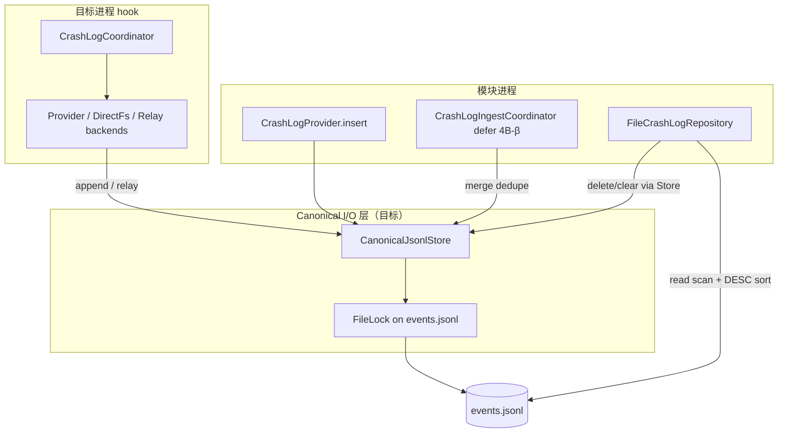

# Canonical JSONL 文件系统一致性

> 适用模块：`:app`（hook `CrashLogCoordinator` + 模块 `FileCrashLogRepository` + `CrashLogProvider`）
> 存储决策：[ADR-007](../decisions/007-crash-log-cross-process-storage.md)、[ADR-008](../decisions/008-multi-backend-crash-log-storage.md)
> 多后端与 ingest：[crash-log-backends.md](crash-log-backends.md)、[ADR-017](../decisions/017-root-ingest-and-dedupe.md)
> 读口消费：[crash-data-layer.md](crash-data-layer.md)、[crash-history-ui.md](crash-history-ui.md)
> I/O 决策：[ADR-021](../decisions/021-canonical-jsonl-io-consistency.md)（proposed）

## 概述

`files/crash_logs/events.jsonl` 是观测层 **canonical SSOT**。hook 运行在**目标 app UID**，模块 UI 运行在 **模块 UID**；二者对同一文件的 append、retention、删除与读取缺乏统一契约时，会出现 **跨进程竞态、列表排序错误、重复行、relay 孤岛** 等问题。

本文档在 4B-α as-built 基础上，定义 **canonical 文件系统层** 的目标架构、分期实施与验收标准，不重复 [crash-log-ipc.md](crash-log-ipc.md) 的 IPC 机制对比。

## 问题陈述（as-built 2026-06）

| # | 现象 | 根因 | 影响 |
|---|------|------|------|
| F1 | hook 写路径未闭环 | LSPosed / IS-1~IS-6 未验；`DirectFsBackend.probe()` 恒 `MAYBE` | 无法判断 Primary A 在目标 ROM 是否可用 |
| F2 | 同 `crash_id` 多行 | Phase 2 三后端并行，Provider + DirectFs 均 append canonical | 历史重复、统计偏高、retention 按行失真 |
| F3 | 列表「最旧在上」 | `FileCrashLogRepository` 按**文件行序**扫描，未按 `timestampMs` 降序；注释与实现不符 | 违背 [crash-history-ui.md](crash-history-ui.md) §排序 |
| F4 | `deleteById` / `clear` 与 append 竞态 | 写侧 `CanonicalJsonlWriter` 用 `FileLock`；删改侧 `ReentrantReadWriteLock` 仅进程内 + 无共享锁 | 并发时可能丢行、截断或读到半写文件 |
| F5 | relay 不可见 | `TargetRelayBackend` 写入目标 UID 私有目录；`CrashLogIngestCoordinator` defer 4B-β | canonical 全失败时 UI 仍空态 |
| F6 | DirectFs 静默失败 | `mkdirs` 失败直接 `return`，无 log | IS 矩阵难区分「未写」与「写了」 |

**不在本文 scope**：公开 `/sdcard/` 主路径（已否决，见 [crash-log-ipc.md § FAQ](crash-log-ipc.md)）；Native crash / ANR。

## 设计目标

| 目标 | 说明 |
|------|------|
| **G1 干预不变** | 文件 I/O 失败 **silent**；不阻塞 [CrashHandler](crash-handler.md)、不 `System.exit` |
| **G2 单文件 SSOT** | canonical 仍为单文件 JSONL；不引入 Room 为主存储（4E+ 可选 sidecar） |
| **G3 读口语义稳定** | `getAll` / Paging 对 UI 保证 **`timestampMs` 降序**；同 `id` 至多一行（dedupe 后） |
| **G4 变异原子性** | 凡修改 `events.jsonl` 内容（append、retention rewrite、`deleteById`、`clear`）须 **同一 `FileLock` 协议** |
| **G5 可验收** | IS-1~IS-6 + FS-* 补充用例可写入 `dev/verification/` |

## 架构总览



**原则**：`CanonicalJsonlStore`（名称待定，见 §实施）封装所有 **写/删/轮转**；`FileCrashLogRepository` 只负责 **读、筛选、分页语义**，删改委托 Store。

## 1. 跨进程写入（衔接现有后端）

写入路径不变量见 [crash-log-backends.md](crash-log-backends.md)。本方案 **不替换** ADR-007 Primary A + Provider Fallback B，仅加固其落盘一致性。

| 后端 | canonical | relay | 4B-β 目标（ADR-017 §3） |
|------|-----------|-------|-------------------------|
| `ProviderBackend` | append（模块进程内 Provider） | — | 保留 |
| `DirectFsBackend` | append（跨 UID 直写） | 失败时写 relay | **收敛**：canonical 仅一条成功路径；或 relay 为主、ingest merge |
| `TargetRelayBackend` | 不写 | append | 保留；ingest 补 canonical |
| `RootSuBackend` | Phase 1 append | — | 4B-β |

**独立启动**（IS-1 / IS-2）：须至少一条路径在模块 **force-stop** 或 **从未打开 UI** 时仍能写入；验收记录写入 `dev/verification/is_matrix_*.md`。

## 2. Canonical I/O 统一层

### 2.1 职责

| API | 调用方 | 行为 |
|-----|--------|------|
| `append(event)` | `DirectFsBackend`、`CrashLogProvider`、ingest merge | 现有 `CanonicalJsonlWriter.append` 逻辑 + 锁 |
| `applyRetention()` | 模块 `Repository.applyRetention`、可选定时 | 锁内 trim |
| `deleteById(id)` | `FileCrashLogRepository` | 锁内读全文件 → 过滤 → temp → atomic replace |
| `clear()` | Toolbar 清空（4D） | 锁内 `delete()` 或 truncate |

### 2.2 FileLock 协议（ADR-021）

```
所有变异操作:
  RandomAccessFile(events.jsonl, "rw").use { raf ->
    val lock = raf.channel.lock()  // 阻塞锁，跨进程有效
    try { ... } finally { lock.release() }
  }
```

| 场景 | 策略 |
|------|------|
| hook append ∥ 模块 delete | 串行化；delete 完成后 Repository invalidate cache |
| 双 hook 进程 append | 已有锁；retention 仍在锁内完成 |
| Provider insert ∥ DirectFs append | 锁串行；**仍可能同 id 两行** → dedupe（§3） |
| UI 只读 scan | 不持锁；依赖 `lastModified` + `length` 失效缓存；可选读前短暂共享锁（defer，见 §风险） |

**禁止**：模块侧 `deleteById` 在无 `FileLock` 情况下 `BufferedReader` + `renameTo`（当前 as-built 行为）。

### 2.3 实现落点

| 选项 | 说明 | 建议 |
|------|------|------|
| A | 重命名 `CanonicalJsonlWriter` → `CanonicalJsonlStore`，迁入 `deleteById`/`clear` | **推荐** — 单 object，hook 与模块 classpath 共享 |
| B | 新建 `CanonicalJsonlStore` 委托 Writer | 过渡期双类，易漂移 |

包路径保持 `nota.android.crash.log`，hook 与 `CrashLogProvider` / `FileCrashLogRepository` 共用（符合 [app-di-and-module-boundaries.md](app-di-and-module-boundaries.md)）。

## 3. Dedupe 与 relay 可见性

**SSOT 决策**：[ADR-017](../decisions/017-root-ingest-and-dedupe.md)（proposed）。

| 层级 | 职责 | 优先级 |
|------|------|--------|
| **写路径收敛** | Phase 2 常态下单 canonical append + relay 副本 | 4B-β |
| **ingest merge** | `CrashLogIngestCoordinator` 按 `id` merge relay → canonical | 4B-β |
| **读路径防御** | `getAll` 返回前 `distinctBy { id }` 保留 `timestampMs` 最大者 | 4B-γ 可先做，成本低 |

relay 路径：`/data/user/0/{packageName}/files/crashcenter_relay/{eventId}.json` — 模块 **无 root 时不可读**；须 4B-β ingest 或用户文档说明「仅 canonical 可见」。

## 4. 读路径语义修正

### 4.1 排序

| 层 | 物理顺序 | 逻辑顺序（UI） |
|----|----------|----------------|
| `events.jsonl` 文件 | append 顺序 ≈ 时间升序 | — |
| `FileCrashLogRepository.getAll` | 扫描全文件或 early terminate | **`sortedByDescending { timestampMs }`** 后 `drop(offset).take(limit)` |
| `CrashEventPagingSource` | 不变 | 消费已排序列表 |

**注意**：在 dedupe 前，offset 分页可能对重复 `id` 产生跳页；**4B-γ 读路径 dedupe 应与排序同批落地**。

### 4.2 缓存失效

保持 as-built：`lastModified` + `length` 变更 → 清空 LRU 与 filter cache。`CanonicalJsonlStore` 每次变异后文件 mtime 必变，读侧自动 reload。

### 4.3 `getById`

扫描顺序无关；缓存键仍为 `id`。dedupe 后 canonical 单行 / id，语义不变。

## 5. 可观测性（静默失败）

| 项 | as-built | 目标 |
|----|----------|------|
| DirectFs `mkdirs` 失败 | silent return | `XposedBridge.log` 一行 + `AppendResult.Failure` |
| 三后端全失败 | `hookSafeLog` | 保持 |
| 模块删改失败 | 无 | `Log.w`（仅模块进程）；UI 操作返回 false |

不改变 G1：仍不向用户弹窗、不杀进程。

## 6. 实施分期

与 [phase4_crash_observability.md](../../dev/roadmap/active/phase4_crash_observability.md) 对齐：

### 6.1 4B-γ — Canonical 一致性（本方案 MVP）

**不依赖** root / libsu；可与 IS 矩阵并行。

- [ ] **FS-1** 抽取 `CanonicalJsonlStore`（或扩展 Writer）：`append` / `applyRetention` / `deleteById` / `clear` 统一 `FileLock`
- [ ] **FS-2** `FileCrashLogRepository` 删改委托 Store；移除无锁 temp rewrite
- [ ] **FS-3** `getAll`：`timestampMs` 降序 + 读路径 `distinctBy { id }`
- [ ] **FS-4** 单测：跨线程 append+delete 同文件；排序 + dedupe 用例
- [ ] **FS-5** DirectFs `mkdirs` 失败可观测（log + Failure）

**出口**：`crash-history-ui` 列表时间倒序正确；并发删改不因无锁损坏 JSONL。

### 6.2 4B-β — ingest + 写路径收敛（ADR-017）

- [ ] `CrashLogIngestCoordinator` + relay merge
- [ ] `RootSuBackend` Phase 1（可选）
- [ ] 写路径收敛减少 canonical 重复 append
- [ ] IS-R1~IS-R5

### 6.3 IS 矩阵（写入路径）

沿用 IS-1~IS-6；补充 **FS-6**：

| # | 操作 | 期望 |
|---|------|------|
| FS-6 | hook 连续崩溃 10 次后 UI `deleteById` 一条 | 文件有效 JSONL；无损坏行；条数 -1 |
| FS-7 | 模块 `clear()` 后 hook 再崩溃 | 仅 1 条新行；Observe 显示 1 条 |

## 7. 验收标准

| 闸门 | 条件 |
|------|------|
| **4B-γ done** | FS-1~FS-5 单测绿 + `:app:assembleDebug`；文档 as-built 更新 |
| **ADR-021 accepted** | FS-1~FS-2 设计无冲突 |
| **ADR-017 accepted** | IS-1+IS-2 至少一条写入路径 + G3 无重复行（ingest 或读 dedupe） |
| **4B 写入闭环** | 真机 `dev/verification/is_matrix_*.md` 记录 DirectFs / Provider / relay 组合 |

## 8. 风险与非目标

| 风险 | 缓解 |
|------|------|
| 全文件扫描 + 排序影响大文件性能 | 500 条 / 8 MB 硬顶；4E sidecar index defer |
| `FileLock` 阻塞 UI 删改 | 删改在 `Dispatchers.IO`；文件小，可接受 |
| 读无锁时碰到 retention rewrite | 极低窗口；parse 失败跳过行；可选后续读锁 defer |
| Paging + 全量 sort 每次 load | 当前 `PAGE_SIZE=50`、≤500 行；全量 sort 可接受 |

**非目标**：

- 替换 JSONL 为 SQLite/Room（4E+ 另议）
- 多文件分片 / 按包名分目录
- 公开存储导出（仍属 P3 SAF）

## 相关文档

- [crash-logging.md](crash-logging.md) — CrashEvent 与 retention 默认
- [crash-log-ipc.md](crash-log-ipc.md) — 跨进程 IPC 与 IS 矩阵背景
- [crash-log-backends.md](crash-log-backends.md) — 多后端写入时序
- [crash-data-layer.md](crash-data-layer.md) — Repository 读口
- [ADR-017](../decisions/017-root-ingest-and-dedupe.md) — dedupe 与 ingest
- [ADR-021](../decisions/021-canonical-jsonl-io-consistency.md) — FileLock 与读序决策
- [phase4_crash_observability.md](../../dev/roadmap/active/phase4_crash_observability.md) — 4B-γ checklist
- [dev/verification/README.md](../../dev/verification/README.md) — 验收报告模板
