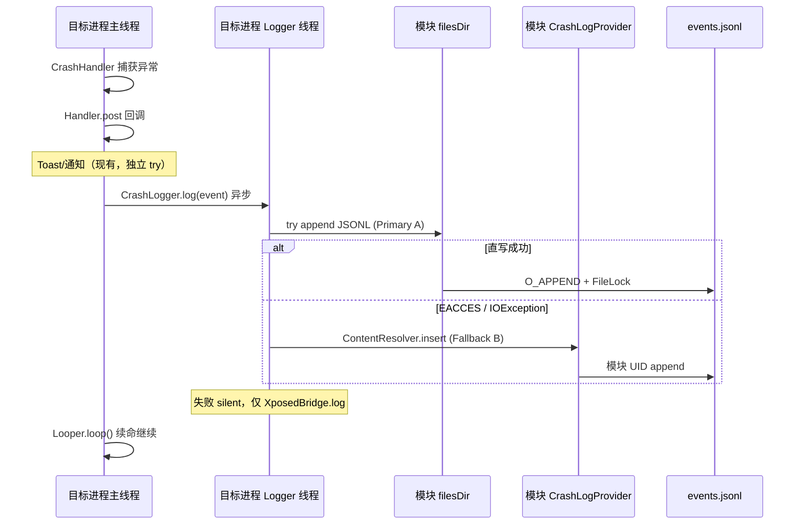

# 崩溃日志跨进程通信

> 适用模块：`:app`（Phase 4 待建 `CrashLogger` / `CrashLogProvider`）
> 数据模型与 retention 见 [crash-logging.md](crash-logging.md)
> 存储决策见 [ADR-007](../decisions/007-crash-log-cross-process-storage.md)、[ADR-008](../decisions/008-multi-backend-crash-log-storage.md)
> **编排与多后端 SSOT**：[crash-log-backends.md](crash-log-backends.md)（root 优先并行写入 + 模块 root ingest）

## 上下文

CrashCenter 的 hook 代码运行在**目标 app 进程**（目标 UID / 沙箱），崩溃日志须持久化到**模块进程** `nota.android.crash.xp.app` 的私有存储，供历史 UI 与统计读取。

| 维度 | hook 侧 | 模块侧 |
|------|---------|--------|
| 进程 | 目标 app | 模块 app |
| 职责 | 拦截异常、异步写入 | 存储 JSONL、UI 读取 |
| 配置 | [XSharedPreferences 只读](../decisions/003-xsharedpreferences-cross-process.md) | SharedPreferences 写入 |

观测层写入**不改变**干预层语义：失败须 silent，不得阻塞 [CrashHandler](crash-handler.md) 的 Looper 续命，不得触发 `System.exit`。

---

## 机制对比（A–J）

完整数据模型、retention 与分阶段交付见 [crash-logging.md](crash-logging.md)。

| 选项 | 原理 | 崩溃时可靠性 | 最大 payload | 模块未运行 | OEM 风险 | MVP |
|------|------|--------------|--------------|------------|----------|-----|
| **A. 直写 filesDir** | `createPackageContext(module).getFilesDir()` append JSONL | 高（不依赖模块进程） | 磁盘上限 | **可写** | **高**（10+ SELinux 常拒写） | **主路径** |
| **B. ContentProvider insert** | `ContentResolver.insert` → Provider append | 高 | ~1MB Binder（建议 <512KB/行） | AM 按需拉起 | 低 | **Fallback** |
| **C. Broadcast** | 显式广播 → Receiver 写文件 | 中（后台限制、丢广播） | Intent extra ~100KB | 受限 | 中 | 不推荐 |
| **D. startService / WorkManager** | 启动模块 Service/Worker | 低–中（BG 限制） | Intent/Bundle 受限 | 可拉起 | 高 | 不推荐 |
| **E. AIDL Bound Service** | bind → transact | 低（须连接成功） | 可分段 | 须 bind | 中 | 过度设计 |
| **F. XSharedPreferences 写** | hook 写模块 prefs | — | **不适合**（KB 级） | — | — | **错误方向** |
| **G. Unix / Local Socket** | 模块 listen，hook connect | 中（对端须监听） | 流式 | 须模块进程 | 高 | 不推荐 |
| **H. Logcat / XposedBridge.log** | 写系统 log 缓冲区 | 高 | 无硬限但截断 | 不需要 | 低 | **仅调试** |
| **I. Provider openFile + pipe** | `openFile()` 返回 PFD 流式写 | 高 | **最佳大 payload** | 同 B | 低 | P2+ 优化 |
| **J. Messenger / Handler** | bind Service + Message | 低 | Bundle 限制 | 同 E | 中 | 过度设计 |

**硬约束摘要：**

- 写入须**异步**，不得阻塞崩溃路径
- stack 4KB–64KB+；Intent/Binder 有上限
- 多目标 app 同时崩溃 → 同一 `events.jsonl` 竞争，需 `FileLock` 或 Provider 串行
- `crash_log_enabled` 等开关可走 prefs（hook 只读）；**事件体不走 prefs**（见 [ADR-003](../decisions/003-xsharedpreferences-cross-process.md)）

---

## 推荐链路（MVP）

**编排层**（[ADR-008](../decisions/008-multi-backend-crash-log-storage.md)、[crash-log-backends.md](crash-log-backends.md)）：

```
Phase 1:   RootSu (tier 0) — hook 内 su append canonical
Phase 2:   B Provider ∥ A DirectFs ∥ Relay 并行
Module:    RootFs ingest relay → canonical；UI 读 canonical
Debug:     H — XposedBridge.log
Future:    I — openFile 流式
Never:     F — prefs 存事件体
```

**单后端语义**（本文件 A–J 对比仍有效）与 ADR-007 一致：

```
Primary:   A — 异步 JSONL append（createPackageContext → files/crash_logs/events.jsonl）
Fallback:  B — CrashLogProvider.insert（ContentResolver IPC）
```

### MVP 时序



### hook 侧调用位置

- 在 [xposed-entry.md](xposed-entry.md) 所述 handler 内、**与 `showNotify` 解耦**：`crash_log_enabled` 为 true 时无论是否 Toast 均记录
- **不得**放入现有 `try { Toast... } catch { System.exit(0) }` 块内

---

## LSPosed / Xposed inject 特性

| 问题 | 结论 |
|------|------|
| inject 代码 classpath | hook 类由 Xposed/LSPosed 加载进**目标进程**，使用模块 APK dex，但运行在**目标 UID/沙箱** |
| 共享 Application？ | **否**。`AndroidAppHelper.currentApplication()` 是目标 app 的 Application |
| XSharedPreferences | **只读**；prefs 由 UI 进程写入；hook 不能用来 append 大日志 |
| XSharedPreferences 冷启动 | **不依赖模块进程**；LSPosed 使 hook 侧可直接读 `/data/data/nota.android.crash.xp.app/shared_prefs/`（见 [ADR-003](../decisions/003-xsharedpreferences-cross-process.md)） |
| XposedBridge.log | 写 logcat，**非** IPC 到模块 |
| export Provider | 跨 UID 调用须 `exported="true"`；`exported="false"` 仅同 UID 可用 |
| 经典 Xposed vs LSPosed | prefs 路径细节不同，但「hook 在目标进程、存储在模块进程」模型一致 |
| LSPosed scope 冷启动 | 目标 app 独立启动时 inject 仍生效；**不要求**模块 UI 进程曾运行 |

---

## 目标进程独立启动时的权限与通信

> **场景**：用户从未打开 CrashCenter，或已 force-stop 模块；仅目标 app 被 Zygote 拉起并触发崩溃。此时 hook 代码仍运行，但模块进程 `nota.android.crash.xp.app` **可能不存在**。

### 进程隔离模型

```
┌─────────────────────────────────────────────────────────────┐
│  Zygote fork → 目标 app 进程                                 │
│  UID = 目标 app (如 u0a123)                                  │
│  SELinux = u:r:untrusted_app:s0:cXXX,...                     │
│  Context = 目标 Application（非模块 Application）           │
│  Dex = 目标 APK + Xposed 注入的模块 hook 类                  │
└─────────────────────────────────────────────────────────────┘
         │  IPC / I/O 均以目标 UID 身份经 Binder / VFS
         ▼
┌─────────────────────────────────────────────────────────────┐
│  模块进程 nota.android.crash.xp.app（可能未运行）               │
│  UID = 模块 (如 u0a456)                                      │
│  存储 = /data/data/nota.android.crash.xp.app/files/...          │
└─────────────────────────────────────────────────────────────┘
```

**核心约束**：Android 权限与 SELinux 按 **调用方 UID**（目标 app）判定，**不会**因 dex 来自模块 APK 而授予模块权限。`CONTEXT_IGNORE_SECURITY` 仅绕过 Java 层 `Context` 权限检查，**不能**绕过 SELinux MAC。

### 独立启动时各 IPC 路径矩阵

| 机制 | 模块进程须运行？ | 独立启动可行性 | 主要障碍 |
|------|-----------------|----------------|----------|
| **A. createPackageContext → filesDir** | **否** | ROM 相关 | API 30+ **包可见性**（`NameNotFoundException`）；Android 10+ **SELinux** 拒跨 UID 写 `module_data_file`（EACCES） |
| **B. ContentProvider insert** | **否**（AM 按需拉起 Provider 所在进程） | **可行**（若权限模型正确） | 见下文 **signature 权限悖论** |
| **C. Broadcast → Receiver** | 须能投递 | **不可靠** | force-stop 后广播被丢弃；后台限制；同权限问题 |
| **D. startService** | 可拉起 | **低** | Android 8+ 后台启动限制；Android 12+ 前台服务限制；foreign UID |
| **E–J** | 各异 | 不推荐 | 见机制对比表 |

#### A. 直写 filesDir（Primary）

```java
// hook 侧 — 运行在目标 UID
AndroidAppHelper.currentApplication()
    .createPackageContext("nota.android.crash.xp.app", Context.CONTEXT_IGNORE_SECURITY)
    .getFilesDir();  // → /data/data/nota.android.crash.xp.app/files/
```

| 检查层 | 模块未运行 | 说明 |
|--------|-----------|------|
| 进程依赖 | ✅ 无 | 直接 VFS 写路径，不经模块代码 |
| 包可见性 (API 30+) | ⚠️ | `createPackageContext` 内部 `getApplicationInfo(modulePkg)`；目标 manifest **无法**加 `<queries>` → 可能 `NameNotFoundException` |
| SELinux (API 29+) | ⚠️ 高概率拒 | 目标 `untrusted_app` 域写模块 `data_file` → EACCES；硬编码路径 `new File("/data/data/...")` **同样**被 SELinux 拦截 |
| 模块 force-stop | ✅ 不影响 | 与进程存活无关 |

**现有代码佐证**：`XposedEntry.showNotification` 已用 `createPackageContext(pkgName)` 加载**目标**包字符串（反向方向），说明同 API 在 hook 侧可用；但 **module → filesDir 写入**方向更严，须真机矩阵验证。

#### B. ContentProvider insert（Fallback）

```java
// hook 侧 — Binder 调用，callingUid = 目标 UID
getContentResolver().insert(
    Uri.parse("content://nota.android.crash.xp.app.crashlog/events"), values);
```

| 检查层 | 模块未运行 | 说明 |
|--------|-----------|------|
| 进程依赖 | ✅ AM 拉起 | `ContentProvider.onCreate` 在模块进程执行；**首次 insert 可能冷启动模块** |
| 包可见性 | ✅ 通常无影响 | `ContentResolver` 按 **authority** 路由，不经过目标 `PackageManager.query` |
| 权限 | ⚠️ **设计关键** | 见下一节 signature 悖论 |
| force-stop | ⚠️ | Provider 调用可唤醒模块进程；但若模块被 force-stop，部分 OEM 对 Provider 拉起亦有限制 — 真机验证 |

#### C / D. Broadcast / Service

- **Broadcast**：显式 `ComponentName(module, Receiver)` 在模块 force-stop 后 **不投递**（Android 3.1+）；不适合崩溃路径。
- **startService**：foreign UID 从后台启动模块 Service 受 **Background Execution Limits** 约束；MVP 不采用。

#### Intent / 组件可见性

| 操作 | 需要目标 `<queries>` 模块？ | 独立启动 |
|------|---------------------------|----------|
| `createPackageContext(modulePkg)` | **可能需要**（API 30+） | 风险点 |
| `ContentResolver.insert(content://authority/...)` | **否** | 推荐 fallback 路径 |
| 显式 `ComponentName` 启动 `ActivityCrashInfo` | **否** | 现有通知 PendingIntent 已验证可行 |
| `PackageManager.getPackageInfo(module)` | **是** | hook 侧应避免依赖 |

**模块 Manifest 的 `<queries>`**（`QUERY_ALL_PACKAGES`）仅扩大**模块 UI 进程**可见性，**不能**替目标 app 解决包过滤。

### signature 权限悖论（Fallback B 关键缺陷）

原方案写「exported Provider + `protectionLevel="signature"` 防伪造」。但：

| 角色 | 签名 | 调用 Provider 时 UID |
|------|------|---------------------|
| 模块 `nota.android.crash.xp.app` | 模块 keystore | 模块 UID ✅ |
| 目标 app（hook 注入处） | **目标 app 签名** | 目标 UID ❌ |
| 任意第三方 app | 各异 | 各异 ❌ |

`protectionLevel="signature"` 仅授予与**声明该 permission 的 APK 同签名**的调用方。hook 代码虽来自模块 dex，但 `Binder.getCallingUid()` 返回 **目标 app UID** → `checkCallingPermission()` **失败** → `SecurityException`。

**结论**：Fallback B **不能**使用 signature-only 的 `android:permission`；否则从 hook 侧调用 **永远失败**，与「模块未运行」无关，是身份悖论。

#### 可行 Provider 权限模型

| 方案 | hook 可调用 | 安全 | MVP 建议 |
|------|------------|------|----------|
| `exported="true"` **无** manifest permission | ✅ | 低 — 任意 app 可 insert | **采用** + Provider 内校验 |
| `protectionLevel="signature"` | ❌ | 高但对 hook 不可用 | **禁止** |
| `protectionLevel="normal"` 自定义 permission | ❌ | 目标 manifest 无法声明 | 不可行 |
| `exported="false"` | ❌ | 仅同 UID | 不可行 |

**Provider 内缓解**（替代 signature permission）：

1. `Binder.getCallingUid()` → `getPackageNameForUid` 必须与 payload 中 `packageName` 一致
2. 单条 stack 上限（64KB）、字段白名单、rate limit（按 callingUid）
3. retention 硬顶 — 防 DoS 写满磁盘
4. authority 非公开文档化（弱 obscurity，不单独依赖）

### 配置读取 vs 日志写入（独立启动）

| 数据 | 方向 | 独立启动 | 机制 |
|------|------|----------|------|
| scope / `crash_log_enabled` | UI → hook | ✅ | `XSharedPreferences.reload()` — 直读模块 prefs 文件，**无需模块进程** |
| CrashEvent 事件体 | hook → 模块存储 | ⚠️ | Primary A 或 Fallback B；**不能**用 XSharedPreferences（ADR-003） |

用户从未打开模块 UI 时：`scope_mode` 默认 `false`（hook 全部 app）；`crash_log_enabled` 默认 `true`（待建 pref）— hook 仍应尝试写入。

### 修正后主备链路

```
Primary A:   createPackageContext(module) → filesDir JSONL append
             └─ 不依赖模块进程；受 SELinux + 包可见性约束

Fallback B:  ContentResolver.insert → CrashLogProvider（exported，无 signature permission）
             └─ AM 按需启动模块进程；Provider 内 UID/payload 校验

Debug H:     XposedBridge.log

Never:       signature permission 门禁的 Provider（hook 侧不可调用）
Never:       Broadcast / startService 作崩溃写入
Never:       XSharedPreferences 存事件体
```

**决策顺序**（Phase 4B 真机矩阵驱动）：

1. 若 A 在目标 ROM 成功 → 默认 A，B 作保险
2. 若 A 因 SELinux/可见性失败 → **必须**启用 B，且 B **不得**用 signature permission
3. 若 A、B 均失败 → silent + logcat；干预层不受影响

---

## 安全

| 组件 | 风险 | 缓解 |
|------|------|------|
| exported Provider（无 signature permission） | 任意 app 伪造崩溃、DoS 写满磁盘 | Provider 内 **UID ↔ packageName 一致性**、rate limit、单条 stack 上限（64KB）、retention 硬顶；**禁止** signature permission（见上节悖论） |
| exported Receiver/Service | 同上 + 后台滥用 | MVP 不引入 |
| JSONL 内容 | stack 含路径/token | 本地 only；`allowBackup="false"`；导出前用户确认（P3 SAF） |
| 直写 filesDir | 误配 world-readable；跨 UID 写 | 仅模块私有目录；不暴露外部存储；SELinux 失败则走 Provider |

当前 Manifest 仅 export `ActivityMain` / `ActivityCrashInfo`；Phase 4 新增 Provider 是主要新增攻击面，须权限门禁。

---

## 失败模式

| 场景 | 行为 | 禁止 |
|------|------|------|
| Primary 写失败 | 尝试 Fallback B；仍失败则 `XposedBridge.log` | `System.exit`、抛到 UEH |
| Fallback 失败 | silent；干预层继续 Looper 续命 | 阻塞主线程 |
| 模块进程未运行 | A 不依赖进程；B 由 AM 拉起 Provider 进程 | 假设 UI 在前台 |
| 模块 force-stop | A 仍可能（若 SELinux 允许）；B 通常可拉起 Provider | 忽略 force-stop 场景 |
| 目标从未 `<queries>` 模块 | A 可能 `NameNotFoundException`；B 用 content URI 不受影响 | 假设 A 全平台可用 |
| Provider signature permission | hook 侧 **SecurityException** | 使用无 signature permission 的 exported Provider + 内部校验 |
| 多 app 同时崩溃 | `FileLock` 或 Provider 单线程 | 无锁并发 append |
| 磁盘满 / 超 retention | 轮转删最旧；写失败 silent | 无限增长 |
| Binder 过大 | 截断 stack；或升级 I 流式 | 让整个 IPC 失败并 exit |
| OEM 拒跨 UID 写 | 真机矩阵 → 启用 B | 假设 A 全平台可用 |

**与现有代码冲突点：** [xposed-entry.md](xposed-entry.md) 通知路径失败会 `System.exit(0)`；`CrashLogger` 须独立线程 + 独立 try/catch，确保**日志失败不影响吞异常**。

---

## 方案取舍与常见疑问

本节汇总架构评审与用户问答中的结论，作为 IPC 设计的 **SSOT 答疑**（与 [ADR-007](../decisions/007-crash-log-cross-process-storage.md) 一致）。

### 有没有「稳定」的采集方案？

**有，但不是单一 API 全 ROM 零失败。** Xposed 跨进程写入的硬约束：

| 约束 | 含义 |
|------|------|
| hook 运行在**目标 UID** | 不是模块身份，不能假设模块权限 |
| 与模块**异签名** | signature Provider / 同签名 IPC 对 hook 侧不可用 |
| 模块进程**可不存在** | force-stop、从未打开 UI 后仍须能采集 |
| SELinux + 包可见性 | 直写模块 `data/` 在部分 ROM 上 EACCES |
| 崩溃路径须快 | 异步写入；失败 silent |

**稳定方案 = 分层主备**，而非银弹：

```
Primary A（JSONL 直写 module filesDir）— 快、可不启模块进程；ROM 相关
    ↓ 失败
Fallback B（exported CrashLogProvider.insert）— 跨 ROM 最可预期；AM 拉起模块进程
    ↓ 失败
Debug H（XposedBridge.log）— 仅调试，非持久化
```

| 机制 | 独立启动 + 异签名下的可靠度 |
|------|---------------------------|
| **B ContentProvider** | **最高**（模块 UID 写盘） |
| **A 直写 filesDir** | 中（部分 ROM 成功，部分 EACCES） |
| 其余（Broadcast、Service、公开 FS、framework） | 低 — **不作主路径** |

实现上应默认 **B 在目标矩阵上必须可用**；A 为性能加分项。API 30+ 可对已知失败设备 **A+B 双试** 提高成功率。

**不存在**「全 Android 版本、全 OEM、100% 写入成功」的单一机制；目标是 **IS-1/IS-2 验收通过 + 失败不影响吞崩溃**。

### 为何不用 XSharedPreferences 存崩溃日志？

[XSharedPreferences](../decisions/003-xsharedpreferences-cross-process.md) 与崩溃采集 **方向相反、能力不匹配**：

| 维度 | ADR-003（配置） | 崩溃事件体 |
|------|-----------------|------------|
| 数据方向 | UI **写** → hook **读** | hook **写** → UI **读** |
| API | `reload()` + `getBoolean` 等 | **无** `putString` / append API |
| 体量 | boolean、StringSet | stack 4KB–64KB+ |
| 存储形态 | 单份 XML | 需 append-only、数百条 |
| 并发 | 低频 UI 写入 | 多 app 同时崩溃 + UI 改设置 → **易损坏 XML** |
| 独立启动 | hook 可读 prefs，**无需模块进程** | 仍不能解决「hook 写大日志」 |

**分工**（见 [crash-logging.md](crash-logging.md#retention-与隐私)）：

- ✅ `crash_log_enabled`、`crash_log_max_entries` 等 **开关** → prefs / XSharedPreferences **只读**
- ❌ `stackTrace`、历史列表、统计 → **JSONL / Provider**，**禁止**写入 `grapcrash.xml`

强行用 hook 直改 `shared_prefs/grapcrach.xml` 存堆栈：与 UI `commit()` 竞争、只能留最后一条、SELinux 问题与直写 `filesDir` 同类，**不比 ADR-007 更稳**。

### 为何不用公开文件系统（/sdcard/）？

公开目录 **不能**作为 IPC 主路径或 Fallback：

| 路径类型 | 目标进程写 | 模块读 | 问题 |
|----------|------------|--------|------|
| 模块 `filesDir` / `externalFilesDir` | 跨 UID，SELinux | ✅ | 与 Primary A 同类 |
| `/sdcard/Android/data/目标包名/` | ✅ | ❌ 其他 app 不可读 | 模块读不到 |
| 公共 Documents 等 | 需存储权限 | ✅ 任意 app 可读 | 见下 |

**Android 10+**：Scoped Storage；`WRITE_EXTERNAL_STORAGE` 对 targetSdk 30+ 几乎无效；**不能替目标 app 申请** `MANAGE_EXTERNAL_STORAGE`。

**写入方是目标 UID**：目标 app 通常无存储权，hook 无法用目标身份随意 append `/sdcard/`。

**安全**：堆栈含路径/token；公共目录 = 任意有存储权限的 app 可读 + 可伪造日志。

**结论**：公开 FS **不降低**跨 UID 难度，**升高**隐私与权限成本。外部存储仅作 **P3 SAF 用户主动导出**（[crash-logging.md](crash-logging.md) P3），不是采集 IPC。

### celestailruler / framework 注入能否更稳？

参照 [framework-injection-feasibility.md](framework-injection-feasibility.md)：

- **吞崩溃**必须在目标 app 主线程 `Looper` 续命 → framework **不能替代** app 级 hook
- **已吞 Java 异常**不会走 AMS `handleApplicationCrash` → system 采集补不到主场景
- celestailruler 跨进程走 **exported Provider**（独立 server APK），不是 system_server 或公开 FS
- 唯一可选补丁：`parseQueries`（须 LSPosed System Framework scope）— 仅当 A 因**包可见性**失败，**不替代 B**

### LSPosed 作用域 vs UI 应用列表

两套机制，文档须同时说明（见 [usage.md](../guides/usage.md)）：

| 机制 | 控制什么 |
|------|----------|
| **LSPosed 作用域** | 模块代码是否注入目标进程（hook 是否执行） |
| **UI Switch / `package_list`** | hook 后是否拦截该包（`shouldHandlePackage`） |
| **XSharedPreferences** | hook 读 UI 写的 scope 配置；**冷启动可用，无需模块进程** |

UI 能列出几乎全部 app（模块 `QUERY_ALL_PACKAGES`）≠ 目标 app 已被 hook ≠ 崩溃会被记录。用户须：**管理器勾选作用域** + **应用内 Switch** +（Phase 4）`crash_log_enabled`。

---

## Framework 注入（已评估：不采用）

曾参照 [celestailruler](/home/clarence/Projects/Android/celestailruler) 评估 hook **System Framework**（`system_server` / `android` 包）以改善跨进程写入或集中采集崩溃。**结论：不作为主架构**——干预与观测均须在目标 app 进程；system_server 代写或 AMS crash hook 无法替代 [ADR-007](../decisions/007-crash-log-cross-process-storage.md) 的 Provider fallback，且无法解决已吞 Java 异常的采集。

**唯一可选后续**：Phase 4B 真机矩阵若 Primary A 因 **包可见性**（非 SELinux）失败，可局部借鉴 `parseQueries` 补丁（须额外勾选 LSPosed System Framework scope）。详见 [framework-injection-feasibility.md](framework-injection-feasibility.md)。**不创建 ADR-008**。

---

## 与 ADR / 文档关系

| 文档 | 关系 |
|------|------|
| [crash-logging.md](crash-logging.md) | 观测层总方案：数据模型、retention、分阶段 |
| [crash-log-backends.md](crash-log-backends.md) | 多后端抽象、并行编排、模块 root ingest |
| [ADR-008](../decisions/008-multi-backend-crash-log-storage.md) | 已接受：root 优先 + 并行 fallback |
| [ADR-007](../decisions/007-crash-log-cross-process-storage.md) | canonical JSONL + Provider；由 ADR-008 编排 |
| [ADR-003](../decisions/003-xsharedpreferences-cross-process.md) | 配置只读；事件体不走 prefs |
| [xposed-entry.md](xposed-entry.md) | hook 回调写入点；`System.exit` 隔离要求 |
| [framework-injection-feasibility.md](framework-injection-feasibility.md) | System Framework 注入可行性；结论：不采用 |

Phase 4 第一项验收：独立启动矩阵（见 [phase4_crash_observability.md](../../dev/roadmap/active/phase4_crash_observability.md#4b-验收独立启动矩阵)）— Primary 直写是否 EACCES / 包可见性失败，决定 Fallback B 是否默认启用。

---

## 相关文档

- [crash-log-backends.md](crash-log-backends.md) — 多后端存储与 ingest
- [crash-logging.md](crash-logging.md) — 崩溃日志采集与统计
- [ADR-007](../decisions/007-crash-log-cross-process-storage.md) — 跨进程存储决策
- [ADR-003](../decisions/003-xsharedpreferences-cross-process.md) — 配置跨进程（只读）
- [xposed-entry.md](xposed-entry.md) — hook 入口与通知
- [crash-handler.md](crash-handler.md) — 拦截机制
- [phase4_crash_observability.md](../../dev/roadmap/active/phase4_crash_observability.md) — 实施任务
- [framework-injection-feasibility.md](framework-injection-feasibility.md) — Framework 注入评估（不采用）
