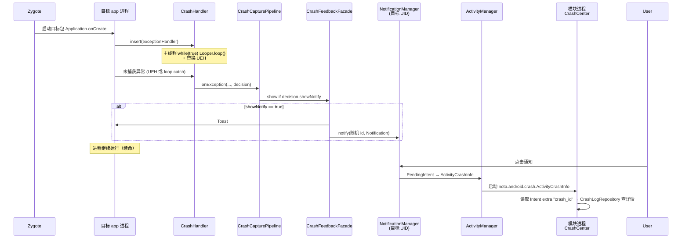

# 崩溃通知与用户反馈流程

> 适用模块：`:app`
> 源码：`CrashFeedbackFacade.kt`、`CrashCapturePipeline.kt`、`XposedEntry.java`、`CrashHandler.java`、`ActivityCrashInfo.java`
> 上游：[crash-handler.md](crash-handler.md)、[xposed-entry.md](xposed-entry.md)
> 配置键：[scope-and-prefs.md](scope-and-prefs.md)

## 概述

CrashCenter 在**目标 app 进程**内拦截 Java 未捕获异常后，除 `XposedBridge.log` 外，还可通过 **Toast** 与 **系统通知** 向用户反馈。通知由目标进程的 `NotificationManager` 发出，点击后启动**模块进程**中的 `ActivityCrashInfo` 展示完整 stack trace。

通知与拦截是**解耦**的：包可被 hook（续命）但不弹通知；通知失败不得影响吞异常（[ADR-011](../decisions/011-feedback-failure-isolation.md)）。

---

## 端到端流程



### 文字版数据流

```
目标 app 进程
  Application.onCreate (hook after)
    → CrashHandler.insert(handler)
         ├─ 路径 A: 主线程 Looper.loop() catch → handlerException
         └─ 路径 B: UncaughtExceptionHandler → handlerException（不转发系统 handler）

    → handler 内 CrashCapturePipeline.onException
         ├─ CrashLogCoordinator.logAsync（异步，独立 try）
         ├─ XposedBridge.log(throwable)
         └─ CrashFeedbackFacade.show → Handler(mainLooper).post {
              Toast（主线程）
              NotificationManager.notify（主线程）
            }

用户点击通知
  PendingIntent → Component(模块包, ActivityCrashInfo)
    → 模块进程 ActivityCrashInfo.onCreate
         → intent.getStringExtra("crash_id")
         → CrashDetailLoader.loadStackTraceById(repository, crashId)
         → 若找到则展示完整 stack trace，若未找到则提示 "crash_detail_not_found"
```

---

## 何时展示通知：`showNotify`

`showNotify` 来自 `ScopePolicy.evaluate()` 返回的**实例级** `ScopeDecision`，在 `handleLoadPackage` 阶段确定后由闭包传入 `CrashCapturePipeline`（[ADR-010](../decisions/010-scope-policy-show-notify.md)）。

| 场景 | 是否 hook（续命） | `showNotify` | Toast / 通知 |
|------|-------------------|--------------|----------------|
| 模块自身包 `selfCheck` | 是 | `true` | 模块进程内崩溃时也会尝试展示 |
| `scope_mode == true`，包在允许范围内 | 是 | `true` | 是 |
| `scope_mode == true`，包在禁用列表 / 系统且未开 handle_system / 管理器 / android | **否**（提前 return） | — | 否 |
| `scope_mode == false`，包**未**在禁用列表 | 是 | `true` | 是 |
| `scope_mode == false`，包**在**禁用列表 | 是 | `false` | **否**（仍吞异常，仅静默） |

配置来源：`XSharedPreferences` 读取 `scope_mode`、`package_list`、`handle_system`（见 [scope-and-prefs.md](scope-and-prefs.md)）。

**注意**：非作用域模式下，禁用列表只关闭通知，**不**跳过 `CrashHandler.insert()`。

---

## 线程与进程边界

| 步骤 | 线程 | 进程 |
|------|------|------|
| `CrashHandler.handlerException` | 主线程（UEH）或 loop 所在线程 | 目标 app |
| `Handler.post` 回调 | 主线程 | 目标 app |
| `Toast.makeText` / `showNotification` | 主线程 | 目标 app |
| `NotificationManager.notify` | 主线程 | 目标 app（**目标 UID** 发通知） |
| `ActivityCrashInfo` | UI 线程 | **模块** `nota.android.crash.xp.app` |

通知出现在**崩溃 app 的通知栏**（使用该 app 的 `NotificationManager`），小图标为**目标 app 的 `ApplicationInfo.icon`**，而非 CrashCenter 图标。

---

## Toast 内容

```text
getCrashTip(packageName) + appLabel + " " + throwable.getLocalizedMessage()
```

- `getCrashTip`：`createPackageContext(packageName, CONTEXT_IGNORE_SECURITY)` 后取 `R.string.crash_tip`（模块资源 ID）
- 文案：`CrashCenter [Xposed]` / `崩溃中心 [Xposed]`（随系统语言，见 `values` / `values-zh`）

---

## 系统通知构建（`showNotification`）

### Intent 与 PendingIntent

| 项 | 值 |
|----|-----|
| Action | `Intent.ACTION_VIEW` |
| Component | `nota.android.crash.xp.app` / `nota.android.crash.ActivityCrashInfo` |
| Flags | `FLAG_ACTIVITY_NEW_TASK \| FLAG_ACTIVITY_RESET_TASK_IF_NEEDED` |
| Extra | `crash_id` = 事件 UUID（由 `CrashEventBuilder` 生成） |
| 详情页加载 | `ActivityCrashInfo` 通过 `CrashDetailLoader.loadStackTraceById` 从 `CrashLogRepository` 读取完整 stack trace |
| PendingIntent | `getActivity(context, 0, intent, FLAG_CANCEL_CURRENT \| FLAG_IMMUTABLE*)` |

\* API 31+（`Build.VERSION_CODES.S`）附加 `FLAG_IMMUTABLE`。

`ActivityCrashInfo` 在 Manifest 中 `exported="true"`，带 `VIEW` intent-filter，允许跨包显式 Component 启动。

### NotificationChannel（Android 8+）

仅当 **设备 API ≥ O** 且 **目标 app `targetSdkVersion ≥ O`** 时创建 channel：

| 字段 | 值 |
|------|-----|
| id | `catch_exception` |
| name | `catch exception[Xposed]`（硬编码英文，未走 strings） |
| importance | `IMPORTANCE_LOW` |

否则使用无 channel 的 `Notification.Builder(application)`（兼容旧 targetSdk）。

### 通知文案与样式

| 字段 | 来源 |
|------|------|
| `contentTitle` | `crash_tip` + `" - "` + 目标 app 显示名 |
| `contentText` | `throwable.getLocalizedMessage()` |
| `BigTextStyle.bigText` | `localizedMessage` + `\n-----\n` + 栈顶 cause 的 stack trace 行（**非**完整 `getStackTraceString`） |
| `smallIcon` | `applicationInfo.icon`（目标 app） |
| `notify(id)` | `new Random().nextInt()`（每次随机 id，不合并旧通知） |

`crash_tip` 通过 `createPackageContext(pkgName)` 的 Context 配合模块 `R.string.crash_tip` 加载（与 Toast 相同机制）。

### 与详情页 stack 的差异

| 载体 | stack 内容 |
|------|------------|
| 通知 `BigTextStyle` | cause（若有）的 `StackTraceElement` 逐行拼接 |
| Intent extra `crash_id` | 事件 UUID（`CrashEvent.id`），详情页通过 `CrashDetailLoader` 从 repository 加载完整 stack |
| `ActivityCrashInfo` | 通过 `crash_id` 查 `CrashLogRepository`；若找不到则回退到旧 `Exception` extra（兼容） |

用户需**点击通知**才能看到 Intent 中的完整 stack；通知展开文本仅为摘要。

---

## 详情页：`ActivityCrashInfo`

```
onCreate
  → ViewBinding 布局 activity_crashinfo
  → SystemBars 边距
  → getIntent().getStringExtra("crash_id")
  → CrashDetailLoader.loadStackTraceById(repository, crashId)
  → 若找到则展示，若未找到则 fallback 到旧 "Exception" extra
```

- 无持久化：关闭 Activity 后 stack 不保留（Phase 4 [crash-logging.md](crash-logging.md) + [code-editor-porting.md](code-editor-porting.md)）
- `launchMode="singleTask"`：同任务栈内复用实例
- Toolbar 返回 → `finish()`

---

## 失败与兜底

| 情况 | 行为 |
|------|------|
| `CrashFeedbackFacade` 内 Toast / Notification 失败 | `XposedBridge.log(t)`，**不**杀进程 |
| `CrashCapturePipeline` 外层兜底 | `XposedBridge.log(t)`，**不** `System.exit` |
| 模块未安装 / Activity 无法启动 | 用户点击通知无效；崩溃 app 仍可能已续命 |

观测层（JSONL）与通知**并行独立**：`CrashLogCoordinator` 在 `showNotify` 之外异步写日志（见 [crash-logging.md](crash-logging.md)）。

---

## 已知实现注意点

1. **受管应用三态 `showNotify`**：`InterventionRule.showNotify == null` 时继承 ScopePolicy 全局默认（见 [scope-and-prefs.md](scope-and-prefs.md)）。
2. **跨包 `R.string`**：`createPackageContext(目标包)` + 模块 `R` 类取 string，依赖 `CONTEXT_IGNORE_SECURITY`；资源 ID 与目标 APK 不对齐时可能异常或文案错误。
3. **Channel 名称未本地化**：channel 显示名固定英文 `catch exception[Xposed]`。
4. **通知渠道归属**：通知由目标 app 进程注册 channel 并发出，卸载目标 app 后 channel 随其数据清除。

---

## 相关文档

- [crash-capture-pipeline.md](crash-capture-pipeline.md)
- [crash-handler.md](crash-handler.md) — Looper 续命与 UEH
- [xposed-entry.md](xposed-entry.md) — 包过滤与 hook 安装
- [configuration-ui.md](configuration-ui.md) — 配置 UI（Switch / scope 与 `showNotify` 映射）
- [crash-logging.md](crash-logging.md) — Phase 4 持久化（与通知并行）
- [glossary.md](../glossary.md) — `showNotify`、Self Hook
