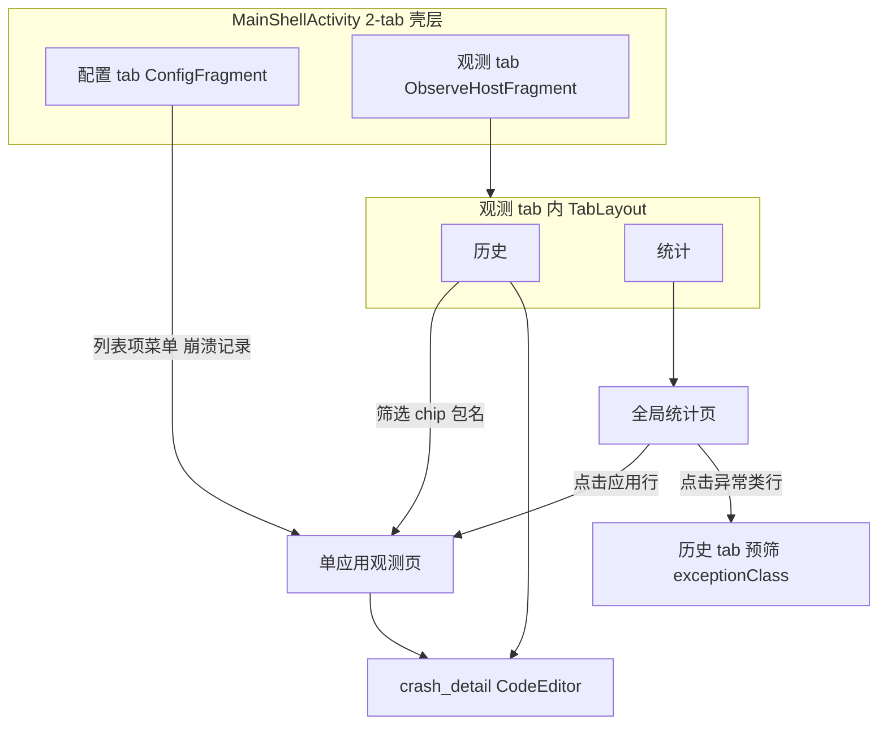

# 崩溃统计与单应用观测 UI 需求

> 适用模块：`:app` 观测域 UI（Phase 4D+）
> 数据 SSOT：[crash-logging.md](crash-logging.md) `events.jsonl` / `CrashEvent`
> 导航壳层：[navigation-ia.md](navigation-ia.md)；路由：[ui-routing.md](ui-routing.md)
> 详情展示：[code-editor-porting.md](code-editor-porting.md)

## 概述

观测层除**全局时间线**（历史子 tab）外，需要两类聚合视图：

| 页面 | 用户问题 | 载体 |
|------|----------|------|
| **全局统计页** | 哪些 app / 哪些异常最频繁？近期趋势如何？ | 观测 tab → **统计** 子 tab |
| **单应用观测页** | 某个 app 一共拦截了多少次？最近发生了什么？ | 自统计页或配置列表下钻的 **独立页 / Fragment** |

两页共享同一 `CrashEvent` 数据源与 `StatsAggregator`，差异在 **过滤维度**（全量 vs `packageName`）与 **信息密度**（聚合 vs 列表为主）。

观测 UI 属于 **observe/detail domain**：

| 层 | 类 / 包 | 职责 |
|----|--------|------|
| Shell | `shell/MainShellActivity` | 底栏选中「观测」、Toolbar 菜单、状态条 |
| Observe host | `observe/ObserveHostFragment` | 内层历史/统计 TabLayout；不直接渲染列表行 |
| History | `observe/CrashHistoryFragment` | 时间线与筛选；点击进入 `crash_detail` |
| Stats | `observe/CrashStatsFragment` | 全局统计聚合与下钻 |
| Detail | `ActivityCrashInfo` / `CrashLogDetailActivity` + `CrashLogViewerClient` | 优先 `crash_id`，兼容旧 `Exception` extra |
| Per-app | `PerAppCrashActivity` | 单应用摘要与事件列表 |

Design System 复用 [configuration-ui.md](configuration-ui.md) 中固化的 Fluent token 与 `CrashEventRow`、`FilterChipRow`、`EmptyState`、`LoadingState`；统计页不得重新定义一套视觉语言。

## As-built（2026-06-23，4D+ 部分）

| 项 | 实现 |
|----|------|
| 载体 | `ObserveHostFragment` → **统计** 子 tab → `CrashStatsFragment` |
| 聚合 | `StatsAggregator.computeStats()` 全量扫描 `events.jsonl`（`getAll` limit=MAX） |
| 摘要 | 总次数、独立包数、最近崩溃时间 |
| TOP N | 应用 TOP 5、异常类 TOP 5、**异常类别 TOP 5**、**重复崩溃 TOP 5**（4G-V2） |
| 趋势 | 按日计数列表（`yyyy-MM-dd`，降序） |
| 空/加载 | `EmptyState` / `LoadingState` |
| 单应用下钻 | `PerAppCrashActivity`（`packageName` extra）；统计页应用 TOP 行点击；`StatsAggregator.computePerAppStats` + Paging 列表 + `CrashDetailBottomSheet` |
| **未实现** | 统计页时间范围 Chip；配置 tab「崩溃记录」入口；深链 `crashcenter://app/{packageName}` |

---

## 信息架构与导航



### 不应混淆的页面

| 页面 | 排序 | 主内容 | 与配置 tab 关系 |
|------|------|--------|-----------------|
| **配置 tab 应用列表** | 安装/名称等 | per-app **hook Switch** | 干预层；可带「最近崩溃次数」角标（可选 P2+） |
| **历史子 tab** | `timestampMs` 降序 | 全量事件时间线 | 观测层；无聚合 |
| **全局统计子 tab** | 计数 / TOP N | 聚合指标 + 排行榜 | 观测层 |
| **单应用观测页** | 时间降序 | 该包事件列表 + 包级摘要 | `PerAppCrashActivity`；**无** hook Switch |

---

## 全局统计页（应用日志统计）

### 用户目标

- 快速判断「问题出在哪个 app、哪类异常」
- 了解近期拦截量是否异常升高
- 从聚合视图下钻到单 app 或过滤后的历史

### 入口

- 底栏 **观测** → 内层 Tab **统计**（[navigation-ia.md](navigation-ia.md) Phase 4D）
- 默认展示；与「历史」并列，不占用配置 tab 空间

### 布局结构（建议）

```
┌─────────────────────────────────────┐
│ Toolbar [观测]  ⋮ 清空 / 设置 / 导出 │  ← 4E 导出挂菜单
├─────────────────────────────────────┤
│ 摘要区（2×2 或横向滚动卡片）          │
│  总拦截 │ 今日 │ 涉及应用数 │ 异常类型数 │
├─────────────────────────────────────┤
│ 时间范围 Chip：[今天][7天][30天][全部] │  ← 影响下方所有聚合
├─────────────────────────────────────┤
│ 应用 TOP N（列表）                   │
│  图标 名称  次数  最近时间  >          │
├─────────────────────────────────────┤
│ 异常类 TOP N（列表）                 │
│  RuntimeException  42  >             │
├─────────────────────────────────────┤
│ 按日计数（简单列表，无图表库）        │  ← 可选 4D MVP
│  06-19  12                           │
│  06-18   3                           │
└─────────────────────────────────────┘
```

### 指标定义

| 指标 | 计算 | 时间范围 |
|------|------|----------|
| **总拦截次数** | `count(events)` | 受 Chip 过滤 |
| **今日拦截** | `timestampMs` ∈ 本地今日 0 点起 | 可与 Chip「今天」一致 |
| **涉及应用数** | `distinct packageName` | 受 Chip 过滤 |
| **异常类型数** | `distinct exceptionClass` | 受 Chip 过滤 |
| **应用 TOP N** | `groupBy(packageName).count` 降序，默认 N=10 | 受 Chip 过滤 |
| **异常类 TOP N** | `groupBy(exceptionClass).count` 降序 | 受 Chip 过滤 |
| **按日计数** | `groupBy(localDate(timestampMs)).count` | 受 Chip 过滤；默认最近 7 或 14 天 |

**去重（可选 P2+）**：同一 app、同一 `exceptionClass`、同一 `message` 哈希在 1 分钟内多次拦截是否算 1 次——默认 **不去重**（与「记录每次拦截」一致）；可在设置中开启「统计去重」。

### 交互

| 操作 | 行为 |
|------|------|
| 点击应用 TOP 行 | 打开 **`PerAppCrashActivity`**（传入 `packageName`） |
| 点击异常类 TOP 行 | 切换至 **历史** 子 tab，并应用 `filter_exception` 筛选（或 Snackbar「已在历史中筛选」） |
| 时间范围 Chip | 重算聚合；列表区显示 loading |
| Toolbar「清空历史」 | 确认对话框 → 删 `events.jsonl` / 截断 + 重置 `meta.json` → 刷新统计为 0 |
| Toolbar「记录设置」 | 跳转或 BottomSheet：`crash_log_enabled`、`crash_log_max_entries`（见 [scope-and-prefs.md](scope-and-prefs.md) Phase 4 键） |

### 空状态与边界

| 状态 | UI |
|------|-----|
| 无记录 | 插图 +「尚无拦截记录」+ 链到配置 tab / Test 菜单说明 |
| `crash_log_enabled == false` | 横幅：「记录已关闭，仅显示旧数据」 |
|  ingest 进行中 | 摘要区副文案「正在合并 relay…」或静默刷新 |
| JSONL 损坏行 | 跳过该行；统计页脚可选「已跳过 N 条无效记录」 |

### 非目标（4D MVP）

- 饼图 / 折线图 / MPAndroidChart 等重型图表库（[navigation-ia.md](navigation-ia.md)）
- 跨设备同步、云端统计
- Native crash / ANR（数据模型不含）

---

## 单应用观测页（单应用列表统计）

### 用户目标

- 查看**某一应用**被拦截崩溃的完整列表与摘要
- 从配置列表或全局统计跳转后，无需在历史里手动搜包名
- 打开单条 stack 详情（CodeEditor）

### 入口（多路径，同一页面）

| 来源 | 参数 |
|------|------|
| 全局统计 → 应用 TOP 行 | `packageName` |
| 配置 tab → 应用行菜单「崩溃记录」 | `packageName`（仅当该包有记录或 hook 开启时显示菜单） |
| 历史 tab → 某条事件的包名链接 | `packageName` |
| Deep link（可选 P3） | `crashcenter://stats/app/{packageName}` |

### 布局结构（建议）

```
┌─────────────────────────────────────┐
│ Toolbar [←] 应用名                   │
├─────────────────────────────────────┤
│ 头部摘要卡片                         │
│  [图标] 应用名 / 包名                 │
│  本应用拦截 28 次 · 最近 10 分钟前    │
│  最多：NullPointerException (15)      │
├─────────────────────────────────────┤
│ Chip：[今天][7天][30天][全部]        │  ← 仅过滤本应用列表
│ 可选 Chip：异常类筛选（下拉或多选）   │
├─────────────────────────────────────┤
│ RecyclerView 崩溃列表（同历史行样式） │
│  时间  异常类  message 摘要  >        │
├─────────────────────────────────────┤
│ （可选）本应用异常类小 TOP 3 行       │
└─────────────────────────────────────┘
```

### 列表项字段（与历史 tab 对齐）

| 列 | 来源字段 | 说明 |
|----|----------|------|
| 时间 | `timestampMs` | 相对时间 + 绝对时间（次要） |
| 异常类 | `exceptionClass` | 单行 truncate |
| 摘要 | `message` 或 stack 首行 | 单行 |
| 来源 | `source` | 可选角标 `UEH` / `Looper` |

点击行 → `crash_detail` 路由（优先 `crash_id`，兼容整段 stack）→ [code-editor-porting.md](code-editor-porting.md) `CrashLogViewerClient`。

### 包级摘要指标

| 指标 | 计算 |
|------|------|
| 拦截总次数 | `count where packageName == X` |
| 最近拦截时间 | `max(timestampMs)` |
| 最高发异常类 | `groupBy(exceptionClass).count` 取 max |
| 时间范围内次数 | 与 Chip 一致 |

`appLabel` 优先用 `CrashEvent.appLabel`；缺失时用 `PackageManager` 查当前 label（与 [ActivityMain](configuration-ui.md) 一致）。

### 与配置 tab 的联动（可选增强）

| 能力 | 优先级 | 说明 |
|------|--------|------|
| 应用列表行显示崩溃次数角标 | P2+ | 需后台轻量计数或缓存 `stats.json` |
| 长按 →「崩溃记录」 | P1 | 无记录时隐藏或灰显 |
| 从单应用页跳回配置并高亮该 app | P3 | 方便关闭 hook |

**不在单应用页放置 Switch**：hook 开关留在配置 tab（ADR-005），避免干预/观测语义混淆。

### 空状态

| 状态 | UI |
|------|-----|
| 该包无记录 | 「该应用尚无拦截记录」+ 说明仅统计**被 hook 且被拦截**的异常 |
| 时间 Chip 过滤后为空 | 「该时间段内无记录」+ 建议放宽 Chip |
| 包已卸载 | 仍显示历史记录；头部标注「已卸载」；图标用默认 |

---

## 数据层需求

### 读取与聚合

```
events.jsonl (SSOT)
  └── CrashLogRepository.readAll() / scanLines
        └── StatsAggregator
              ├── globalSummary(timeRange)
              ├── topPackages(n, timeRange)
              ├── topExceptionClasses(n, timeRange)
              ├── dailyCounts(timeRange)
              └── perAppSummary(packageName, timeRange)
                    └── perAppEvents(packageName, timeRange, filters)
```

| 要求 | 说明 |
|------|------|
| **线程** | 聚合在 `Dispatchers.IO`；UI 显示 loading |
| **增量** | 4D MVP 可全量扫描 JSONL；超 500 条仍可行；瓶颈后见 [crash-logging.md](crash-logging.md) sidecar `stats.json` |
| **一致性** | ingest 完成后 `LiveData` / Flow 刷新；或 `onResume` 重扫 |
| **排序** | 列表默认 `timestampMs` 降序；TOP 榜按 count 降序 |

### 与 `meta.json` 的关系

若维护 `totalCount`、`byteSize`，摘要区「总拦截」可优先读 meta，列表仍以 JSONL 为准；meta 与文件不一致时以 JSONL 重算并修正 meta。

---

## 共享组件与一致性

| 组件 | 全局统计 | 单应用页 | 历史 tab |
|------|----------|----------|----------|
| 崩溃列表行 `CrashEventRow` | — | ✅ | ✅ |
| 时间范围 Chip 组 | ✅ | ✅ | 可选 |
| `CrashLogViewerClient` 详情 | — | ✅ | ✅ |
| Toolbar 清空 | ✅ | ❌（仅全局） | ❌ |

视觉：延续 [configuration-ui.md](configuration-ui.md) Fluent token（白 Toolbar、4dp 圆角、扁平列表行）。

### 路由参数

| 路由 | 参数 | 说明 |
|------|------|------|
| `observe` | `initial_page = history|stats` | Shell 选中观测 tab 后由 `ObserveHostFragment` 处理 |
| `crash_history` | `filter_package?`、`filter_exception?` | TOP 异常类下钻或单应用入口回筛 |
| `per_app_crash` | `packageName` | 独立任务页，Back 回来源 |
| `crash_detail` | `crash_id` 优先；`Exception` 兼容 | 历史/单应用传 `crash_id`；旧通知可继续传 `Exception` |

---

## 分阶段交付（对齐 roadmap）

| 阶段 | 全局统计页 | 单应用观测页 |
|------|------------|--------------|
| **4C** | 不交付 | 不交付（仅历史子 tab） |
| **4D MVP** | 摘要 + 应用/异常 TOP + 时间 Chip + 清空 | 自全局统计下钻；列表 + 摘要头 |
| **4D+** | 按日简单列表 | 配置 tab 菜单入口、异常类 Chip 筛选 |
| **4E** | Toolbar 导出 | — |
| **P2+** | 统计去重选项 | 配置列表崩溃角标 |

---

## 验收标准（4D）

| # | 场景 | 期望 |
|---|------|------|
| S1 | 3 个 app 各触发 2 次崩溃 | 全局「总拦截」= 6；涉及应用 = 3 |
| S2 | 点击 TOP 应用行 | 进入单应用页，列表仅该包 2 条 |
| S3 | 单应用页时间 Chip「今天」 | 列表与摘要仅含今日事件 |
| S4 | 清空历史 | 全局统计与单应用页均为空状态 |
| S5 | `crash_log_enabled=false` 后再崩溃 | 统计不增加；横幅提示（若保留旧数据） |
| S6 | 卸载某 app 后打开其单应用页 | 仍显示历史记录；label 降级合理 |

---

## 相关文档

- [navigation-ia.md](navigation-ia.md) — 观测 tab 与子 tab 壳层
- [crash-logging.md](crash-logging.md) — CrashEvent、retention
- [crash-event-timeline-ui.md](crash-event-timeline-ui.md) — 统计下钻到历史时间线的呈现规范
- [crash-intelligent-analysis.md](crash-intelligent-analysis.md) — 分类、聚类与诊断建议（4G）
- [code-editor-porting.md](code-editor-porting.md) — 详情阅读器
- [ui-routing.md](ui-routing.md) — observe/detail 路由和参数兼容
- [configuration-ui.md](configuration-ui.md) — 配置 tab 应用列表
- [ADR-009](../decisions/009-ui-shell-design-system.md) — Shell 与 Design System 分层
- [crash-notification.md](crash-notification.md) — 通知与即时详情（非统计页）
- [phase4_crash_observability.md](../../dev/roadmap/active/phase4_crash_observability.md) — 4D 任务清单
- [glossary.md](../glossary.md) — CrashEvent、events.jsonl
