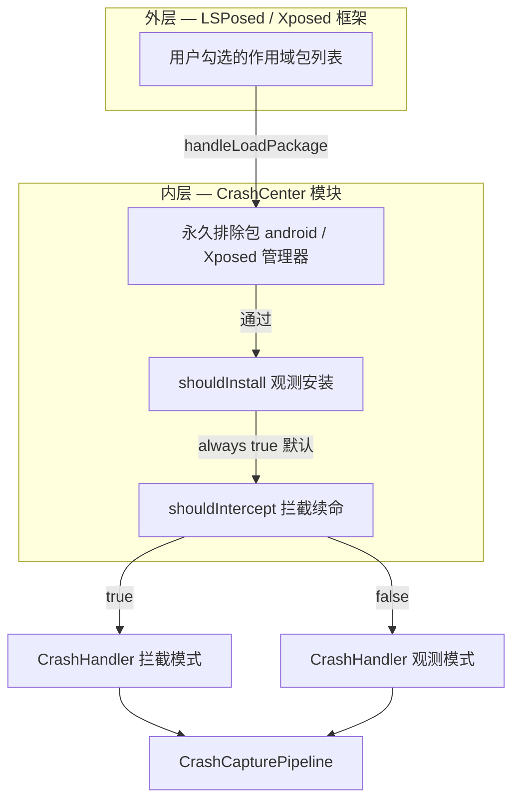

# 全量注入与观测/拦截分离

> 适用模块：`:app`（hook：`XposedEntry`、`ScopePolicy`、`CrashHandler`；UI：配置域）
> 决策记录：[ADR-023](../decisions/023-injection-observe-intercept-split.md)
> 取代关系：修订 [ADR-015](../decisions/015-managed-apps-intervention-rules.md) §2–§4 的 hook 门控语义；[scope-and-prefs.md](scope-and-prefs.md) 待 as-built 后同步
> 相关：[crash-logging.md](crash-logging.md)、[crash-handler.md](crash-handler.md)、[crash-capture-pipeline.md](crash-capture-pipeline.md)

## 背景与动机

当前模型（ADR-015）将 **「是否 hook」** 与 **「是否配置干预规则」** 绑定：

- 不在 `managed_packages` → 不注入
- 无 `enabled` 干预规则 → 不注入
- 行内 Switch OFF → 不注入

用户期望：

1. **默认注入**：对已纳入 LSPosed 作用域的 app，模块侧不再做第二层「白名单式」门控
2. **Switch 只控拦截**：开启 = 吞异常 + Looper 续命（现有 `CrashHandler`）；关闭 = **仅观测**（记录崩溃，进程按系统路径退出）
3. **崩溃日志不依赖拦截**：观测模式下同样写入 `events.jsonl`（与 [crash-logging.md](crash-logging.md) 观测层定位一致）

## 目标与非目标

### 目标

| # | 目标 |
|---|------|
| G1 | 除永久排除包外，凡 LSPosed 加载的包均安装 **观测捕获**（`Application.onCreate` hook） |
| G2 | 行内 Switch / `CATCH_ALL.enabled` 语义改为 **`shouldIntercept`**，不再门控注入 |
| G3 | 观测模式：主路径异常经 `CrashCapturePipeline` 写日志后 **转发系统默认处理**（进程可退出） |
| G4 | 拦截模式：行为与现网 **完全等价**（ADR-001 Looper 续命 + 不转发 UEH） |
| G5 | 提供可测迁移路径，Legacy 与受管模型用户行为可解释 |

### 非目标（本方案 v1）

- 替代 LSPosed Manager 的作用域 UI（外层门控仍在框架侧）
- Native crash / ANR 观测（仍仅 Java 未捕获异常）
- 无注入场景下的 logcat / tombstone 采集（见观测 tab logcat 导入，独立管线）
- 自动修复目标 app 异常

## 概念模型

### 两层门控



| 术语 | 定义 |
|------|------|
| **注入（Install）** | `XposedEntry` hook `Application.onCreate` 并安装捕获器 |
| **观测（Observe）** | 捕获异常 → 构建 `CrashEvent` → 可选写 JSONL；**不**续命 |
| **拦截（Intercept）** | 在观测基础上吞异常、主线程 `Looper` 无限续命（现有语义） |

> **注意**：「全量」指 **模块内不再用 managed 列表门控注入**，不是「所有已安装 APK」。未纳入 LSPosed 作用域的进程永远不会调用 `handleLoadPackage`。

### 与现有层级对齐

| 层级 | 观测模式 | 拦截模式 |
|------|----------|----------|
| 干预层 | 不干预；转发 UEH / 主线程异常退出 | 吞异常 + 续命 |
| 观测层 | `crashLogEnabled` 时写 JSONL | 同左 |
| 反馈层 | 默认 **不** Toast/通知（进程将退出） | `showNotify` 控制 |

## 决策摘要

详见 [ADR-023](../decisions/023-injection-observe-intercept-split.md)。核心：

### 1. `ScopeDecision` 字段演进

```kotlin
data class ScopeDecision(
    /** 是否安装 Application.onCreate 捕获；仅 IGNORED / 无 appInfo 时为 false */
    val shouldInstall: Boolean,
    /** 是否启用 Looper 续命 + 吞异常 */
    val shouldIntercept: Boolean,
    val showNotify: Boolean,
    val crashLogEnabled: Boolean = true,
)
```

**不变量**：

- `shouldIntercept` ⇒ `shouldInstall`
- `!shouldInstall` ⇒ 其余均为 false
- `shouldInstall && !shouldIntercept` = 纯观测

`shouldHook` 重命名为 `shouldInstall`（或保留 deprecated alias 一版）。

### 2. `ScopePolicy` 默认策略

| 条件 | shouldInstall | shouldIntercept |
|------|---------------|-----------------|
| `packageName ∈ IGNORED_PACKAGES` | false | false |
| 模块 self hook | true | true |
| **默认（其余所有 LSPosed 已加载包）** | **true** | 见下表 |

**`shouldIntercept` 解析**（优先级从高到低）：

| 存储模型 | 规则 |
|----------|------|
| 受管模型 `managed_packages != null` | `pkg` 在列表中且存在 `enabled` 的 `CATCH_ALL` → true；否则 **false（仅观测）** |
| Legacy `managed_packages == null` | `package_list` 含 pkg（原「禁用」）→ **false**；否则 **true** |

**废弃语义**：

- `managed_packages` **不再是**注入成员资格 SSOT，改为 **用户策展的 per-app 拦截配置集**
- 「待配置」= 已策展但未开拦截 → **仍注入、仅观测**
- `scope_mode` 保留为 **系统 app 过滤**（见 §4），不再表示「仅 hook 列表内 app」

### 3. `CrashHandler` 双模式

| 模式 | 主线程 Looper | UEH | 异常后进程 |
|------|---------------|-----|------------|
| **intercept** | `while` 续命 catch → handler | 替换，**不转发** | 存活 |
| **observe** | 单次 catch → handler → **rethrow / 系统 crash** | 包装：log → **转发 saved default** | 退出 |

接口草图：

```kotlin
object CrashHandler {
    enum class Mode { INTERCEPT, OBSERVE }

    fun install(mode: Mode, handler: ExceptionHandler)
}
```

观测模式须 **保存**安装前的 `Thread.getDefaultUncaughtExceptionHandler()` 并在 pipeline 返回后转发。

### 4. 观测路径日志可靠性

`CrashLogCoordinator.logAsync` 在进程即将退出时可能 **丢事件**。观测模式须满足以下之一（实现时二选一，推荐 A）：

| 方案 | 做法 | 权衡 |
|------|------|------|
| **A（推荐）** | 观测路径 `logSync`：先 `TargetRelayBackend`（同 UID，ms 级）再 canonical；短超时（≤500ms） | 阻塞崩溃线程；须严格 catch |
| **B** | 仅 relay 同步 + 依赖 `CrashLogIngestCoordinator` harvest | 模块未启动时 UI 延迟可见 |
| **C** | 维持 async，文档标注 observe 模式可能丢日志 | 实现简单，产品妥协 |

拦截模式可继续使用 async（进程存活）。

### 5. 反馈语义

| 模式 | showNotify 默认 | 说明 |
|------|-----------------|------|
| intercept | 继承规则 / 全局 true | 与现网一致 |
| observe | **false** | 避免 Toast 后进程立即被杀；用户可在编辑页显式开启（可选 v2） |

`CrashFeedbackFacade` 入口不变；`ScopePolicy` 在 `!shouldIntercept` 时默认 `showNotify=false`。

## UI 与存储变更

### 配置 tab

| UI 元素 | 现语义 | 新语义 |
|---------|--------|--------|
| 行内 Switch ON | 启用干预 → hook | **启用拦截**（续命） |
| 行内 Switch OFF | 不 hook | **仅观测**（仍注入） |
| 「待配置」角标 | 无 hook | **观测中、未拦截**（文案调整） |
| 空 `managed_packages` | 零 hook | **观测全部 scoped app**；列表为空 = 无策展项，非零观测 |
| Picker 添加 | 入库不 hook | 入库；默认 Switch OFF = 观测；用户开 Switch = 拦截 |

### 偏好键（增量）

| Key | 类型 | 默认 | 含义 |
|-----|------|------|------|
| `observe_all_scoped` | boolean | `true` | 模块内全量注入开关（v1 常开；预留关闭以回退 ADR-015 门控） |
| `intercept_default` | boolean | `false` | 未策展 app 的默认是否拦截（v1：**false** = 仅观测） |

现有 `intervention_rules` / `CATCH_ALL.enabled` **映射为 `shouldIntercept`**，无需新 rule type。

`scope_mode` + `handle_system`：继续过滤 **系统 app 是否安装捕获**（`shouldInstall=false` 当 `scope_mode && isSystemApp && !handle_system`）。与「全量第三方观测」并存。

### 观测 tab 文案

- 历史列表：「崩溃记录」而非隐含「已拦截」
- 统计：`interceptedCount` vs `observedCount` 分列（Phase 5 实施项）
- `source` 字段已有 `looper` / `uncaught`；可选新增 `intercepted: boolean` 于 `CrashEvent`（defer 至 roadmap）

## 迁移

### 触发

`managed_model_migrated == true` 且 `!observe_intercept_split_migrated`

### 算法

```
observe_intercept_split_migrated = true

for each pkg in managed_packages:
  if has enabled CATCH_ALL:
    shouldIntercept = true   # 与现网 hook 行为一致
  else:
    shouldIntercept = false  # 原为 no-hook → 现为 observe-only（行为变化，见下）

Legacy (managed_packages == null):
  scope_mode=false, pkg NOT IN package_list:
    was: hook + intercept  →  stays intercept
  scope_mode=false, pkg IN package_list:
    was: hook + no notify  →  becomes observe-only（intercept=false）
  scope_mode=true, pkg IN package_list:
    was: no hook           →  becomes observe-only（重大变化，需发布说明）
```

### 行为变化公告（用户可见）

| 原行为 | 新行为 |
|--------|--------|
| 未添加受管应用 | 无日志 | **scoped app 崩溃可进历史** |
| Switch OFF / 无规则 | 完全不 hook | **仍观测**，仅不续命 |
| Legacy scope 模式 + 禁用列表 | 不 hook | **改为观测** |

## 实施顺序（Roadmap 草案）

建议新建 `dev/roadmap/active/phase5_observe_intercept_split.md`（方案 commit 后）：

| 步骤 | 内容 | 验证 |
|------|------|------|
| 5.0 | ADR-023 accepted；本架构 `status: accepted` | 架构评审 |
| 5.1 | `ScopeDecision` + `ScopePolicy` 新语义；`XposedEntry` `shouldInstall` | `ScopePolicyTest` 矩阵重写 |
| 5.2 | `CrashHandler` observe 模式 + UEH 转发 | 单元测试 + 手工 observe 崩溃 |
| 5.3 | 观测路径 `logSync` / relay-first | `events.jsonl` 在进程退出后可读 |
| 5.4 | UI 文案 + Switch 语义 + 空状态 | LSPosed smoke |
| 5.5 | `PrefMigrator` 第三轮 + 发布说明 | 迁移单测 |
| 5.6 | 更新 `scope-and-prefs.md`、`app-management-ui.md`、`usage.md` | docs health |

**方案 / 实施 commit 分开**（规则 3a）。

## 风险与缓解

| 风险 | 缓解 |
|------|------|
| 观测 async 丢日志 | §观测路径日志可靠性 方案 A |
| 全量注入性能 | observe 模式无无限 Looper；仅一次 `onCreate` hook |
| 隐私 / JSONL 膨胀 | retention 已有；导出隐私提示；可选按包筛选 |
| ADR-015 测试与文档大量失效 | 分阶段改测试；ADR-015 标注 superseded sections |
| 主线程 observe rethrow 路径 OEM 差异 | IS 矩阵新增 observe 用例 |
| Switch 语义变化困惑 | 设置页一次性 What's New；Switch 副标题「拦截崩溃」 |

## 验收标准

1. scoped 第三方 app **未**加入受管列表时，触发未捕获异常后 `events.jsonl` **新增一行**，且 **进程退出**
2. 同 app 开启 Switch 后，异常被吞掉，进程 **不退出**，JSONL 仍新增
3. `IGNORED_PACKAGES` 与 `scope_mode` 系统过滤仍 **不安装**捕获
4. 拦截模式回归：现有 smoke / `CrashHandler` 单测行为不变
5. 迁移后：原「Switch ON + CATCH_ALL」的 app **仍为拦截**

## 相关文档

- [ADR-023](../decisions/023-injection-observe-intercept-split.md) — 架构决策
- [ADR-015](../decisions/015-managed-apps-intervention-rules.md) — 被修订的 hook 门控
- [ADR-001](../decisions/001-looper-loop-resurrection.md) — 拦截模式续命
- [ADR-011](../decisions/011-feedback-failure-isolation.md) — 失败域隔离
- [scope-and-prefs.md](scope-and-prefs.md) — 偏好模型（待同步）
- [app-management-ui.md](app-management-ui.md) — 配置 UI（待同步）
- [crash-logging.md](crash-logging.md) — 观测层
- [glossary.md](../glossary.md) — 术语
