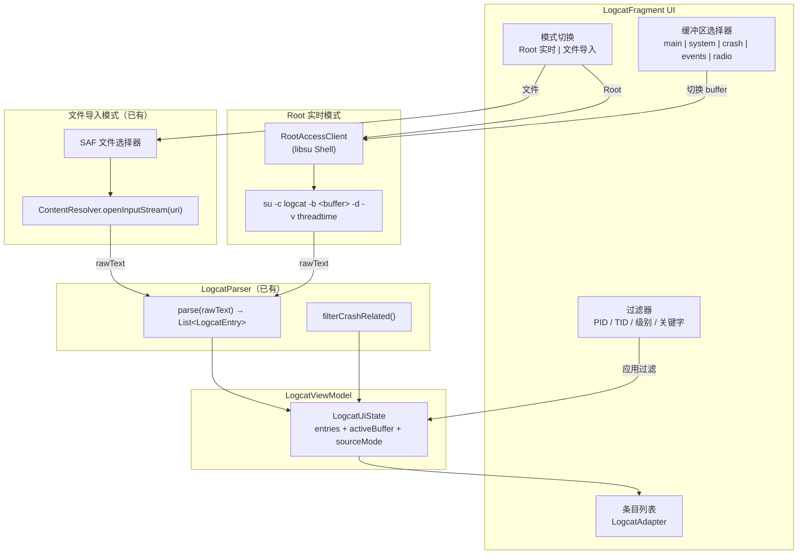
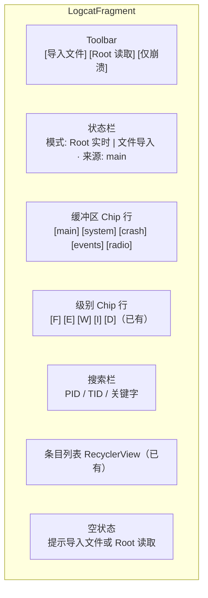
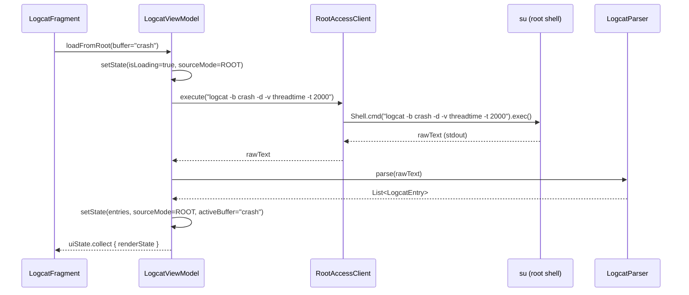
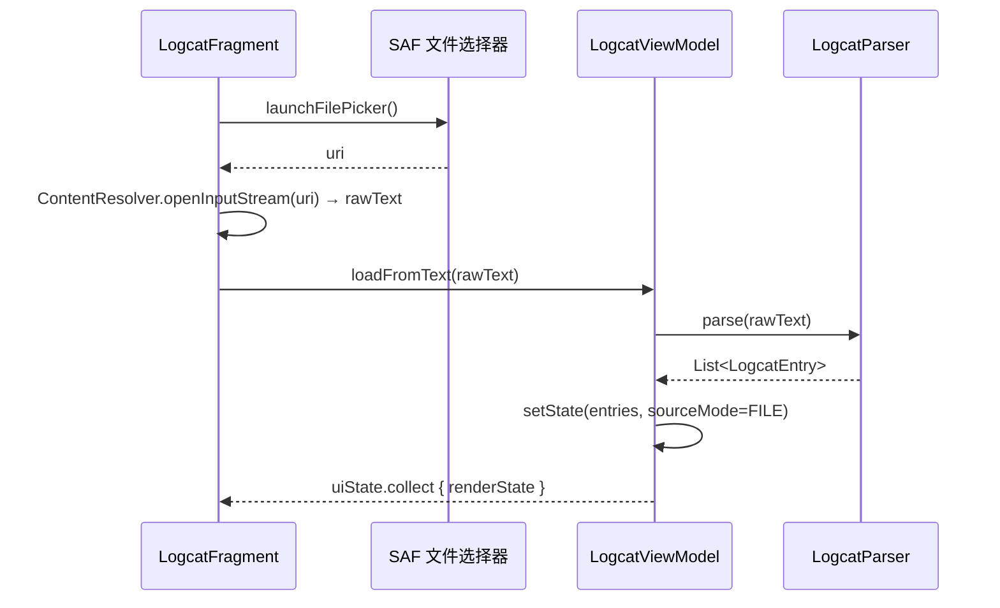
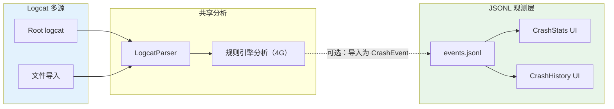

# Logcat 多源架构

> 适用模块：`:app`（`LogcatFragment`、`LogcatViewModel`、`LogcatParser`）
> 前置文档：[adb-logcat-analysis.md](adb-logcat-analysis.md)（需求与解析规范）、[unified-root-service.md](unified-root-service.md)（Root 基础设施）
> 数据 SSOT 仍为 [crash-logging.md](crash-logging.md) `events.jsonl` — logcat 作为诊断与补充观测手段，不替代 JSONL 历史统计

## 概述

CrashCenter 当前的 logcat 功能仅支持**文件导入**（SAF 选取 `.txt` / `.log`，由 `LogcatParser` 解析为 `List<LogcatEntry>` 展示）。本方案扩展为**双模式**架构：

1. **Root 实时读取** — 通过已有 `RootAccessClient`（libsu）执行 `su -c logcat -b <buffer> -d`，拉取设备当前日志缓冲区快照
2. **文件导入分析** — 现有 SAF 导入功能，增强支持多缓冲区文件格式

同时覆盖 Android 系统的多个日志缓冲区（`main`、`system`、`crash`、`events`、`radio` 等），使 CrashCenter 成为设备级日志诊断入口。

**不变量**：

- logcat 分析是**诊断补充**，不替代 `events.jsonl` 作为历史统计 SSOT
- 观测层不改变干预层语义：root 读取失败须静默，不得阻塞主流程
- 无 root 设备仍可使用文件导入模式

---

## Android 日志系统概述

Android 的 `logd` 守护进程维护多个**独立的日志缓冲区**（log buffer），每个缓冲区有独立的环形空间和用途。

### 缓冲区清单

| 缓冲区 | 命令参数 | 用途 | 格式 | 需要 root |
|--------|---------|------|------|-----------|
| `main` | `-b main` | 应用日志（默认）；`Log.d/i/w/e` 输出 | 文本（threadtime） | 读全量需 root 或 `READ_LOGS` |
| `system` | `-b system` | 系统服务日志（`SystemServer`、`ActivityManager` 等） | 文本（threadtime） | 同上 |
| `crash` | `-b crash` | Java/Native 崩溃日志（**Android 11+**） | 文本（threadtime） | 同上 |
| `events` | `-b events` | 系统事件（`EventLog`）；结构化二进制 | **二进制**（需 `logcat -b events` 解码） | 同上 |
| `radio` | `-b radio` | 无线电 / 电话栈日志（RIL、Telephony） | 文本（threadtime） | 同上 |
| `security` | `-b security` | 安全相关事件（SELinux audit 等） | 文本 | 同上，部分 ROM 不可用 |
| `kernel` | `-b kernel` | 内核日志（`dmesg` 等效） | 文本 | **必须 root** |

### 对 CrashCenter 的价值

| 缓冲区 | 诊断价值 | 优先级 |
|--------|---------|--------|
| `main` | 已有 XposedBridge / CrashCenter 日志；通用应用异常 | **P0** |
| `crash` | 系统级崩溃记录（Android 11+ `FATAL EXCEPTION` 自动写入）；**最有价值的额外缓冲区** | **P1** |
| `system` | `ActivityManager` 进程死亡、OOM adj、ANR 信息 | **P2** |
| `events` | 结构化事件（`am_crash`、`am_anr`、`am_proc_died`）；需二进制解析 | **P3** |
| `radio` | 电话相关崩溃诊断（少数场景） | P3 |
| `kernel` | 内核 panic / watchdog；Native crash 关联 | P4 |
| `security` | SELinux 拒绝导致的功能异常；ROM 依赖 | P4 |

---

## 双模式架构



### 模式 A：Root 实时读取

通过已有 root 基础设施（[unified-root-service.md](unified-root-service.md)）执行 `logcat` 命令读取设备日志缓冲区。

#### 命令格式

```bash
# dump 模式：获取缓冲区全部内容（快照）
su -c 'logcat -b <buffer> -d -v threadtime'

# 最近 N 行
su -c 'logcat -b <buffer> -d -t <N> -v threadtime'

# 按 tag 过滤
su -c 'logcat -b crash -d -v threadtime *:E'

# 按 PID 过滤
su -c 'logcat -b main -d -v threadtime --pid=<pid>'
```

| 参数 | 说明 |
|------|------|
| `-b <buffer>` | 指定缓冲区（`main`、`system`、`crash` 等） |
| `-d` | dump 模式：转储当前内容后退出（非阻塞） |
| `-t <N>` | 仅输出最近 N 行（与 `-d` 配合） |
| `-v threadtime` | 输出格式：`MM-DD HH:MM:SS.mmm PID TID LEVEL TAG: message`（`LogcatParser` 已支持） |
| `*:E` | 仅输出 ERROR 及以上级别 |

#### Root 通道选择

| 通道 | 实现 | 适用场景 |
|------|------|---------|
| libsu `Shell` | `RootAccessClient.execute("logcat -b crash -d")` | **推荐**：复用已有 root 会话，性能好 |
| `su -c` 直接调用 | `ProcessBuilder("su", "-c", "logcat ...")` | fallback：libsu 不可用时 |

CrashCenter 已有 `RootAccessClient`（基于 libsu `AppShell`），**直接复用**，不新建 root 通道。

#### 输出限制与安全

| 约束 | 处理 |
|------|------|
| 缓冲区大小 | 通常 256KB–4MB（因 ROM 而异）；`-d` 一次 dump 全量 |
| 大输出 OOM | `LogcatParser` 已有 `MAX_TEXT_BYTES = 5MB` 截断 |
| 无 root 时 | 探测 `RootAccessClient.isRootAvailable`；不可用则灰显 root 按钮、提示用文件导入 |
| `events` 缓冲区 | 二进制格式，`-d -v threadtime` 输出需专用解析器（见下文） |

---

### 模式 B：文件导入分析

现有功能，无需变更核心逻辑。增强点：

| 增强 | 说明 |
|------|------|
| 支持 `crash` 缓冲区文件 | 用户 `adb logcat -b crash -d > crash.txt` 后导入；`LogcatParser` 已兼容 threadtime 格式 |
| 支持多缓冲区混合文件 | `adb logcat -b all -d > all.txt`；解析无差别，全部按 threadtime 匹配 |
| `events` 缓冲区文件 | `adb logcat -b events -d` 输出为文本（经 `logcat` 二进制转换）；但原始二进制 dump（`adb logcat -b events -B`）需专用解析 |

---

## UI 设计

### 页面结构



### 缓冲区选择器（Chip 行）

在现有**级别 Chip 行**上方新增一行**缓冲区 Chip 行**：

| Chip | 缓冲区 | 可用条件 |
|------|--------|---------|
| `main` | `-b main` | 始终可选（Root 模式 / 文件模式） |
| `system` | `-b system` | Root 模式可用；文件模式取决于导入内容 |
| `crash` | `-b crash` | Root 模式可用（Android 11+）；文件模式取决于导入内容 |
| `events` | `-b events` | Root 模式可用（需二进制解析） |
| `radio` | `-b radio` | Root 模式可用 |

**交互规则**：

- 切换 Chip 时自动触发对应缓冲区的 `logcat -b <buffer> -d` 读取（Root 模式）
- 文件导入模式下，Chip 仅作为过滤标签（标注文件来源缓冲区），切换不触发新读取
- 无 root 时，缓冲区 Chip 行整体灰显或隐藏（文件模式下根据导入内容显示）

### 模式切换 UI

```
┌──────────────────────────────────────────────┐
│  Toolbar: [导入文件] [Root 读取] [仅崩溃过滤]  │
├──────────────────────────────────────────────┤
│  模式: Root 实时  来源: main 缓冲区  行数: 1234 │
├──────────────────────────────────────────────┤
│  [main] [system] [crash] [events] [radio]     │  ← 缓冲区 Chip
├──────────────────────────────────────────────┤
│  [F] [E] [W] [I] [D]                         │  ← 级别 Chip（已有）
├──────────────────────────────────────────────┤
│  搜索: PID / TID / 关键字                      │
├──────────────────────────────────────────────┤
│  06-23 14:32:01.123  1234  1234 E AndroidRu..│
│  06-23 14:32:01.125  1234  1234 E XposedBri..│
│  06-23 14:32:02.456  5678  5678 W ActivityM..│
│  ...                                         │
└──────────────────────────────────────────────┘
```

---

## 数据流

### Root 模式数据流



### 文件导入模式数据流（已有）



---

## 现有代码复用与扩展

### 复用组件

| 组件 | 路径 | 复用方式 |
|------|------|---------|
| `LogcatParser` | `observe/LogcatParser.kt` | **直接复用**：`parse(rawText)` 兼容 threadtime 格式；`filterCrashRelated()` 用于「仅崩溃」过滤 |
| `LogcatEntry` | `observe/LogcatEntry.kt` | **直接复用**：通用数据模型 |
| `LogcatLevel` | `observe/LogcatEntry.kt` | **直接复用**：级别枚举 |
| `LogcatAdapter` | `observe/LogcatAdapter.kt` | **直接复用**：RecyclerView 列表适配器 |
| `RootAccessClient` | root 基础设施 | **直接复用**：执行 root 命令 |
| `LogcatFragment` | `observe/LogcatFragment.kt` | **扩展**：新增模式切换、缓冲区 Chip、Root 读取按钮 |
| `LogcatViewModel` | `observe/LogcatViewModel.kt` | **扩展**：新增 `loadFromRoot()` 方法、buffer 切换逻辑 |
| `LogcatUiState` | `observe/LogcatUiState.kt` | **扩展**：新增 `sourceMode`、`activeBuffer`、`availableBuffers` 字段 |

### `LogcatUiState` 扩展

```kotlin
data class LogcatUiState(
    // ── 已有字段 ──
    override val isLoading: Boolean = false,
    val entries: List<LogcatEntry> = emptyList(),
    val allEntries: List<LogcatEntry> = emptyList(),
    val activeLevels: Set<LogcatLevel> = DEFAULT_LEVELS,
    val isFiltered: Boolean = false,
    val totalRawCount: Int = 0,
    override val errorMessage: String? = null,

    // ── 新增字段 ──
    val sourceMode: SourceMode = SourceMode.NONE,
    val activeBuffer: LogcatBuffer = LogcatBuffer.MAIN,
    val availableBuffers: Set<LogcatBuffer> = emptySet(),
    val isRootAvailable: Boolean = false,
) : LoadableState, HasErrorMessage { /* ... */ }

enum class SourceMode { NONE, ROOT, FILE }

enum class LogcatBuffer(val id: String, val label: String, val minApi: Int = 0) {
    MAIN("main", "main"),
    SYSTEM("system", "system"),
    CRASH("crash", "crash", minApi = 30),  // Android 11+
    EVENTS("events", "events"),
    RADIO("radio", "radio"),
}
```

### `LogcatViewModel` 扩展

```kotlin
class LogcatViewModel(/* ... */) : BaseFlowViewModel<LogcatUiState>(LogcatUiState()) {

    // ── 已有方法 ──
    fun loadFromText(rawText: String?, crashOnly: Boolean = false)
    fun setCrashFilter(crashOnly: Boolean)
    fun toggleLevel(level: LogcatLevel)
    fun resetLevels()

    // ── 新增方法 ──

    /** Root 模式：读取指定缓冲区 */
    fun loadFromRoot(buffer: LogcatBuffer, maxLines: Int = 2000)

    /** 切换缓冲区（Root 模式自动触发重新读取） */
    fun switchBuffer(buffer: LogcatBuffer)

    /** 刷新当前缓冲区（Root 模式） */
    fun refresh()

    /** 检测 root 可用性 */
    fun checkRootAvailability()
}
```

---

## `events` 缓冲区特殊处理

`events` 缓冲区默认为**二进制格式**（`android_log_event` 结构），与 `main`/`system`/`crash` 的纯文本 threadtime 格式不同。

### 解析策略

| 场景 | 命令 | 输出格式 | 处理 |
|------|------|---------|------|
| Root 读取 | `su -c 'logcat -b events -d -v threadtime'` | **文本**（`logcat` 自动转换） | `LogcatParser` 可直接解析 |
| Root 读取（原始） | `su -c 'logcat -b events -d -v binary'` | **二进制** | 需 `EventsLogParser`（P3） |
| 文件导入（文本） | `adb logcat -b events -d > events.txt` | **文本** | `LogcatParser` 可直接解析 |
| 文件导入（二进制） | `adb logcat -b events -d -b > events.bin` | **二进制** | 需 `EventsLogParser`（P3） |

**结论**：Root 模式使用 `-v threadtime` 时，`events` 缓冲区**无需特殊解析**。仅当用户显式以二进制格式导入文件时才需要 `EventsLogParser`。

### `EventsLogParser`（P3，defer）

```kotlin
/**
 * 解析 android_log_event 二进制格式。
 *
 * 结构：header(2B) + tag(4B) + payload(variant)
 * 常见 event tag 映射：
 *   - am_crash (30014)    → 进程崩溃
 *   - am_anr (30008)      → ANR
 *   - am_proc_died (30017) → 进程死亡
 *   - am_proc_start (30009) → 进程启动
 */
object EventsLogParser {
    fun parse(binaryData: ByteArray): List<LogcatEntry>
}
```

---

## 实施优先级

| 优先级 | 内容 | 依赖 | 交付 |
|--------|------|------|------|
| **P0** | Root `logcat -b main -d` 读取 + UI 集成 | `RootAccessClient`（已有） | `LogcatViewModel.loadFromRoot()` + 缓冲区 Chip 行 |
| **P1** | Root `logcat -b crash -d` 读取 | P0 | 新增 `CRASH` buffer 选项；最有价值的额外缓冲区 |
| **P1b** | `LogcatUiState` 扩展（`sourceMode`、`activeBuffer`） | 无 | 状态模型变更 |
| **P2** | Root `logcat -b system -d` 读取 | P0 | 新增 `SYSTEM` buffer 选项 |
| **P2b** | 搜索 / 过滤器（PID、TID、关键字） | P0 | `LogcatUiState` 增加 `searchQuery`；ViewModel 增加过滤逻辑 |
| **P3** | `events` 缓冲区文本模式 | P0 | 新增 `EVENTS` buffer 选项 |
| **P3b** | `EventsLogParser` 二进制解析 | P3 | 支持二进制文件导入 |
| **P4** | `radio` / `kernel` / `security` 缓冲区 | P0 | 低频需求，按需添加 |
| **P4b** | 实时 tail 模式（`logcat` 不加 `-d`） | P0 | 需前台 Service；开发者向 |

### P0 实施范围

```
变更文件:
  LogcatViewModel.kt      — +loadFromRoot(), +switchBuffer(), +refresh(), +checkRootAvailability()
  LogcatUiState.kt         — +sourceMode, +activeBuffer, +availableBuffers, +isRootAvailable
  LogcatFragment.kt        — +缓冲区 Chip 行, +Root 读取按钮, +模式切换逻辑
  fragment_logcat.xml      — +缓冲区 ChipGroup, +Root 按钮

新增文件:
  LogcatBuffer.kt          — 缓冲区枚举定义

不变:
  LogcatParser.kt          — 直接复用
  LogcatEntry.kt           — 直接复用
  LogcatAdapter.kt         — 直接复用
```

---

## 与现有系统的关系

### 与 JSONL 观测层的关系



| 维度 | JSONL 观测层 | Logcat 多源 |
|------|-------------|------------|
| 数据来源 | hook 拦截写入 | Android logd 缓冲区 / 用户文件 |
| 持久化 | 本地文件（SSOT） | 环形缓冲（不持久）/ 用户文件 |
| 覆盖范围 | 仅 CrashCenter hook 的 app | 设备全局（root 模式） |
| 结构化程度 | `CrashEvent` 完整字段 | `LogcatEntry` 基础字段 |
| 统计 UI | CrashStats（按包名/异常/时间） | 不参与（除非显式导入为 CrashEvent） |

### 与 `adb-logcat-analysis.md` 的关系

[adb-logcat-analysis.md](adb-logcat-analysis.md) 定义了**需求与解析规范**（`LogcatCrashSnippet`、识别规则、分阶段交付）。本文档在此基础上定义**多缓冲区 + 双模式**的技术架构。两者的对应关系：

| adb-logcat-analysis.md 需求 | 本文档实现 |
|---------------------------|-----------|
| 通道 B：应用内导入 logcat 文件（P1） | 模式 B：文件导入分析（已实现，增强多缓冲区） |
| 通道 C：应用内 root 拉取 logcat（P1b） | 模式 A：Root 实时读取 |
| 通道 D：实时 tail（P3） | P4b：实时 tail 模式（defer） |
| 日志解析规范 | 复用 `LogcatParser`（已实现） |
| 结构化事件类型 | 复用 `LogcatParser.filterCrashRelated()`（已实现） |

---

## 风险与缓解

| 风险 | 缓解 |
|------|------|
| Root 命令执行超时 | `logcat -d`（dump 模式）非阻塞；设置 5s 超时；超时提示用户 |
| 缓冲区内容过大导致 OOM | `LogcatParser.MAX_TEXT_BYTES`（5MB）截断；`-t 2000` 限制行数 |
| `crash` 缓冲区在 Android 10 以下不可用 | `LogcatBuffer.CRASH.minApi = 30`；低版本自动隐藏该 Chip |
| `events` 二进制格式解析复杂 | P3 defer；先用 `-v threadtime` 文本模式覆盖 |
| 无 root 用户被误导 | UI 明确区分模式；无 root 时灰显 Root 按钮 + 提示 |
| 实时 tail 模式耗电 | P4b defer；需前台 Service + 通知；仅开发者选项 |
| `READ_LOGS` 权限在非 root 设备上不可用 | 文件导入作为无 root 兜底；不在应用内尝试申请 `READ_LOGS` |

---

## 配置项（建议）

| Key | 类型 | 默认 | 含义 |
|-----|------|------|------|
| `logcat_root_max_lines` | int | 2000 | Root 模式单次读取最大行数 |
| `logcat_default_buffer` | string | `main` | 默认缓冲区 |
| `logcat_crash_filter_default` | boolean | false | 默认是否启用「仅崩溃」过滤 |

所有配置走 `PrefManager`（[scope-and-prefs.md](scope-and-prefs.md)）。

---

## 验收标准

| # | 场景 | 期望 |
|---|------|------|
| ML1 | Root 设备 + 切换到 `main` 缓冲区 | 列表显示当前 main 缓冲区日志条目 |
| ML2 | Root 设备 + 切换到 `crash` 缓冲区 | Android 11+ 设备显示崩溃日志；Android 10 以下 Chip 灰显 |
| ML3 | Root 设备 + 切换到 `system` 缓冲区 | 列表显示系统服务日志 |
| ML4 | 无 root 设备 | Root 读取按钮灰显；文件导入仍可用 |
| ML5 | 导入 `adb logcat -b crash -d > crash.txt` | 文件模式正常解析并展示 |
| ML6 | 切换缓冲区时已有数据 | 显示 loading 状态；新数据加载完成后替换列表 |
| ML7 | 5MB 大日志 dump | 不 ANR；截断有 Toast 提示 |
| ML8 | 「仅崩溃」过滤 + Root 模式 | 过滤生效，仅显示 crash-related 条目 |
| ML9 | 缓冲区 Chip 行 + 级别 Chip 行 | 两级过滤独立生效、互不干扰 |

---

## 相关文档

- [adb-logcat-analysis.md](adb-logcat-analysis.md) — logcat 分析需求、解析规范、分阶段交付
- [unified-root-service.md](unified-root-service.md) — Root 基础设施（`RootAccessClient`）
- [crash-logging.md](crash-logging.md) — JSONL 观测层（SSOT）
- [crash-log-backends.md](crash-log-backends.md) — 多后端存储架构
- [crash-stats-ui.md](crash-stats-ui.md) — 崩溃统计 UI（JSONL 驱动）
- [code-editor-porting.md](code-editor-porting.md) — 日志详情阅读器
- [scope-and-prefs.md](scope-and-prefs.md) — 配置模型
- [navigation-ia.md](navigation-ia.md) — 导航与页面层级
