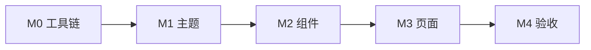

# Material 3 迁移方案

> 决策依据：[ADR-022](../decisions/022-material3-static-theme-minsdk26.md)
> Design System：[design-system.md](design-system.md)
> 暗色基线：[dark-mode-theming.md](dark-mode-theming.md)
> 任务勾选：[phase3_ui_redesign.md](../../dev/roadmap/active/phase3_ui_redesign.md) §3E

## 概述

将 CrashCenter 配置与观测 UI 从 **Material Components 2.x** 迁移至 **Material 3**，同时：

1. **minSdk 26** — 全模块统一（见 ADR-022）。
2. **静态 Fluent 主题** — `values/colors.xml` / `values-night/colors.xml` 为唯一色值 SSOT，映射到 M3 语义槽。
3. **拒绝 dynamic color** — 不使用壁纸取色、`DynamicColors`、`harmonize*`；品牌色固定为 Communication Blue `#0078D4`。

**范围**：`:app` 全域 UI + `lib/ui_common` 主题对齐；`:CodeEditor*` 仅同步 minSdk。

**范围外**：Compose 迁移、应用内主题三态、M3 Expressive 动效、Navigation Rail 改造。

## 目标栈

| 项 | 当前（as-built） | 目标 |
|----|------------------|------|
| minSdk | 21 | **26** |
| Material | 1.13.0（app）/ 1.12.0（ui_common） | **1.14.0+**（catalog 统一） |
| 主题 parent | `Theme.MaterialComponents.DayNight.NoActionBar` | `Theme.Material3.DayNight.NoActionBar` |
| Widget parent | `Widget.MaterialComponents.*` | `Widget.Material3.*` |
| 取色 | 静态 Fluent + DayNight | **同上**（仅换 M3 槽位名） |
| UI 范式 | ViewBinding + Fragment | 不变 |

## 静态主题原则

### 允许

- `Theme.Material3.DayNight.NoActionBar` + `@color/fluent_*` 显式 `item` 映射。
- `MaterialColors.getColor(context, attr, fallback)` 解析 **主题 attr**（非壁纸 scheme）。
- 系统 `uiMode` 切换 → `values-night/` 资源覆盖。

### 禁止

```kotlin
// ❌ 以下不得出现在 :app / :ui_common
DynamicColors.applyToActivitiesIfAvailable(application)
MaterialColors.harmonize(color, primary)
MaterialColors.harmonizeWith(primary, other)
// Theme parent 不得为 Theme.Material3.DynamicColors.*
```

CI / 代码审查：对 `DynamicColors`、`harmonize`、`WallpaperColors` 做 grep 门禁（实施阶段加入 `scripts/` 或 pre-commit 可选检查）。

## Fluent → M3 语义色映射

浅色基线（`values/colors.xml`）；深色见 `values-night/colors.xml` 同名语义链。

| M3 语义槽 | Fluent 源 | 浅色示例 |
|-----------|-----------|----------|
| `colorPrimary` | `fluent_accent` | `#0078D4` |
| `colorOnPrimary` | `white` | `#FFFFFF` |
| `colorPrimaryContainer` | `fluent_accent_container` | `#DEECF9` |
| `colorOnPrimaryContainer` | `fluent_accent` | `#0078D4` |
| `android:colorBackground` | `fluent_canvas` | `#FAFAFA` |
| `colorSurface` | `fluent_layer` | `#FFFFFF` |
| `colorOnSurface` | `fluent_text_primary` | `#242424` |
| `colorSurfaceVariant` | `fluent_fill_subtle` | `#F5F5F5` |
| `colorOnSurfaceVariant` | `fluent_text_secondary` | `#616161` |
| `colorOutline` | `fluent_stroke` | `#E0E0E0` |
| `colorOutlineVariant` | `fluent_stroke_subtle` | `#EBEBEB` |
| `colorError` | （新增或沿用 semantic） | 待实施时对齐 M3 默认或 Fluent 警告色 |

自定义 attr（`statusBanner*`、`dividerColor` 等）**保留**；仅 theme `item` 指向的 `@color/` 在 night 下切换。

### 主题基类（目标形态）

```xml
<style name="AppTheme" parent="Theme.Material3.DayNight.NoActionBar">
    <item name="colorPrimary">@color/fluent_accent</item>
    <item name="colorOnPrimary">@color/white</item>
    <item name="colorPrimaryContainer">@color/fluent_accent_container</item>
    <item name="colorOnPrimaryContainer">@color/fluent_accent</item>

    <item name="android:colorBackground">@color/fluent_canvas</item>
    <item name="colorSurface">@color/fluent_layer</item>
    <item name="colorOnSurface">@color/fluent_text_primary</item>
    <item name="colorSurfaceVariant">@color/fluent_fill_subtle</item>
    <item name="colorOnSurfaceVariant">@color/fluent_text_secondary</item>
    <item name="colorOutline">@color/fluent_stroke</item>
    <item name="colorOutlineVariant">@color/fluent_stroke_subtle</item>

    <item name="android:statusBarColor">@android:color/transparent</item>
    <item name="android:navigationBarColor">@android:color/transparent</item>

    <item name="materialButtonStyle">@style/AppTheme.Button</item>
    <item name="chipStyle">@style/AppTheme.Chip.Filter</item>
    <item name="switchStyle">@style/AppTheme.Switch</item>
    <item name="bottomNavigationStyle">@style/AppTheme.BottomNavigation</item>
    <item name="toolbarStyle">@style/AppTheme.Toolbar</item>
    <item name="textInputStyle">@style/AppTheme.SearchField</item>

  <!-- 现有 statusBanner* / dividerColor 等自定义 attr 不变 -->
</style>
```

Edge-to-edge 与 [SystemBars.kt](../../app/src/main/java/nota/android/crash/xp/app/SystemBars.kt) 行为不变；minSdk 26 后可移除 `isAppearanceLightNavigationBars` 的 API 26 分支。

## Widget 迁移对照

| 当前 parent (M2) | 目标 parent (M3) | 主要消费方 |
|------------------|------------------|------------|
| `Widget.MaterialComponents.Toolbar` | `Widget.Material3.Toolbar` | Shell、详情 Activity |
| `Widget.MaterialComponents.Chip.Choice` | `Widget.Material3.Chip.Filter` | Hook 过滤 Chip |
| `Widget.MaterialComponents.Chip.Filter` | `Widget.Material3.Chip.Filter` | 设置 Chip |
| `Widget.MaterialComponents.TextInputLayout.OutlinedBox.Dense` | `Widget.Material3.TextInputLayout.OutlinedBox.Dense` | `DenseSearchField` |
| `Widget.MaterialComponents.TextInputEditText.OutlinedBox` | `Widget.Material3.TextInputEditText.OutlinedBox` | 搜索 EditText |
| `Widget.MaterialComponents.CompoundButton.Switch` | `Widget.Material3.CompoundButton.Switch` | 列表行 Switch |
| `Widget.MaterialComponents.BottomNavigationView` | `Widget.Material3.BottomNavigationView` | `MainShellActivity` |
| `Widget.MaterialComponents.Button.TextButton` 等 | `Widget.Material3.Button.*` | Banner、EmptyState、Sheet |
| `ShapeAppearance.MaterialComponents.SmallComponent` | `ShapeAppearance.Material3.Corner.Small` | Chip 4dp override |

**类名不变**：`MaterialToolbar`、`MaterialButton`、`MaterialCardView`、`MaterialAlertDialogBuilder`、`BottomSheetDialogFragment`、`TabLayout`、`CircularProgressIndicator`。

layout 内联 `style="@style/Widget.MaterialComponents.*"`（约 6 处）改为 M3 或删除以继承 theme default。

## 高风险视觉点

M3 默认与 [visual-language.md](../design/visual-language.md) / [form-controls.md](../design/components/form-controls.md) 冲突处须 **显式 override**：

| 区域 | M3 默认 | Fluent 要求 | 对策 |
|------|---------|-------------|------|
| Chip | ~32dp 高 | `chip_min_height_compact` 28dp | `chipMinHeight`；`checkedIconVisible=false` |
| Card | tonal elevation | 0dp + stroke | `cardElevation=0`；`strokeWidth` + `strokeColor` |
| BottomNav | active indicator pill | 扁平 | `itemActiveIndicatorStyle` → 透明 / 0dp |
| Switch | M3 宽 track | 44×24dp | 保留 `switch_thumb_color` / `switch_track_color` |
| SearchField | 更圆 outlined | `radius_mobile_control` 8dp | `boxCornerRadius*` 四维显式 |
| 列表按压 | ripple 明显 | overlay 无 ripple | `shell_press_surface`；Chip `rippleColor=@null` |
| Sheet | 可能 tonal 底 | 实色 `fluent_layer` | `BottomSheetUtils` 已有 `MaterialShapeDrawable` |

## 组件与页面清单

### Design System（`common/ui/`）— M2

| 组件 | 迁移要点 |
|------|----------|
| `StatusBanner` / `PermissionBanner` | theme attr 不变；验证 night 对比度 |
| `FilterChipRow` | M3 Filter 选中态 → `fluent_accent_container` |
| `DenseSearchField` | Dense outlined 高度 |
| `EmptyState` / `LoadingState` | M3 Button / CPI 色 |
| `BottomSheetUtils` | 28dp 顶圆角与 sheet 背景 |
| `ToolbarHeaderInsets` | inset 逻辑不变 |
| `ThemeColors.kt` | 统一 `colorOnSurface` 等 M3 attr |

### 页面 — M3

| 页面 / Fragment | 要点 |
|-----------------|------|
| `MainShellActivity` | Toolbar + BottomNav |
| `ConfigFragment` | Chip 行、Switch、搜索、Banner |
| `ObserveHostFragment` | `TabLayout` indicator |
| `CrashHistoryFragment` | Dialog、菜单 |
| `CrashStatsFragment` | `MaterialCardView` stroke |
| `AppInterventionEditActivity` | Card、ChipGroup、Switch |
| `ActivityCrashInfo` | Toolbar + CodeEditor 容器 |
| `lib/ui_common` `styles_tag_chip.xml` | M3 对齐（CodeEditor 详情 tag） |

## 分阶段实施（M0–M4）



### M0 — 工具链（≈0.5 天）

- [ ] 全模块 `minSdk 26`
- [ ] `libs.versions.toml`：`material` 1.14.0+；`ui_common` 改 catalog
- [ ] `./gradlew :app:assembleDebug`；Robolectric `sdk` 配置检查
- [ ] ADR-022 accepted；ADR-006 archived

### M1 — 主题与 Token（≈1 天）

- [ ] `AppTheme` → `Theme.Material3.DayNight.NoActionBar`
- [ ] 补全 M3 语义色（含 night）；`styles.xml` / `shapes.xml` Widget 父样式
- [ ] 确认 **无** `DynamicColors` 引用
- [ ] 更新 [design-system.md](design-system.md) §主题基类

**验收**：Shell 两 tab + 配置页可浏览；浅/深无色块异常。

### M2 — Design System 组件（≈1–1.5 天）

- [ ] §组件清单逐项视觉回归
- [ ] `SystemBars`：移除 API 26 以下 nav bar 分支（可选同 PR）

### M3 — 页面扫尾（≈1 天）

- [ ] §页面清单；layout 内联 M2 style 清理
- [ ] `ui_common` tag chip 样式

### M4 — 验收（≈0.5 天）

```bash
./gradlew :app:assembleDebug
./scripts/generate-docs-index.sh
python3 scripts/check-docs-health.py
./scripts/adb-smoke-verification.sh -s <serial>
```

- 浅色 / 深色：Meizu 实机 + AOSP API 30/34
- 手动：Switch、BottomSheet 拖曳、Tab、Dialog、Chip 过滤
- 截图对比：Shell、Config、Intervention 三屏（防 Chip/Switch 漂移）
- 更新 `dev/verification/smoke_YYYYMMDD.md`

实施前打 git tag `pre-m3-theme` 便于回滚。

## 工作量估计

| 阶段 | 人天 |
|------|------|
| M0 + 文档 | 0.5 |
| M1 | 1.0 |
| M2 | 1.5 |
| M3 | 1.0 |
| M4 | 0.5 |
| **合计** | **≈4.5** |

## 明确不做（本方案 v1）

| 项 | 原因 |
|----|------|
| Dynamic color / 壁纸取色 | ADR-022；Fluent 品牌色 SSOT |
| Jetpack Compose | ADR-009 View 架构 |
| 应用内主题三态 | [dark-mode-theming.md](dark-mode-theming.md) defer |
| minSdk 21–25 双轨主题 | 维护成本 |
| M3 Expressive 大改 | 与「动效克制」冲突 |

## 相关文档

- [ADR-022](../decisions/022-material3-static-theme-minsdk26.md)
- [ADR-006](../decisions/006-material3-toolchain.md) — 已归档
- [design-system.md](design-system.md)
- [dark-mode-theming.md](dark-mode-theming.md)
- [configuration-ui.md](configuration-ui.md)
- [visual-language.md](../design/visual-language.md)
- [form-controls.md](../design/components/form-controls.md)
- [phase3_ui_redesign.md](../../dev/roadmap/active/phase3_ui_redesign.md)
