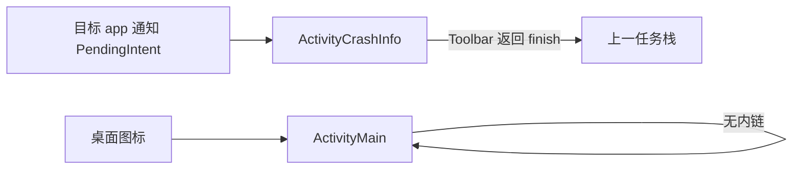

# 界面路由与导航图

> 适用模块：`:app` UI
> 信息架构（为何 2 tab）：[navigation-ia.md](navigation-ia.md)
> UI Shell 决策：[ADR-009](../decisions/009-ui-shell-design-system.md)
> 单页需求： [configuration-ui.md](configuration-ui.md)、[crash-stats-ui.md](crash-stats-ui.md)、[adb-logcat-analysis.md](adb-logcat-analysis.md)

## 概述

CrashCenter UI 路由按 **壳层深度** 分为四层：

| 层级 | 载体 | 典型内容 |
|------|------|----------|
| **L0 外部入口** | 系统 / 其他 app Intent | 桌面、通知、SAF |
| **L1 应用壳层** | `MainShellActivity`（4C+）或当前 `ActivityMain` | Toolbar、状态条、底栏 配置 \| 观测、WindowInsets |
| **L2 壳内子页** | `Fragment` + 可选内层 `TabLayout` | 配置列表、历史、统计 |
| **L3 任务页** | 独立 `Activity` 或全屏 `Fragment` | 详情、单应用观测、logcat 导入 |

**原则**：深度阅读与单次任务走 **L3 Activity**（或全屏 Fragment）；tab 内列表走 **L2**；**不**为 About/Test 建路由节点。

## 目标分层契约

| 层 | 路由责任 | 不做 |
|----|----------|------|
| **Shell** | Launcher、BottomNavigation、Toolbar 菜单分发、全局状态条 | 不直接读写 `package_list`；不承载详情大文本 |
| **Design System / common ui** | 提供行、banner、Chip、加载/空态组件 | 不拥有 NavController 或业务参数 |
| **Domain Page** | `ConfigFragment`、`ObserveHostFragment`、`CrashHistoryFragment`、`CrashStatsFragment`、`PerAppCrashActivity` | 不拥有全局底栏 |
| **Feature State** | `ConfigUiState`、历史列表状态、统计聚合状态 | 不跨域持有 Shell 状态 |
 
Phase 4C 路由迁移的核心是：`ActivityMain` 的页面内容变成 `ConfigFragment`，Launcher 入口变为 `MainShellActivity`，详情 Activity 继续兼容旧通知 extra。

---

## 当前实现（Phase 3）

### Manifest Activity

| Activity | 类名 | `launchMode` | `exported` | 入口 |
|----------|------|--------------|------------|------|
| 主界面 | `nota.android.crash.xp.app.ActivityMain` | `singleTask` | `true` | `MAIN` + `LAUNCHER`；`VIEW` |
| 崩溃详情 | `nota.android.crash.ActivityCrashInfo` | `singleTask` | `true` | 显式 Component；`VIEW` |

namespace / applicationId：`nota.android.crash.xp.app`。

### 当前路由图



| 路由 | 触发 | 参数 | 返回行为 |
|------|------|------|----------|
| → `ActivityMain` | Launcher、`am start` | 无 | 系统 HOME |
| → `ActivityCrashInfo` | 通知点击（跨包 Component） | `Exception` String（stack） | `finish()` / navigate up |

**缺口**：无观测历史/统计；详情仅 Intent extra，无 `crash_id`；主界面无 deep link。

### 壳内「伪路由」（非 Navigation 组件）

| 交互 | 实现 | 路由类型 |
|------|------|----------|
| 排序 / 全选 / About / Test | `ActivityMain` `onOptionsItemSelected` | **对话框 / Toast**，无页面跳转 |
| Xposed 管理器 | 状态条 → `XposedManagerLauncher` | **外部 Activity** |
| 包可见性 | banner → `AlertDialog` → 系统 App 详情 | **外部 Settings** |
| 作用域说明 | Chip 长按 `AlertDialog` | 对话框 |

---

## 目标实现（Phase 4C+）

### 壳层 Activity 演进

| 方案 | 类名 | 说明 |
|------|------|------|
| **推荐** | `MainShellActivity` | 新壳：Toolbar + 状态条 + `NavHost` + BottomNav；`ActivityMain` 页面内容降为 `ConfigFragment` |
| 备选 | 保留 `ActivityMain` 作壳 | 观测 tab 用 `FragmentTransaction` 切换；历史 Activity 独立（不推荐二次重构） |

Launcher **唯一**入口指向 `MainShellActivity`。迁移期可保留 `ActivityMain` 类作内部兼容壳或薄 wrapper，但 manifest 的 `MAIN` / `LAUNCHER` 不再指向配置单体。

### 目标路由总图

```mermaid
flowchart TB
    subgraph external [L0 外部入口]
        Launcher[LAUNCHER]
        Notif[通知 PendingIntent]
        SAF[SAF 导入 logcat]
    end

    subgraph shell [L1 MainShellActivity singleTask]
        Status[Xposed 状态条]
        BottomNav[底栏 配置 | 观测]
    end

    subgraph config [L2 配置 Fragment]
        ConfigList[ConfigFragment 应用列表]
    end

    subgraph observe [L2 观测 Fragment + TabLayout]
        ObsHost[ObserveHostFragment]
        Hist[CrashHistoryFragment 历史]
        Stats[CrashStatsFragment 统计]
    end

    subgraph task [L3 任务页 Activity]
        CrashDetail[CrashLogDetailActivity]
        PerApp[PerAppCrashActivity]
        LogcatImport[LogcatImportActivity]
        AddApp[AddManagedAppBottomSheet]
        AppEdit[AppInterventionEditActivity]
    end

    Launcher --> shell
    BottomNav --> ConfigList
    ConfigList --> AddApp
    ConfigList --> AppEdit
    BottomNav --> ObsHost
    ObsHost --> Hist
    ObsHost --> Stats
    Hist --> CrashDetail
    Stats --> PerApp
    ConfigList -->|菜单 崩溃记录| PerApp
    Stats -->|TOP 应用行| PerApp
    Stats -->|TOP 异常类| Hist
    Notif --> CrashDetail
    SAF --> LogcatImport
    LogcatImport --> CrashDetail
    PerApp --> CrashDetail
```

---

## 路由表（规范 SSOT）

### Activity 路由

| routeId | Activity | launchMode | exported | 参数（Intent extras） | 说明 |
|---------|----------|------------|----------|----------------------|------|
| `main` | `MainShellActivity` | `singleTask` | `true` | — | Launcher；恢复底栏选中 tab |
| `legacy_main` | `ActivityMain`（迁移期可选） | `singleTask` | `false` 或移除 | — | 仅内部兼容；不再作为 Launcher |
| `crash_detail` | `CrashLogDetailActivity` * | `singleTop` | `true` | `crash_id` UUID **或** `Exception` String | 统一详情；兼容通知旧 extra |
| `per_app_crash` | `PerAppCrashActivity` | `standard` | `false` | `packageName` String | 单应用观测列表 |
| `logcat_import` | `LogcatImportActivity` | `standard` | `false` | —（SAF 在 onCreate 选文件） | [adb-logcat-analysis.md](adb-logcat-analysis.md) |
| `add_managed_app` | `AddManagedAppBottomSheet` | —（壳内 BottomSheet） | — | — | 从已安装包挑选受管应用；Draggable Half Sheet；见 [app-management-ui.md](app-management-ui.md) |
| `app_intervention_edit` | `AppInterventionEditActivity` | `standard` | `false` | `packageName` String | 单应用干预规则 CRUD；配置域，非观测 |

\* 可保留类名 `ActivityCrashInfo` 并扩展参数，或新建/重命名为 `CrashLogDetailActivity` 以区分「通知瞬时」与「历史 id」。无论类名如何，路由契约统一为 `crash_detail`。

**`CrashLogDetailActivity` 参数优先级**：

1. `crash_id` → 从 `events.jsonl` 加载（Phase 4C+ 主路径）
2. `Exception` → 通知直传 stack（Phase 3 兼容）
3. `logcat_snippet_id` / 内嵌 `rawText` → logcat 导入详情（Phase 4F）

### Fragment 路由（壳内）

| routeId | Fragment | 父容器 | 参数 | 说明 |
|---------|----------|--------|------|------|
| `config` | `ConfigFragment` | BottomNav 配置 | — | 原 `ActivityMain` 内容；由 `ConfigUiState` 驱动 |
| `observe` | `ObserveHostFragment` | BottomNav 观测 | `initial_page?` | 观测域宿主；持有历史/统计内层 tab |
| `crash_history` | `CrashHistoryFragment` | `ObserveHostFragment` TabLayout | `filter_package?`、`filter_exception?` | 历史时间线 |
| `crash_stats` | `CrashStatsFragment` | `ObserveHostFragment` TabLayout | — | [crash-stats-ui.md](crash-stats-ui.md) 全局统计 |

### 非页面路由（显式不进 NavGraph）

| 动作 | 机制 |
|------|------|
| About / 使用警告 | `AlertDialog` |
| Test 崩溃 | `Handler.postDelayed` throw |
| 排序 / 批量 | Toolbar 菜单，同 Fragment 内状态 |
| 添加受管应用 | `AddManagedAppBottomSheet`（Half Sheet，非 NavGraph Activity） |
| 应用干预编辑 | `startActivity` → `AppInterventionEditActivity` |
| 清空历史确认 | `AlertDialog` → Repository |
| SAF 导出 JSONL | `ActivityResultContracts` → 无新 Activity |
| Xposed 管理器 | `startActivity` 外部包 |
| 系统 App 详情（包可见性） | `Settings.ACTION_APPLICATION_DETAILS_SETTINGS` |

---

## 外部 Intent 与深链

### 通知 → 详情（已实现，待扩展）

```text
Component: nota.android.crash.xp.app / nota.android.crash.ActivityCrashInfo
Action:    android.intent.action.VIEW
Flags:     NEW_TASK | RESET_TASK_IF_NEEDED
Extra:     Exception = Log.getStackTraceString(throwable)
```

Phase 4C 详情可先兼容旧 `Exception` extra；Phase 4E 通知改造目标：

```text
Extra: crash_id = <uuid>
（模块进程内 PendingIntent；不再塞整段 stack）
```

### Launcher

```text
Action: MAIN + category LAUNCHER
→ MainShellActivity / ActivityMain
```

Phase 4C 后：

```text
Action: MAIN + category LAUNCHER
→ MainShellActivity
startDestination: config
```

### 可选 Deep Link（P3）

| URI | 目标 | 参数 |
|-----|------|------|
| `crashcenter://main` | 壳层 | — |
| `crashcenter://main/observe/history` | 观测 → 历史 | — |
| `crashcenter://crash/{crash_id}` | `CrashLogDetailActivity` | path `crash_id` |
| `crashcenter://app/{packageName}` | `PerAppCrashActivity` | path `packageName` |

Manifest `intent-filter` + `NavController` deep link 与 **显式 Component 通知** 可并存。

---

## 返回栈与 launchMode 策略

| 场景 | 期望返回栈 | launchMode |
|------|------------|------------|
| 通知点详情 | 详情 → Back 消失（不进主界面） | 详情 `singleTop`；若需「回主页」则改 `standard` + 通知 Intent 带 `MAIN` task affinity |
| 壳内列表 → 详情 | 详情 → 回到列表 | 详情 `standard` |
| 底栏切换 | 保留各 tab Fragment 状态 | `NavController` `restoreState` / `saveState` |
| 重复点通知 | 刷新同详情实例 | `singleTop` + `onNewIntent` |
| 主界面 | 避免多实例 | 壳 `singleTask` |

**推荐**：通知首次进入仅详情 Activity；用户按返回直接离开模块。从 Launcher 进壳层与通知路径 **任务栈分离**（当前 `ActivityCrashInfo` `singleTask` 行为需真机验证）。

### BottomNav 与返回键

| 当前 tab | 按返回键 |
|----------|----------|
| 配置（根） | 退出应用 |
| 观测 → 历史/统计（根） | 退出应用 |
| 已打开 L3 Activity | 先 `finish` Activity，回到 L2 |

内层 TabLayout **不**占用返回栈层级；切换子 tab 不触发 `onBackPressed` 退出应用。

---

## Navigation 组件图（实施参考）

```text
nav_graph.xml (MainShellActivity)

  startDestination = config

  config (ConfigFragment)
    action_config_to_per_app → per_app_crash [packageName]

  observe (ObserveHostFragment)   // 内嵌 TabLayout，或两个并列 destination
    crash_history [filter_package?, filter_exception?]
      action_history_to_detail → crash_detail [crash_id | Exception]
    crash_stats
      action_stats_to_per_app → per_app_crash
      action_stats_to_history_filtered → crash_history + filter_exception

  // 独立 activity 在 graph 外 startActivity，或 navigation 1.x activity destination

crash_detail_activity   // 可选 activity 节点
per_app_activity
logcat_import_activity
```

**Toolbar 菜单**（观测 tab）：导出、记录设置、导入 logcat → `ActivityResult` / 子 Activity，不全部塞进 graph。

---

## 分阶段路由演进

| 阶段 | Activity 数 | Fragment | 外部入口 |
|------|-------------|----------|----------|
| **Phase 3（现）** | 2 | 0 | Launcher、通知 → `ActivityCrashInfo` |
| **4B** | 2 | 0 | 同上 |
| **4C-α** | 3（+`MainShell`，`ActivityMain` 降级/兼容） | 2（配置 + 观测宿主） | Launcher → Shell；通知仍可走旧详情 extra |
| **4C-β** | 3 | 3（配置 + 观测宿主 + 历史） | 历史 → 详情（`crash_id`） |
| **4D** | 4（+`PerAppCrash`） | 3（+统计） | 配置菜单 → 单应用 |
| **4E** | 4 | 3 | 通知改 `crash_id`；SAF 导出 |
| **4F** | 5（+`LogcatImport`） | 3 | SAF 导入 logcat |

---

## 与 package 分包对应

| UI 层 | 建议包路径 |
|-------|------------|
| 壳层 Activity | `nota.android.crash.xp.app.shell` |
| Design System / common ui | `nota.android.crash.xp.app.common.ui` / `common.design` |
| 配置 Fragment / state | `nota.android.crash.xp.app.config` |
| 观测 Fragment / state | `nota.android.crash.xp.app.observe` |
| 任务 Activity | `nota.android.crash`（`ActivityCrashInfo` 已在此包，可演进为 `CrashLogDetailActivity`） |
| 详情 Viewer | `nota.android.crash.xp.app.view`（`CrashLogViewerClient`） |

跨包 Activity 须在 Manifest **全限定类名**（见现有 `ActivityCrashInfo`）。

---

## 验收要点

| # | 场景 | 期望路由 |
|---|------|----------|
| R1 | 冷启动 Launcher | → 壳层 → 默认配置 tab |
| R2 | 通知点击（目标 app 进程） | → 详情 Activity，展示 stack |
| R3 | 历史列表点条目 | → 详情，`crash_id` 加载 |
| R4 | 统计 TOP 应用 | → `PerAppCrash` → 列表 → 详情 |
| R5 | 底栏 配置↔观测 | Fragment 状态保留，无 Activity 重建 |
| R6 | 详情返回 | 回到来源列表，不丢筛选 |
| R7 | 旋转屏幕 | 壳层/详情参数不丢（`crash_id` / ViewModel） |

---

## 相关文档

- [navigation-ia.md](navigation-ia.md) — tab 与信息架构决策
- [crash-notification.md](crash-notification.md) — 通知 PendingIntent
- [crash-stats-ui.md](crash-stats-ui.md) — 统计与单应用页入口
- [code-editor-porting.md](code-editor-porting.md) — 详情页 CodeEditor
- [adb-logcat-analysis.md](adb-logcat-analysis.md) — logcat 导入页
- [configuration-ui.md](configuration-ui.md) — 配置 tab 布局
- [ADR-005](../decisions/005-settings-information-architecture.md) — 配置单屏约束
- [ADR-006](../decisions/006-material3-toolchain.md) — Navigation 组件 defer
- [ADR-009](../decisions/009-ui-shell-design-system.md) — Shell / Design System / Domain Page / Feature State
