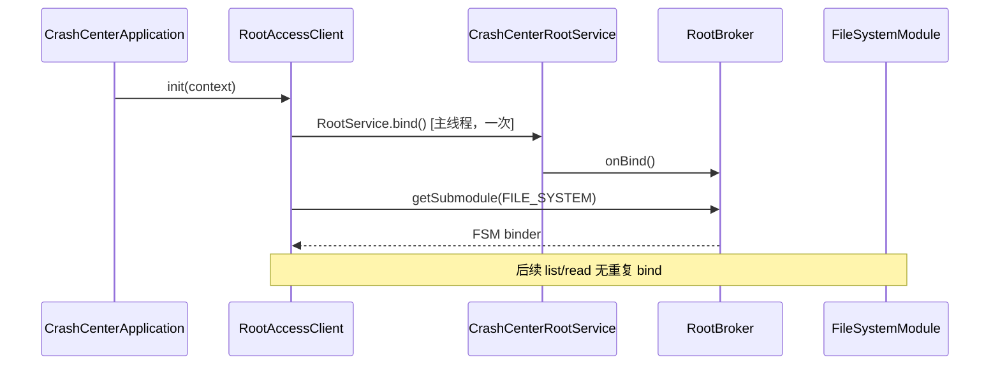

# 统一 Root 服务架构

> **状态**：`proposed` — 4B-β 编码前方案；实施前建议配套 **ADR-023**（统一 Root 访问层）accepted。
>
> **参考**：[AppSnapShotor](https://github.com/TIIEHenry/AppSnapshoter) 双 RootService 模式见 [root-service-patterns.md](../reference/root-service-patterns.md)；本文 **收敛为单 RootService + 子 Binder 池**，避免多 `RootService.bind()` 与分散 `su -c`。
>
> **取代叙事**：`LegacyPrefSnapshotReader` 裸 `Runtime.exec("su")`、`RootFsBackend` 独立 FSM bind、hook `RootSuBackend` 各写一套 shell — **统一为 `RootAccessClient` 契约 + 模块侧单 bind**。

## 目标

| 目标 | 说明 |
|------|------|
| **单 bind** | 模块进程生命周期内只 `RootService.bind()` 一次 |
| **子 Binder 分域** | 文件 I/O、prefs 迁移读、relay ingest、root 探测分模块，经 `RootBroker` 暴露 |
| **API 统一** | 模块与 hook 共用 `RootAccessClient` 接口；实现按进程切换 |
| **可测试** | Broker 各子模块可单测；模块集成测 mock `RootAccessClient` |

## 非目标

| 非目标 | 原因 |
|--------|------|
| 复制 AppSnapShotor 双 RootService + 30+ AIDL RPC | CrashCenter 仅需 FS / 短写 / 探测 |
| hook 进程 `RootService.bind()` | 见 [§进程模型](#进程模型)；与 ADR-008 hook 禁 libsu bind 一致 |
| Framework / `system_server` 注入 | 见 [framework-injection-feasibility.md](framework-injection-feasibility.md) |
| 无 root 设备主路径 | Provider + relay + 同 UID canonical 仍有效 |

---

## 与现状对比

### 现状（碎片化）

```
LegacyPrefSnapshotReader     → Runtime.exec("su -c cat …")     [模块，一次性]
RootFsBackend（规划）         → 独立 FileSystemManagerRootService  [模块，ingest]
RootSuBackend（规划）         → 独立 Shell / su append              [hook，≤1.5s]
SuProbe（规划）               → 各后端各自探测                      [未实现]
```

问题：shell 转义不一致、无共享 probe 缓存、多次 root 子进程启动、与 AppSnapShotor 参考实现分叉。

### 目标（统一）

```
                    ┌─────────────────────────────────────┐
                    │     CrashCenterRootService          │
                    │  onBind() → RootBroker (主 Binder)   │
                    └──────────────┬──────────────────────┘
                                   │
         ┌─────────────────────────┼─────────────────────────┐
         ▼                         ▼                         ▼
  IFileSystemModule          IPrefMigrationModule        IIngestModule
  (libsu FSM binder)         (读 legacy grapcrash.xml)   (relay 批量 harvest)
         │                         │                         │
         └─────────────────────────┴─────────────────────────┘
                                   │
                          ISuProbeModule (TTL 缓存)
```

**模块进程**：`RootAccessClient` → `RootServiceRemoteAdapter` → 单 bind `RootBroker`。

**hook 进程**：`RootAccessClient` → `ShellOnlyAdapter`（同接口，无 bind，≤1.5s）。

---

## 进程模型

| 进程 | RootService bind | RootAccessClient 实现 | 典型调用方 |
|------|----------------|----------------------|------------|
| **模块 app**（`nota.android.crash.xp.app`） | **是**，`Application.onCreate` 后后台线程 | `RootServiceRemoteAdapter` | `CrashLogIngestCoordinator`、`RootFsBackend` |
| **目标 app**（hook） | **否** | `ShellOnlyAdapter` | `RootSuBackend` Phase 1 append |

**hook 绝不 bind `CrashCenterRootService`**（延续 [ADR-008](../decisions/008-multi-backend-crash-log-storage.md)）：

1. **被注入进程 ≠ 模块进程** — Xposed 把模块 dex 加载进**目标 app 的 UID/SELinux 域**；目标包在 Magisk DenyList 上时，该进程**既无法稳定 `su`，也无法 bind RootService**（root 子进程仍受目标包策略约束）。
2. 每个被注入进程各自 bind → N 个 root 子进程、生命周期不可控。
3. libsu `RootService` AAR 进入 hook classpath → 体积与 ProGuard 风险。
4. 模块侧 bind 成功 **不代表** hook 侧可用 root — 二者是不同进程、不同 UID。
5. 崩溃热路径须 ≤1.5s；bind 本身可达数秒，不适合 hook。

**「统一」指什么**：

| 层级 | 模块进程 | hook 进程 |
|------|----------|-----------|
| RootService bind | **唯一入口** | **永不** |
| 读其他 app 私有数据 | `RootBroker` → FSM | **不做**（无 root 读能力） |
| 写 canonical（Phase 1） | 可走 FSM | 仅 **可选** `ShellOnlyAdapter` 试 `su` append；失败 silent → Phase 2 |
| 读 relay / 合并 canonical | `CrashLogIngestCoordinator` | **不做** |

hook 侧的 `ShellOnlyAdapter` **不是** RootService 的另一种 bind，而是「同接口名的无 bind 降级实现」：在部分未 DenyList 的目标上可能偶尔成功 append；**不能**作为读他包数据或 ingest 的依赖。

---

## 组件设计

### 1. `CrashCenterRootService`

单 `RootService` 子类，在 root 子进程 `onBind()` 返回 **`RootBroker`**：

```kotlin
class CrashCenterRootService : RootService() {
    override fun onBind(intent: Intent): IBinder = RootBroker()
}
```

`AndroidManifest.xml` 注册一处；**不**再为 FSM / prefs / ingest 各建独立 `RootService` 类（对比 AppSnapShotor 双服务）。

### 2. `RootBroker`（主 Binder + 子 Binder 池）

采用 **Binder 查询池**（类似 `queryLocalInterface` / 自定义 `TRANSACTION_getSubmodule`）：

| 子模块 | Binder 类型 | 职责 |
|--------|-------------|------|
| `FileSystemModule` | `FileSystemManager`（libsu-nio `getService()`） | `exists` / `list` / `openRead` / `openAppend` / `delete` |
| `PrefMigrationModule` | 薄 AIDL `IPrefMigrationOps` | 读 `/data/user/0/tiiehenry.xp.grapcrash/shared_prefs/grapcrash.xml` → 返回 XML 字符串 |
| `IngestModule` | 薄 AIDL `IRelayIngestOps` 或进程内封装 | 扫描 `*/files/crashcenter_relay/`、批量读 JSON、删已合并文件（可委托 FSM） |
| `SuProbeModule` | 薄 AIDL 或 root 进程内单例 | 缓存 `AVAILABLE` / `DENIED` / `UNAVAILABLE`，TTL 5min |



**设计原则**：

- **大块二进制 I/O** 走 `FileSystemManager` + `ParcelFileDescriptor`（与 AppSnapShotor `FileSystemImpl.openInputStream` 一致）
- **小文本 / 元数据** 可走薄 AIDL（prefs XML、probe 结果）
- **禁止** Broker 暴露任意 shell 命令 RPC（防路径注入与命令注入）

### 3. `AppShell`（libsu 全局 Shell）

模块进程启动时配置（参考 AppSnapShotor `AppShell.kt`）：

- `Shell.FLAG_MOUNT_MASTER`
- `setCommands("su")`
- `EnvInitializer`：`nsenter` 全局 mount + `pipefail`
- 默认 timeout 30s（ingest 批量）；hook `ShellOnlyAdapter` 使用 **独立短 timeout ≤1.5s**

### 4. `RootAccessClient`（模块侧门面）

```kotlin
interface RootAccessClient {
    fun probe(): RootAvailability          // 读 SuProbeModule 或 Shell.getShell().isRoot
    suspend fun readText(path: String): String?
    suspend fun listDir(path: String): List<String>
    suspend fun openRead(path: String): InputStream?
    suspend fun appendBytes(path: String, data: ByteArray, deadlineMs: Long): Boolean
    suspend fun delete(path: String): Boolean
}
```

| 实现 | 进程 | 说明 |
|------|------|------|
| `RootServiceRemoteAdapter` | 模块 | 持有 `RootBroker` 引用；IO 在 `Dispatchers.IO` |
| `ShellOnlyAdapter` | hook | `Shell.cmd` / 极薄 `su`；**不**持有 Broker |

注册位置：`ServiceLocator` 或 `CrashCenterApplication` 单例（见 [app-di-and-module-boundaries.md](app-di-and-module-boundaries.md)）。

### 5. 消费者映射

| 现有 / 规划组件 | 统一后调用 |
|-----------------|------------|
| `LegacyPrefSnapshotReader.readViaRoot` | `RootAccessClient.readText(legacyPrefsPath)`；删除 `execSuCat` |
| `RootFsBackend` | `listDir` + `openRead` + `delete` on relay 路径 |
| `CrashLogIngestCoordinator` | 编排 ingest；依赖 `RootAccessClient` + `RelayMergeBackend` |
| `RootSuBackend` | `ShellOnlyAdapter.appendBytes(canonicalPath, …)` |
| `CrashLogCoordinator` Phase 1 | 先 `probe()`；`UNAVAILABLE` 则跳过 Phase 1 |

路径常量（与 [crash-log-backends.md](crash-log-backends.md) 一致）：

```
/data/user/{userId}/{packageName}/files/crashcenter_relay/{eventId}.json
/data/data/nota.android.crash.xp.app/files/crash_logs/events.jsonl
/data/user/0/tiiehenry.xp.grapcrash/shared_prefs/grapcrash.xml
```

---

## 生命周期与线程

| 阶段 | 线程 | 行为 |
|------|------|------|
| `Application.onCreate` | Main | `AppShell.initMainShell()` |
| root 探测 | Main 或 IO | `Shell.getShell().isRoot`；false → 不 bind，`RootAccessClient` 降级 no-op |
| `RootService.bind` | **Main** | 仅一次；失败可重试（参考 AppSnapShotor `MainActivity`） |
| `getSubmodule` / FS I/O | **IO** | ingest / 迁移 / 读 relay |
| `Application.onTerminate` / 进程杀 | — | `RootService.unbind` |

超时：

| 操作 | 上限 |
|------|------|
| 首次 bind | 15s（可配置） |
| hook `appendBytes` | 1500ms（[ADR-008](../decisions/008-multi-backend-crash-log-storage.md)） |
| ingest 批量扫描 | 后台无硬上限；须 cancellable + 不阻塞 UI |

失败 **silent**（观测层不变量）：不得影响 [CrashHandler](crash-handler.md) 吞异常语义。

---

## Gradle 与包布局

### 依赖（仅模块编译路径可见）

```gradle
implementation libs.libsu.core
implementation libs.libsu.service
implementation libs.libsu.nio
```

hook 源码集（`nota.android.crash.log`、`xp`）**仅**依赖 `RootAccessClient` 接口 + `ShellOnlyAdapter`；**不** `import com.topjohnwu.superuser.ipc.RootService`。

### 建议目录

```
app/src/main/java/nota/android/crash/
├── root/
│   ├── AppShell.kt
│   ├── RootAccessClient.kt
│   ├── RootServiceRemoteAdapter.kt
│   ├── ShellOnlyAdapter.kt
│   ├── RootAvailability.kt
│   ├── service/
│   │   ├── CrashCenterRootService.kt
│   │   └── RootBroker.kt
│   └── module/
│       ├── FileSystemModule.kt      # 包装 FSM
│       ├── PrefMigrationModule.kt
│       ├── IngestModule.kt          # 可选：逻辑也可在 app 进程用 FSM 直接做
│       └── SuProbeModule.kt
```

AIDL（若用）：`app/src/main/aidl/nota/android/crash/root/`

可选演进：拆 `:crash-log-root` 源集（[architecture-optimization.md](architecture-optimization.md) ADR-024 占位）— **首版可留在 `:app`**。

---

## 与 AppSnapShotor 的差异

| 项 | AppSnapShotor | CrashCenter 统一方案 |
|----|---------------|---------------------|
| RootService 数量 | 2（AIDL + FSM） | **1** + Broker |
| PM / tar / SSAID | 有 | **无** |
| 文件读 | FSM 为主 | FSM via `FileSystemModule` |
| 启动 bind | `SnapshotApp` 双 bind | **单次** bind Broker |
| hook 进程 | 不涉及 Xposed inject | **ShellOnlyAdapter**，不 bind |

---

## 对现有文档 / ADR 的影响

| 文档 | 变更 |
|------|------|
| [crash-log-backends.md](crash-log-backends.md) | `RootFsBackend` / `SuProbe` 改为经 `RootAccessClient`；§RootFsBackend 引用本文 |
| [root-service-patterns.md](../reference/root-service-patterns.md) | 增加「单 Broker 变体」链接 |
| [scope-and-prefs.md](scope-and-prefs.md) | 迁移读 prefs 经 `PrefMigrationModule` |
| [ADR-008](../decisions/008-multi-backend-crash-log-storage.md) | **不废止**；hook 仍不 bind，Shell 适配器落实 Phase 1 |
| [ADR-017](../decisions/017-root-ingest-and-dedupe.md) | ingest 实现细节指向 `RootAccessClient` + `IngestModule` |
| **ADR-023**（待建） | 正式接受「单 RootService + Broker + 分进程适配器」 |

---

## 实施阶段

### Phase R0 — 基础设施（4B-β 前置）

- [ ] libsu 依赖 + `AppShell`
- [ ] `CrashCenterRootService` + `RootBroker` + `FileSystemModule`
- [ ] `RootAccessClient` + `RootServiceRemoteAdapter`
- [ ] `Application` 启动 bind + 单测（Robolectric mock / 真机）

### Phase R1 — 消费者迁移

- [ ] `LegacyPrefSnapshotReader` 改用 `readText`；删 `execSuCat`
- [ ] `RootFsBackend` + `CrashLogIngestCoordinator`（[ADR-017](../decisions/017-root-ingest-and-dedupe.md) dedupe）
- [ ] `ShellOnlyAdapter` + `RootSuBackend` Phase 1

### Phase R2 — 验收

- [ ] IS-R1~R5（[crash-log-backends.md](crash-log-backends.md)）
- [ ] 无 root / DenyList 降级路径
- [ ] `dev/verification/` 真机报告

---

## 风险与缓解

| 风险 | 缓解 |
|------|------|
| 首次 bind 慢，用户打开 app 卡顿 | bind 放后台；UI 不阻塞；ingest 可延迟到首屏后 |
| Root 子进程崩溃 | Broker death recipient → 清客户端缓存 → 下次 ingest 重 bind |
| Broker API 膨胀 | 严格白名单路径；FS 走 FSM，禁止 `exec` RPC |
| hook Shell 与模块 FSM 行为不一致 | 共享路径常量 + 集成测；hook 只写 canonical append |
| libsu 体积 | 仅模块 DEX 链接；ProGuard keep `RootService` |

---

## FAQ

### 为什么 hook 进程不 bind RootService？

被注入应用运行在**目标 UID**，不是模块 UID。DenyList / 目标 app 安全策略下，该进程通常**拿不到 root**，自然也无法可靠启动 libsu 的 root 子进程去 `bind`。AppSnapShotor 的 RootService 只在**自家 Application 进程**绑定；CrashCenter hook 路径没有等价条件。

**结论**：`CrashCenterRootService` 是**模块进程专属**基础设施；hook 只保留 Phase 2（Provider / DirectFs / TargetRelay），Phase 1 `RootSuBackend` 为可选增强，失败不影响吞异常语义。

### `RootAccessClient` 为什么还要在 hook 里出现？

仅为 **接口复用**（`appendBytes` 签名、超时、silent 失败），实现是 `ShellOnlyAdapter`，内部无 Broker、无 bind。若 IS 矩阵证明 hook 侧 `su` 几乎无收益，可在 ADR-023 中 **defer 或移除 `RootSuBackend`**，仅保留模块侧 RootService + Phase 2。

## 开放问题（ADR-023 待决）

1. `IngestModule` 放在 root 进程还是 app 进程用 FSM 直接扫描？**建议**：逻辑在 app 进程，Broker 只暴露 FSM，ingest 编排留在 `CrashLogIngestCoordinator`（更简单调试）。
2. `PrefMigrationModule` 是否必要？**建议**：首版可用 FSM `readText` 替代独立 AIDL，Broker 仅暴露 `FILE_SYSTEM` + `SU_PROBE` 两个子 Binder，prefs 走 FS 模块。
3. hook `RootSuBackend` 是否在 DenyList 普及后降级为「文档保留、默认关闭」？**倾向**：prefs 默认 `crash_log_backend_root_su=false`，待 IS-R 矩阵再定。
4. minSdk 26 与 libsu 6.x 兼容性 — 实施时锁定版本并在 `build.gradle` 登记（见 [AGENTS.md](../../AGENTS.md)）。

---

## 相关文档

- [crash-log-backends.md](crash-log-backends.md) — 多后端与 ingest SSOT
- [crash-log-ipc.md](crash-log-ipc.md) — hook 侧 IPC 与 DenyList FAQ
- [app-di-and-module-boundaries.md](app-di-and-module-boundaries.md) — 进程边界
- [root-service-patterns.md](../reference/root-service-patterns.md) — AppSnapShotor 参考
- [ADR-008](../decisions/008-multi-backend-crash-log-storage.md) — root 优先并行
- [ADR-017](../decisions/017-root-ingest-and-dedupe.md) — ingest dedupe
- [phase4_crash_observability.md](../../dev/roadmap/active/phase4_crash_observability.md) — 4B-β 任务
