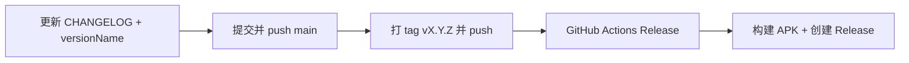

# 发布指南

本文说明如何为 CrashCenter 创建 GitHub Release、维护更新日志，以及如何用 AI 辅助完成发布。

Release 页：https://github.com/TIIEHenry/CrashCenter/releases

## 发布机制概览

向 GitHub 推送 `v*` 格式的 Git tag 后，[`.github/workflows/release.yml`](../../.github/workflows/release.yml) 会自动：

1. 运行 `./gradlew :app:assembleRelease` 构建 Release APK
2. 从 [`CHANGELOG.md`](../../CHANGELOG.md) 提取对应版本段落作为 Release 说明
3. 创建 GitHub Release 并上传 `app/build/outputs/apk/release/CrashCenter_v*_release.apk`



推送 `main` 或打开 PR 时，[`.github/workflows/build.yml`](../../.github/workflows/build.yml) 会执行 `assembleDebug` 并上传 artifact（不发布）。

## 版本号约定

三处版本号必须一致：

| 位置 | 示例 | 说明 |
|------|------|------|
| Git tag | `v0.1.0` | 必须以 `v` 开头，触发 Release CI |
| `app/build.gradle` → `versionName` | `"0.1.0"` | APK 内显示版本，**不含** `v` |
| `CHANGELOG.md` 标题 | `## [0.1.0] - 2026-06-19` | CI 用此段落作为 Release 正文 |

`versionCode` 为递增整数（每次发布 +1），用于 Android 安装/升级判断。

当前版本定义见 [`app/build.gradle`](../../app/build.gradle) 的 `defaultConfig`。

## CHANGELOG 维护

更新日志：仓库根目录 [`CHANGELOG.md`](../../CHANGELOG.md)，格式参考 [Keep a Changelog](https://keepachangelog.com/zh-CN/)。

### 日常开发

在 `## [Unreleased]` 下累积面向用户的变更，按类型分组：`Added` / `Changed` / `Fixed` 等。

### 发布时

1. 将 `## [Unreleased]` 内容移到新版本段落，例如 `## [0.1.0] - 2026-06-19`
2. 保留空的 `## [Unreleased]`
3. 本地校验：

```bash
scripts/extract-changelog.sh 0.1.0
```

有输出即表示 CI 能生成 Release 说明；无输出则发布会失败。

## 手动发布

### 1. 更新 CHANGELOG 与版本号

编辑 `CHANGELOG.md`，并修改 `app/build.gradle`：

```gradle
versionCode 2
versionName "0.2.0"
```

### 2. 提交并推送

```bash
git add CHANGELOG.md app/build.gradle
git commit -m "chore(release): prepare v0.2.0"
git push origin main
```

### 3. 打 tag 并推送

```bash
git tag -a v0.2.0 -m "Release v0.2.0"
git push origin v0.2.0
```

### 4. 等待 CI

- GitHub → **Actions** → **Release** workflow
- [Releases](https://github.com/TIIEHenry/CrashCenter/releases) 页检查正文与 APK

### 本地仅构建（不上传 Release）

```bash
./gradlew :app:assembleRelease
# app/build/outputs/apk/release/CrashCenter_v*_release.apk
```

## 使用 AI 辅助发布

仓库 prompt：[`/.github/prompts/release.md`](../../.github/prompts/release.md)

```
@.github/prompts/release.md 请发布 v0.2.0
```

```
@.github/prompts/release.md 写好 CHANGELOG，准备好发布但不要 push
```

## 签名说明

Release 构建当前使用 **debug 签名**（`signingConfig signingConfigs.debug`），与本地开发一致，便于 CI 无 keystore 即可出包。若需生产签名，在 `app/build.gradle` 配置 `signingConfigs.release` 并通过 GitHub Actions secrets 注入 keystore（后续迭代）。

## 故障排除

| 现象 | 原因 | 处理 |
|------|------|------|
| Release 报错「未找到 CHANGELOG 段落」 | tag 与 `## [版本]` 不匹配 | 补写 CHANGELOG 或修正 tag |
| Release 说明为空 | 版本段落无正文 | 在 CHANGELOG 中补充条目 |
| 推送 tag 后无 workflow | tag 不以 `v` 开头 | 使用 `v0.1.0` 格式 |
| APK 版本与 Release 不一致 | tag 前未 bump `versionName` | 先提交版本 bump 再打 tag |

## 相关文件

| 文件 | 用途 |
|------|------|
| [`CHANGELOG.md`](../../CHANGELOG.md) | 面向用户的更新日志 |
| [`scripts/extract-changelog.sh`](../../scripts/extract-changelog.sh) | CI 提取版本段落 |
| [`.github/workflows/release.yml`](../../.github/workflows/release.yml) | tag 触发发布 |
| [`.github/workflows/build.yml`](../../.github/workflows/build.yml) | main/PR 构建 debug |
| [`.github/prompts/release.md`](../../.github/prompts/release.md) | AI 发布 prompt |
| [`app/build.gradle`](../../app/build.gradle) | `versionCode` / `versionName` |

## 相关文档

- [getting-started/INDEX.md](getting-started/INDEX.md) — 指南导航
- [build-and-install.md](build-and-install.md) — 本地构建与 adb 安装
- [dev/DEV_GUIDE.md](../../dev/DEV_GUIDE.md) — 开发速查
