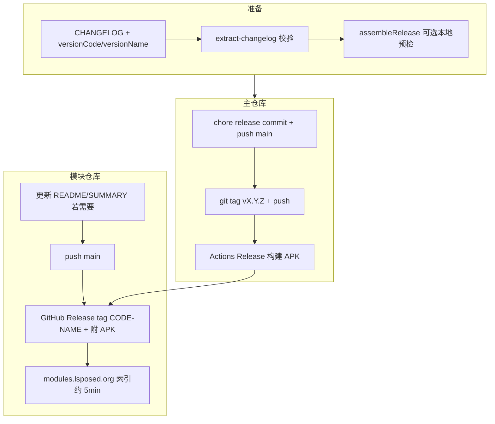

# 发布指南

本文说明 CrashCenter **双渠道发布**流程：

| 渠道 | 仓库 | 用户入口 |
|------|------|----------|
| **GitHub Release** | [TIIEHenry/CrashCenter](https://github.com/TIIEHenry/CrashCenter) | Releases 页下载 APK |
| **LSPosed 模块仓** | [Xposed-Modules-Repo/nota.android.crash.xp.app](https://github.com/Xposed-Modules-Repo/nota.android.crash.xp.app) | LSPosed 管理器搜索安装、[modules.lsposed.org](https://modules.lsposed.org) |

模块仓元数据格式与上架条件详见 [xposed-module-repo.md](xposed-module-repo.md)。

## 流程总览



**推荐顺序**：先完成主仓库 tag（取得 CI 或本地 APK）→ 再在模块仓创建 Release。

## 版本号约定

以 `app/build.gradle` 的 `defaultConfig` 为 **唯一真相源**：

| 位置 | 示例（v1.0.0） | 说明 |
|------|----------------|------|
| `versionName` | `"1.0.0"` | APK 内显示；**不含** `v` |
| `versionCode` | `1` | 整数递增；Android 升级判断 |
| `CHANGELOG.md` 标题 | `## [1.0.0] - YYYY-MM-DD` | 面向用户的 Release 正文来源 |
| 主仓库 Git tag | `v1.0.0` | 必须以 `v` 开头，触发 [release.yml](../../.github/workflows/release.yml) |
| 模块仓 Release tag | `1-1.0.0` | `{versionCode}-{versionName}`，**无** `v` 前缀 |
| 模块仓 Release title | `1.0.0` | 仅 `versionName` |
| APK 文件名 | `CrashCenter_v1.0.0_release.apk` | 见 `app/build.gradle` `androidComponents` |

下次发版示例：`versionCode 2` + `versionName "1.1.0"` → 主仓 `v1.1.0`，模块仓 `2-1.1.0`。

## 发布前自检

```bash
# 在 CrashCenter 仓库根目录
VERSION=1.1.0   # 替换为目标 versionName

scripts/extract-changelog.sh "$VERSION" | head    # 必须非空
./gradlew :app:assembleRelease                    # 可选，本地预检
```

- [ ] `CHANGELOG.md` 已写入 `## [VERSION]` 段落，并保留空 `## [Unreleased]`
- [ ] `versionCode` 已递增、`versionName` 与 CHANGELOG / tag 一致
- [ ] 模块仓 **Description** 非空（`CrashCenter`）
- [ ] 若用户可见功能有变：模块仓 `README.md` / `SUMMARY` 已更新

生成模块仓 Release 正文（可选，便于粘贴）：

```bash
scripts/extract-changelog.sh "$VERSION" > "release/xposed-release-notes-${VERSION}.md"
```

## 一、主仓库 GitHub Release

### CI 机制

推送 `v*` tag 后，[`.github/workflows/release.yml`](../../.github/workflows/release.yml) 自动：

1. `./gradlew :app:assembleRelease`
2. 从 [`CHANGELOG.md`](../../CHANGELOG.md) 提取对应版本段落
3. 创建 [GitHub Release](https://github.com/TIIEHenry/CrashCenter/releases) 并上传 APK

推送 `main` / PR 时，[build.yml](../../.github/workflows/build.yml) 仅构建 debug artifact，不发布。

### 操作步骤

**1. 更新版本与日志**

编辑 `CHANGELOG.md`、`app/build.gradle`：

```gradle
versionCode 2
versionName "1.1.0"
```

**2. 提交并推送**

```bash
git add CHANGELOG.md app/build.gradle
# 若有模块仓正文草稿：git add release/xposed-release-notes-*.md
git commit -m "chore(release): prepare v1.1.0"
git push origin main
```

**3. 打 tag 并推送**

```bash
git tag -a v1.1.0 -m "Release v1.1.0"
git push origin v1.1.0
```

**4. 验证**

- Actions → **Release** workflow 成功
- Releases 页 APK 与正文正确

### 本地仅构建（不上传）

```bash
./gradlew :app:assembleRelease
# app/build/outputs/apk/release/CrashCenter_v*_release.apk
```

## 二、LSPosed 模块仓库 Release

模块仓与主仓 **分开维护**；源码仅在主仓，模块仓存放 listing 元数据 + 分发 APK。

| 项 | 值 |
|----|-----|
| 模块仓 URL | https://github.com/Xposed-Modules-Repo/nota.android.crash.xp.app |
| 本地克隆（建议与 CrashCenter 同级） | `../nota.android.crash.xp.app` |
| 远程 | `git@github.com:Xposed-Modules-Repo/nota.android.crash.xp.app.git` |

### 首次克隆与权限

```bash
# 与 CrashCenter 同级目录
git clone git@github.com:Xposed-Modules-Repo/nota.android.crash.xp.app.git
cd nota.android.crash.xp.app
```

- 须接受组织邀请：https://github.com/Xposed-Modules-Repo/nota.android.crash.xp.app/invitations
- 若 `git status` 显示 `上游分支已经不存在 [gone]`：远程仍为空或未 push 成功，执行 `git branch --unset-upstream`，首次 push 后再 `git push -u origin main`

### 模块仓元数据文件

| 文件 | 说明 |
|------|------|
| `README.md` | 模块完整说明（Markdown） |
| `SUMMARY` | 列表页一句话简介（纯文本） |
| `SOURCE_URL` | 源码 URL，单行：`https://github.com/TIIEHenry/CrashCenter` |

文案模板见 [xposed-module-repo.md#附录](xposed-module-repo.md#附录推荐文案)。

### 仓库设置（GitHub Settings）

| 字段 | 建议值 |
|------|--------|
| **Description** | `CrashCenter` |
| **Website** | `https://github.com/TIIEHenry/CrashCenter/issues` |

### 每次发版操作

**1. 推送元数据变更（若有）**

```bash
cd ../nota.android.crash.xp.app
git add README.md SUMMARY SOURCE_URL   # 按需
git commit -m "docs: update listing for v1.1.0"
git push origin main
```

**2. 创建 GitHub Release（网页）**

https://github.com/Xposed-Modules-Repo/nota.android.crash.xp.app/releases/new

| 字段 | 示例 |
|------|------|
| Tag | `2-1.1.0` |
| Title | `1.1.0` |
| Body | `release/xposed-release-notes-1.1.0.md` 或 CHANGELOG 对应段落 |
| APK | 主仓 CI 产物或 `CrashCenter/app/build/outputs/apk/release/CrashCenter_v1.1.0_release.apk` |

> **重要**：创建 Release 时就要附上 APK。之后**只替换**附件而不新建 Release，索引机器人可能无法感知（见 [submission 说明](https://github.com/Xposed-Modules-Repo/submission)）。

**3. 验证**

- https://modules.lsposed.org/module/nota.android.crash.xp.app.json
- LSPosed 管理器搜索 `CrashCenter`

超过 10 分钟未出现：在 [Xposed-Modules-Repo/submission](https://github.com/Xposed-Modules-Repo/submission) 开 issue。

## 使用 AI 辅助发布

[`/.github/prompts/release.md`](../../.github/prompts/release.md)

```
@.github/prompts/release.md 请发布 v1.1.0（GitHub + LSPosed 双渠道）
```

```
@.github/prompts/release.md 写好 CHANGELOG，准备好发布但不要 push
```

## 签名说明

Release 使用 **debug 签名**（`signingConfig signingConfigs.debug`），便于 CI 无 keystore 出包。生产签名见后续迭代。

## 故障排除

### 主仓库

| 现象 | 处理 |
|------|------|
| CI 报「未找到 CHANGELOG 段落」 | tag 与 `## [版本]` 不一致；运行 `extract-changelog.sh` 校验 |
| 推送 tag 后无 workflow | tag 须为 `v*` 格式 |
| APK 版本与 Release 不一致 | 先 commit version bump 再打 tag |

### 模块仓库

| 现象 | 处理 |
|------|------|
| `Permission denied` push | 接受组织邀请；确认 SSH `ssh -T git@github.com` |
| `上游分支 [gone]` | `git branch --unset-upstream` 后 `git push -u origin main` |
| 管理器搜不到 | Description 为空 / 无 Release / tag 非 `CODE-NAME` 格式 |
| 更新后版本不刷新 | 新建 Release（新 tag），勿只改附件 |
| 非 Xposed 模块 | 使用 `assembleRelease` 产物；检查 manifest 元数据 |

## 相关文件

| 文件 | 用途 |
|------|------|
| [`CHANGELOG.md`](../../CHANGELOG.md) | 更新日志 |
| [`scripts/extract-changelog.sh`](../../scripts/extract-changelog.sh) | 提取 Release 正文 |
| [`release/xposed-release-notes-*.md`](../../release/) | 模块仓 Release 正文草稿（可选提交） |
| [`.github/workflows/release.yml`](../../.github/workflows/release.yml) | 主仓 tag 发布 |
| [`.github/workflows/build.yml`](../../.github/workflows/build.yml) | main/PR debug 构建 |
| [`.github/prompts/release.md`](../../.github/prompts/release.md) | AI 发布 prompt |
| [`app/build.gradle`](../../app/build.gradle) | `versionCode` / `versionName` |

## 相关文档

- [xposed-module-repo.md](xposed-module-repo.md) — 模块仓文件格式与上架条件
- [getting-started/INDEX.md](getting-started/INDEX.md) — 指南导航
- [build-and-install.md](build-and-install.md) — 本地构建与 adb 安装
- [usage.md](usage.md) — 用户安装与 LSPosed 作用域
- [dev/DEV_GUIDE.md](../../dev/DEV_GUIDE.md) — 开发速查
