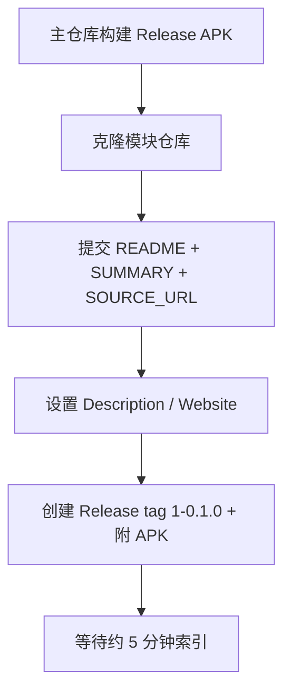

# LSPosed 模块仓库发布指南

本文说明如何将 CrashCenter 上架 [LSPosed 模块仓库](https://modules.lsposed.org)（Xposed Module Repository），与主仓库 [GitHub Release](release.md) **相互独立**。

> **当前状态**：模块仓库已创建；`README` / `SUMMARY` / `SOURCE_URL` 已写入本地克隆（`../nota.android.crash.xp.app`），待 push。首次 Release 计划：**tag `1-1.0.0`**，APK `CrashCenter_v1.0.0_release.apk`。执行清单见 [release-v1.0.0.md](../../dev/plans/release-v1.0.0.md)。

## 两套发布渠道对比

| 项 | 主仓库 GitHub Release | LSPosed 模块仓库 |
|----|----------------------|------------------|
| 仓库 | [TIIEHenry/CrashCenter](https://github.com/TIIEHenry/CrashCenter) | [Xposed-Modules-Repo/nota.android.crash.xp.app](https://github.com/Xposed-Modules-Repo/nota.android.crash.xp.app) |
| 用户入口 | Releases 页、手动下载 | LSPosed 管理器内搜索安装、[modules.lsposed.org](https://modules.lsposed.org) |
| 触发方式 | 推送 `v*` tag → CI | 在模块仓库手动创建 GitHub Release |
| Release **Tag** | `v1.0.0` | `1-1.0.0`（`{versionCode}-{versionName}`） |
| Release **Title** | 同 tag（`v1.0.0`） | `1.0.0`（仅 versionName） |
| Release 正文 | CI 从 `CHANGELOG.md` 提取 | 手写或从 CHANGELOG 复制 |
| APK 来源 | CI 构建 `CrashCenter_v*_release.apk` | 从主仓库构建产物上传，或本地 `./gradlew :app:assembleRelease` |
| 源码 | 本仓库 | 仅分发 APK + 说明文件；源码链到主仓库 |

**原则**：版本号以主仓库 `app/build.gradle` 的 `versionCode` / `versionName` 为准；模块仓库 Release 的 tag 必须与之一致。

## 上架前置条件

官方机器人邮件要求至少满足：

1. **GitHub 仓库 Description 非空** — 模块在列表中的显示名（建议：`CrashCenter` 或 `崩溃中心 / CrashCenter`）
2. **至少一个 Release** — 含有效 APK，且 tag 格式正确

模块 APK 本身须符合 Xposed 规范（本仓库已具备）：

| 元数据 | 位置 | 当前值 |
|--------|------|--------|
| 包名 | `applicationId` | `nota.android.crash.xp.app` |
| `xposedmodule` | `AndroidManifest.xml` | `true` |
| `xposeddescription` | `strings.xml` | 英/中各一份 |
| `xposedscope` | `@array/xposed_scope` | 已声明 |
| `xposedminversion` | manifest | `53` |

详见 [xposed-framework.md](../reference/xposed-framework.md)。

## 模块仓库文件结构

参考 [org.meowcat.example](https://github.com/Xposed-Modules-Repo/org.meowcat.example) 与 [submission 说明](https://github.com/Xposed-Modules-Repo/submission)。

| 文件 | 必填 | 说明 |
|------|------|------|
| `README.md` | 是 | 模块完整说明（支持 Markdown） |
| `SUMMARY` | 推荐 | 一句话简介，显示在列表页；**不支持** Markdown |
| `SOURCE_URL` | 推荐 | 源码地址，单行无换行 |
| `SCOPE` | 可选 | 推荐作用域 JSON；manifest 已有 `xposedscope` 时可省略 |
| `ADDITIONAL_AUTHORS` | 可选 | 额外作者 JSON |
| `HIDE` | 可选 | 存在则不在网站/管理器展示（临时下架） |

### 建议的仓库设置

在 https://github.com/Xposed-Modules-Repo/nota.android.crash.xp.app/settings ：

| 字段 | 建议值 |
|------|--------|
| **Description** | `CrashCenter` |
| **Website** | `https://github.com/TIIEHenry/CrashCenter/issues`（或主仓库 URL） |

## 首次上架清单

按顺序执行（本文档仅作记录，**不要求立即操作**）：



### 1. 构建 APK（主仓库）

```bash
cd /path/to/CrashCenter
./gradlew :app:assembleRelease
# app/build/outputs/apk/release/CrashCenter_v0.1.0_release.apk
```

### 2. 克隆并初始化模块仓库

```bash
git clone https://github.com/Xposed-Modules-Repo/nota.android.crash.xp.app.git
cd nota.android.crash.xp.app
```

将下文「附录：推荐文案」中的 `README.md`、`SUMMARY`、`SOURCE_URL` 写入后提交：

```bash
git add README.md SUMMARY SOURCE_URL
git commit -m "docs: initial module listing metadata"
git push origin master   # 或 main，以仓库默认分支为准
```

### 3. 创建首个 Release

在模块仓库 **Releases → Draft a new release**：

| 字段 | 首次发布示例 |
|------|----------------|
| **Choose a tag** | `1-0.1.0`（新建 tag） |
| **Release title** | `0.1.0` |
| **Description** | 从 `CHANGELOG.md` 的 `## [0.1.0]` 段落复制 |
| **Pre-release** | 稳定版不勾选 |
| **Attach binaries** | 上传 `CrashCenter_v0.1.0_release.apk` |

> **注意**：创建 Release 时就要附上 APK。若之后**只替换** Release 里的 APK 而不新建 Release，机器人可能无法感知更新（[submission 文档](https://github.com/Xposed-Modules-Repo/submission) 说明）。

### 4. 验证展示

- 网站：https://modules.lsposed.org/module/nota.android.crash.xp.app.json
- LSPosed 管理器内搜索 `CrashCenter` 或包名

超过 10 分钟仍未出现：在 [Xposed-Modules-Repo/submission](https://github.com/Xposed-Modules-Repo/submission) 开 issue 说明情况。

## 后续版本更新

每次主仓库发版后，在模块仓库**额外**做一次 Release（可与主仓库 GitHub Release 同一天，顺序建议：先主仓库 tag，再模块仓库）：

1. 主仓库：bump `versionCode` / `versionName`，更新 `CHANGELOG.md`，推送 `vX.Y.Z`（见 [release.md](release.md)）
2. 取得新 APK（CI artifact 或本地 `assembleRelease`）
3. 模块仓库：新建 Release，tag 为 `{新 versionCode}-{新 versionName}`，例如 `2-0.2.0`
4. 若用户可见行为有变，同步更新模块仓库 `README.md` / `SUMMARY`

| 主仓库 | 模块仓库 |
|--------|----------|
| `versionCode 2`, `versionName "0.2.0"` | Release tag `2-0.2.0` |
| Git tag `v0.2.0` | Release title `0.2.0` |

## 故障排除

| 现象 | 可能原因 | 处理 |
|------|----------|------|
| 管理器搜不到模块 | Description 为空 | 填写仓库 Description |
| 管理器搜不到模块 | 无 Release 或 tag 错误 | 创建 tag 形如 `1-0.1.0` 的 Release |
| 有 Release 仍不展示 | 缺少 `README.md` | 补全并 push 到默认分支 |
| 更新后版本不刷新 | 只改了 Release 附件 | 新建 Release 并带正确 tag |
| 安装后提示非 Xposed 模块 | APK 非 release 或元数据缺失 | 用主仓库 `assembleRelease` 产物，检查 manifest |

## 与主仓库 Release 的关系

推荐工作流（手动，当前无自动化）：

1. **开发** → 主仓库 `main`
2. **GitHub Release** → `v*` tag，供 GitHub 用户与 CI
3. **模块仓库 Release** → `{code}-{name}` tag，供 LSPosed 生态

未来若需自动化，可考虑：主仓库 Release workflow 完成后用 `gh release upload` 同步到模块仓库，或单独 workflow；**当前未实施**。

## 附录：推荐文案（首次上架草稿）

以下内容可直接复制到模块仓库，发布前可按需润色。

### `SUMMARY`

```
Intercept uncaught Java exceptions in hooked apps to prevent process exit. Swallows crashes; does not fix bugs. Use with caution.
```

### `SOURCE_URL`

```
https://github.com/TIIEHenry/CrashCenter
```

### `README.md`（草稿）

```markdown
# CrashCenter / 崩溃中心

Xposed module that intercepts **uncaught Java exceptions** in hooked apps so the process does not exit.

**This module swallows crashes — it does not fix bugs.** Unexpected behavior may occur. Use only on apps you understand; avoid system apps unless necessary.

## Requirements

- Android 8.0+ (API 26+)
- LSPosed or compatible Xposed framework
- Enable this module in the manager and **reboot**
- Set **scope** to target apps in LSPosed; configure per-app toggles inside CrashCenter

## Features

- Uncaught exception handler replacement in scoped apps
- Per-app enable/disable in module UI
- Crash notification and detail view
- Crash log observation (module private storage)

## Source & support

- Source: https://github.com/TIIEHenry/CrashCenter
- Issues: https://github.com/TIIEHenry/CrashCenter/issues
```

## 相关文档

- [release.md](release.md) — 主仓库 GitHub Release 与 CHANGELOG
- [usage.md](usage.md) — 用户安装与 LSPosed 作用域
- [build-and-install.md](build-and-install.md) — 本地构建 APK
- [xposed-framework.md](../reference/xposed-framework.md) — Xposed 机制与包名约定
- [getting-started/INDEX.md](getting-started/INDEX.md) — 指南导航

## 外部链接

- [模块仓库提交入口](https://modules.lsposed.org/submission/)
- [Xposed-Modules-Repo/submission](https://github.com/Xposed-Modules-Repo/submission)
- [示例仓库 org.meowcat.example](https://github.com/Xposed-Modules-Repo/org.meowcat.example)
- [本模块仓库](https://github.com/Xposed-Modules-Repo/nota.android.crash.xp.app)
